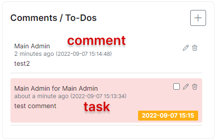
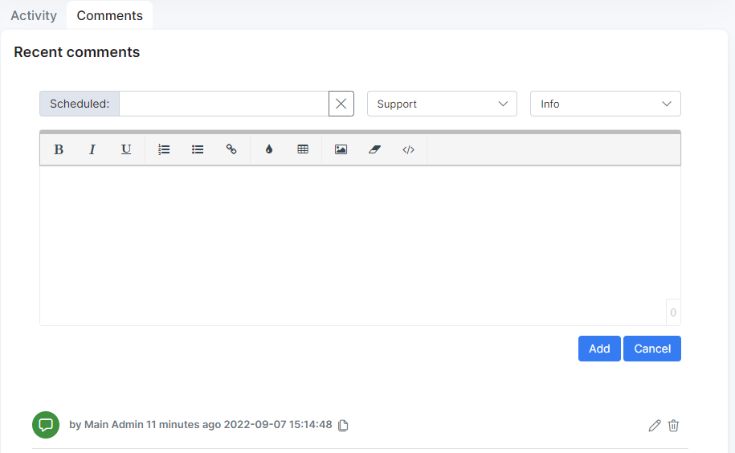
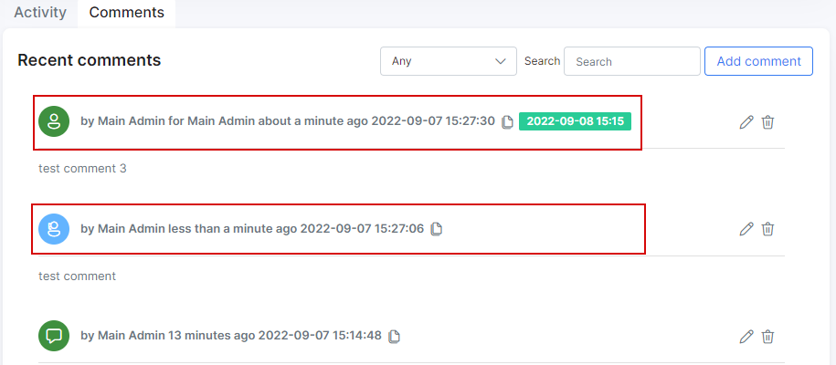
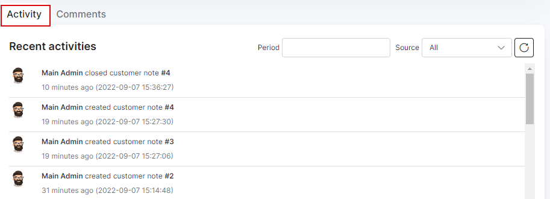

Customer information
====================

The customer information tab is divided into 4 sections, namely, _Main information_, _Additional information_, _Maps_ and _Comments_. Also, at the bottom of the information page you can find _Activity_ and _Comments_ tabs related to the user account.

To edit a customers information, navigate to `Customers → List`, select the customer (click on *Full name*, *ID* or *Portal login* value of required customer)


**Main information**

* **ID** - the customer id within the system, allocated by the system in a sequential order;

* **Portal login** - username used to log into the Customer Portal;

* **Password** -  password used to log into the Customer Portal (passwords are masked by default but it is possible to view the password in plain text by simply clicking the *Show* button);

**Note:**

In order to prevent the display of the customer password for admin accounts, please change `show_passwords` parameter value from `true` to `false` in config file:

```bash
nano /var/www/splynx/config/config.php  
```
  

* **Status** - options to set are: New, Active, Inactive, Blocked (some functions are available to Active customers only, e.g. for the client to make use of services. Also, it is necessary to customer to be inactive in order to delete them `Inactive → Save → Actions → Delete`);

- **New (Not yet connected)** - status given to customer recently created or added to the system;<br>
- **Active** - status given to customers to allow the system to take their profile into account and make feature available;<br>
- **Inactive (Doesn't use services)** - this status stops customers services and the system from accounting. It is the status given to customers' automatically when they've reached the _deactivation (grace) period_. This status is given to customers who will no longer use your services. In case the customer's account has _Inactive_ status it can be deleted.;<br>
- **Blocked** - status given to customers who failed to make payments for services or to simply deny access to the client while taking their profile into account;

* **Billing type** - the options are Recurring payments, Prepaid (daily) and Prepaid (custom);

- **Recurring** - type of billing following a full period in a fixed cycle and paid for either by prepay or post-pay;<br>
- **Prepaid(daily)** - type of billing charged everyday and paid for in advanced;<br>
- **Prepaid(custom)** - type of billing set to a custom period and paid for in advanced;<br>

* **Full name** - full name of the customer;

* **Email** - email address(es) of the customer, multiple emails supported and separated by comma ",";

* **Billing email** - email address of the customer only for the billing correspondence (the multiple ones are supported separated by comma ","). The current field has the next logic:
**1)** *if the billing email field is empty - all emails are sending to email(-s) from main "Email" field;*
**2)** *if there is the email in the "Billing email" field - all billing notifications will be send to this billing email and all other emails will be send to email from main "Email" field. As a result, Splynx doesn't duplicate the billing notifications to email(-s) from the main "Email" field;*
**3)** *in case was added only the billing email ("Email" field is empty), customer receives only the billing related letters, all others letters won't be send by Splynx.*

* **Phone Number** - phone number(s) of the customer, multiple numbers supported and separated by comma ",";

* **Partner** - partner that the customer belongs to;

* **Location** - location that the customer belongs to in the listed locations;

* **Street, ZIP Code, City** - Physical address fields of the customer;

* **Geo data** - physical coordinates of the customer address;

* **Date Added** - when the customer was added to Splynx.


**Additional information**

It is possible to create additional fields for any additional information required/preferred in your system with the [Additional fields](customer_management/custom_additional_fields/custom_additional_fields.md) function.

Additional fields created will be displayed in the *Additional information* section.


**Maps**

This is a physical representation of the customer's address. If the customers address is set and maps is configured within the system, you will be able to view the customers physical location on the map


Maps can be configured in `Config → Main → Maps`

**Comments**

In this section it's possible to add, edit or remove the quick comments. They will be visible for other administrator accounts as well.



The *Comments* tab provides more functionality when we add the comments - the title, the relative type and category of message can be specified:





**Activity**

It's represented as a tab at the bottom of a customer information page. In this tab you can find all the applied actions related to the settings of a customer account.



The information is displayed in a chronological order and can be sorted using *Period* and *Source* filters.
