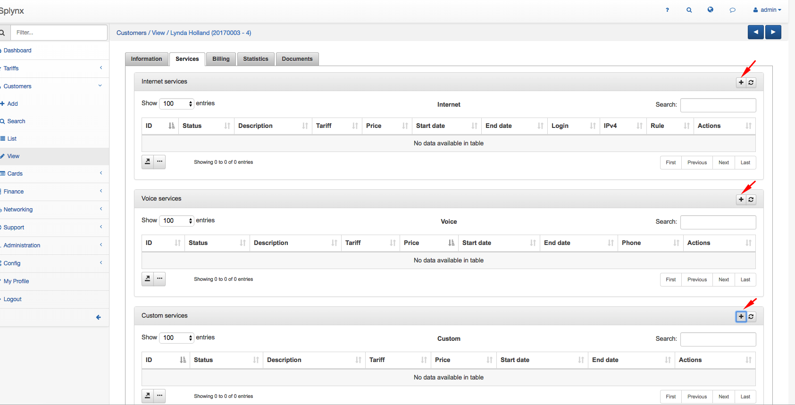
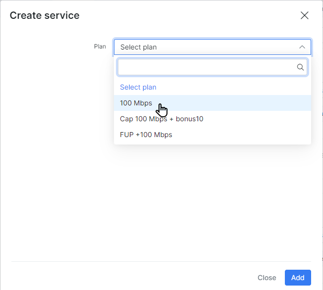
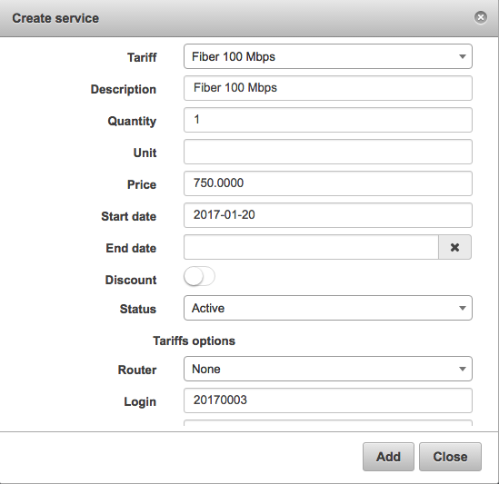
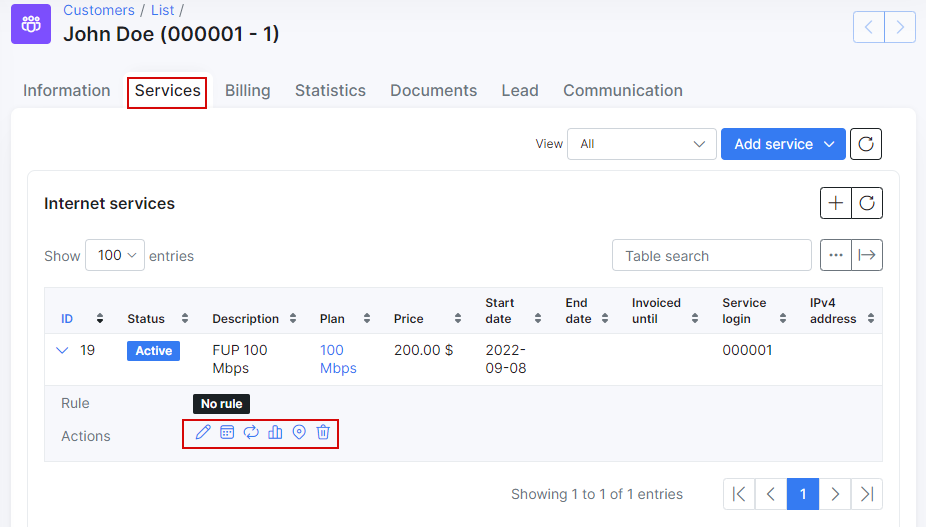

Customer services
==========

It is possible to associate different services for every customer: `Internet services`, `Voice services` and `Custom services`.
In order **to add a new service** for the customer, select the *Customer view* and click `Add service` or `+` sign next to the service (make sure customer is in Active status).

A window will pop up and it will be possible to select the service.

* **Plan** - the tariff (`Internet`, `Voice`, `Custom`)
* **Description** - a description of the tariff (optional)
* **Quantity** - the quantity of the service
* **Unit** - a unit of measurement is a definite magnitude of a quantity (if using for invoices - for example: m, ft, etc.)
* **Price** - the price (custom price can be used that differs from service price)
* **Pay period** - pay period for this service
* **Start date** - when the service will start
* **End date** - when the service will end
* **Discount** - it is possible to set a discount with the percentage, start and end dates of the discount
* **Status** - the options are `Active`, `Disabled`, `Stopped`, `Pending`, `Archived`.
  * **Active** - Status that client needs to be on to function.
  * **Disabled** - Status when data cap has been reached. Can also be used when assuming that customer will no longer use the service.
  * **Stopped** - Used to temporary disable the service. Will be set automatically if customer status is changed to Inactive, when customer will be activated, service status will be automatically changed to Active.

  * **Pending** - Status while we wait for another service to activate.
  * **Archived** - Archived for future information.

***Tariff options***
* **Router** - The router that API will use to connect to (for all API functions - Shaping, contention, address lists)

  <icon class="image-icon"></icon> This is only required when using API authentication methods in [Networking settings](networking\routers_settings\routers_settings.md)

* **Login** - the login used in services such as PPPoE or Hotspot. Login must be unique in active services.

* **Password** - the password used in services

  <icon class="image-icon"></icon> If you don't create a password the password from the Main Information page will be used.

* **Taking IPv4** - the options are None (Router will assign IP), Permanent IP, Dynamic IP. (Make sure the IP's network is the same type of assignment when creating it in IPv4 manager)

* **IPv4** - IP address which will be assigned to customer's device. Available only when **Taking IPv4**=Permanent IP.

* **Additional network** - this is customer's network. Network route to this network will be added on the provider's router (NAS). Available only when **Taking IPv4**=Permanent IP.

* **IPv4 Pool** - the options are Any pool or specific pool. Available only when **Taking IPv4**=Dynamic IP.

* **Mac(s)** - MAC address(es). Separated by comma.

  <icon class="image-icon"></icon> Only the first MAC address will be used if **Authorization/Accounting** for the router is **Hotspot (Users) / API Accounting** or **PPP (Secrets) / API Accounting**

* **Port ID** - the port ID

You can **edit** a service, **schedule a future change**, **change** the plan, view the **graph** for the service, apply **additional discounts**, **delete** or **geolocate** the service by these actions. <icon class="image-icon"></icon>

