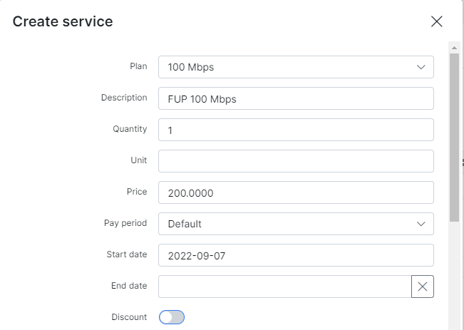

Customer services
==========
The customer service tab is where all products/services supplied to that specific customer can be found, edited or new services can be added to the customers account. This is where you control all services for a client which will influence the bill they receive.

It is possible to associate different services for each customer: `Internet services`, `Voice services` and `Custom services`.
In order **to add a new service** for the customer, select the *Customer view*, go to the services tab and click `Add service` or on the `+` sign above the service table on the left. Please note that customers have to be active on the system to make us of their services, as well as to be able to add services to their profile.

After clicking the "add service" or "+" button, a window will pop up for you to select a service from the list of existing tariffs.

* **Plan** - the tariff selected/list of tariffs available to select (`Internet`, `Voice`, `Custom`)
* **Description** - a description of the tariff (optional)
* **Quantity** - the multiple of plans for the selected service
* **Unit** - a unit of measurement (if using for invoices - for example: m, ft, etc.) (Optional)
* **Price** - the price of the tariff (custom prices can be set that differs from service price in the tariff configuration)
* **Pay period** - period of which to charge for this service
* **Start date** - when the system will start accounting for the service in billing perspective.
* **End date** - when the service will end, changed to a stopped status and the system will stop accounting for it in a billing perspective.
* **Discount** - sets a discount with parameters of a percentage, within start and end dates of the discount, please note that these dates refer to the period of which the discount will be applied.
* **Status** - the options are `Active`, `Disabled`, `Stopped`, `Pending`, `Archived`.
  * **Active** - service is active and ready for use.
  * **Disabled** - used when assuming that customer will no longer use the service,  end date has to be reached or configured for the system to stopped accounting for it in a billing perspective. This will be applied to existing services of customers marked as inactive
  * **Stopped** - Used to temporary disable the service. Will be set automatically  to the new service generated when a client is marked as Inactive, when the customer is activated, the service status will  automatically change to Active with the start date of the day of activation.
  * **Pending** - Status of the new service during the waiting period of a planned service change. Between the end date of the old service and the start date of the new.
  * **Archived** - status for services archived for future reference.

  <icon class="image-icon"></icon> **The clarification of statuses relation (customer, service and invoice):**
  

  
<b>Click here for more information</b>

  

  1. If the customer has an `unpaid` invoice (e.g. an invoice was created in `Billing day` date) and the customer doesn't pay the invoice before the date of `Billing due`, the customer status will be changed to `Blocked`, but the service (e.g. Internet service) is still be active;

  2. The invoice status in period from `Billing day` to `Billing due` date is `unpaid`, from `Billing due` to `Deactivation period` and after `Deactivation period` the invoice will be considered  as `overdue`;

  3. If the customer with `Blocked` status pays the `overdue` invoice, the customer's status will be changed to `Active`;

  4. If the customer with `Blocked` status doesn't pay the invoice before the date of `Deactivation period` date, his status will be changed to `Inactive (doesn't use service)`. And after he decided to pay the invoice, the status would become `Active`;

  5. If the customer has `Inactive (doesn't use service)` status, his service (e.g. Internet service) will be `disabled` (with `Start date` = `Billing day` date and `End date` = `Deactivation period` date) and the duplicate of the previous service will be created with `Stopped` status, its `Start date` = the date of `Deactivation period`.
  And after customer decided to pay the `overdue` invoice, the status of duplicate service would become `Active`, its `Start date` would be changed to invoice payment date.

  

  

  

  

***Plan settings***
* **Router** - The router that API will use to connect to (for all API functions - Shaping, contention, address lists)

  <icon class="image-icon"></icon> This is only required when using API authentication methods in [Networking settings](networking\routers_settings\routers_settings.md)

* **Login** - the username used in services such as PPPoE or Hotspot. Login must be unique in active services.

* **Password** - the password for the login used in services

  <icon class="image-icon"></icon> If you don't create a password the password from the Main Information page will be used.

* **IPv4 assignment method** - the options are None (Router will assign IP), Permanent IP, Dynamic IP. (Make sure the IP's network is the same type of assignment when creating it in IPv4 manager)

* **IPv4** - IP address which will be assigned to customer's device. Available only when using **IPv4 assignment method**=Permanent IP.

* **Additional network** - this is the customer's network. Network route to this network will be added on the provider's router (NAS). Available only when **IPv4 assignment method**=Permanent IP.

* **IPv4 Pool** - the options are Any pool or a specific pool from the list of pools. Available only when **IPv4 assignment method**=Dynamic IP.

* **Mac(s)** - MAC address(es) of client device(s). Separated by comma.

  <icon class="image-icon"></icon> Only the first MAC address will be used if the **Authorization/Accounting** method for the router is set to **Hotspot (Users) / API Accounting** or **PPP (Secrets) / API Accounting**

* **Port ID** - the port ID

You can **edit** a service, **schedule a future change**, **change** the plan, view the **graph** for the service, apply **additional discounts**, **delete** or **geolocate** the service by these icons <icon class="image-icon"></icon>, located in the actions column of the service table.

