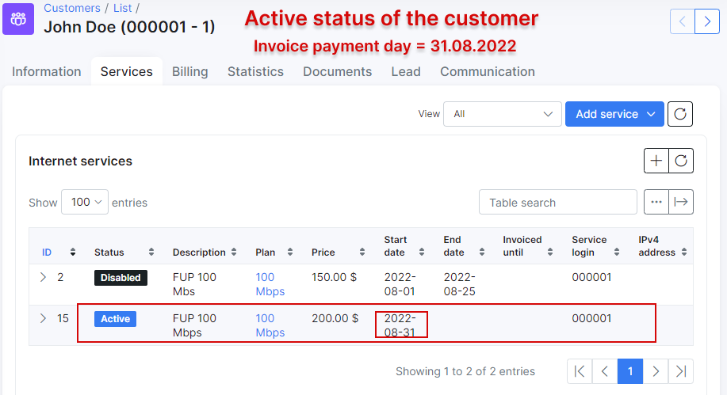

Customer services
==========
The customer service tab is where all products/services supplied to that specific customer can be found, edited or new services can be added to the customers account. This is where you control all services for a client which will influence the bill they receive.

It is possible to associate different services for each customer: `Internet services`, `Voice services` and `Custom services`.
In order **to add a new service** for the customer, select a customer from the list, go to the services tab and click on `Add service` or on the `+` sign above the service table on the right. Please note that customers have to be active on the system to make use of their services, as well as to be able to add services to their profile.


After clicking ``Add service`` or ``+`` button, a window will pop up for you to select a service from the list of existing tariffs.


* **Plan** - the tariff selected/list of tariffs available to select (`Internet`, `Voice`, `Custom`).
* **Description** - a description of the tariff (optional).
* **Quantity** - the multiple of plans for the selected service.
* **Unit** - a unit of measurement (if using for invoices - for example: m, ft, etc.) (optional).
* **Price** - the price of the tariff (custom prices can be set that differ from service price in the tariff configuration).
* **Pay period** - period of which to charge for this service.
* **Start date** - when the system will start accounting for the service in billing perspective.
* **End date** - when the service will end; if changed to a stopped status, the system will stop accounting for it in a billing perspective.
* **Discount** - sets a discount with parameters of a percentage, within start and end dates of the discount; please note that these dates refer to the period of which the discount will be applied.
* **Status** - the options are `Active`, `Disabled`, `Stopped`, `Pending`, `Archived`.
  * **Active** - service is active and ready for use.
  * **Disabled** - used when assuming that customer will no longer use the service,  end date has to be reached or configured for the system to stop accounting for it in a billing perspective. This will be applied to existing services of customers marked as inactive.
  * **Stopped** - Used to disable temporary the service. Will be set automatically  to the new service generated when a client is marked as _Inactive_. When the customer is activated, the service status will  automatically change to Active with the start date of the day of activation.
  * **Pending** - Status of the new service during the waiting period of a planned service change. Between the end date of the old service and the start date of the new.
  * **Archived** - status for services archived for future reference.

  <icon class="image-icon"></icon> **The relation between customer, service and invoice and service accounting:**


  1. If the customer has an `unpaid` recurring invoice (e.g. an invoice was created in `Billing day` date at 22:00 PM) and the customer doesn't pay the invoice before the date of `Payment due (days after billing day)`, the customer status will be changed to `Blocked`, but **their service (e.g. Internet service) is still active and accounted by billing**. If the customer has only the **one-time invoice** and it's not paid before `Payment due`, the `Blocked` status won't be applied to the customer, the one-time invoice will have `unpaid` status. The customer won't be `Disabled` after `Deactivation period` has passed as well;

  2. The recurring invoice status in period from `Billing day` to `Payment due` date is `unpaid`, from `Payment due` to `Deactivation period` and after `Deactivation period` the invoice will be considered  as `overdue`;

  3. If the customer with `Blocked` status pays the `overdue` invoice, the customer's status will be changed to `Active`;

  4. If the customer with `Blocked` status does not pay the invoice before the date of `Deactivation period` date, his status will be changed to `Inactive (doesn't use service)`. And after he decides to pay the invoice, the status will be changed to `Active`;

  5. If the customer has `Inactive (doesn't use service)` status, his service (e.g. Internet service) will be `disabled` (with `Start date` = `Billing day` date and `End date` = `Deactivation period` date) and the duplicate of the previous service will be created with `Stopped` status, its `Start date` = the date of `Deactivation period`.
  And after customer decides to pay the `overdue` invoice, the status of duplicate service will be changed to `Active`and its `Start date` will be changed to invoice payment date.

  

  

  6. Mind that the service (-s) with `Disable` status but **without** `End date` **is still accounted by billing**. If you want to **disable the charge for such service (-s) in the next month**, please set `End date` to service or change its status to `Archived` manually. Also, pay attention that the disabled customer service will be charged up for the whole month e.g. the disabled service `Start date` = 2022-01-01, the `End date` = 2022-01-25 (`Billing due` (value: 15 days) and `Deactivation period` (value: 10 days), as a result the disabled service is charged up to 2022-01-31)


------------

## Plan settings

* **Router** - The router that API will use to connect to (for all API functions - Shaping, contention, address lists).

  <icon class="image-icon"></icon> This is only required when using API authentication methods in [Routers settings](networking/routers_settings/routers_settings.md).


* **Service login** - the username used in services such as PPPoE or Hotspot. Login must be unique in active services.

* **Service password** - the password for the login used in services.

  <icon class="image-icon"></icon> If the service password is not entered, the password from the Main Information page will be used.

* **IPv4 assignment method** - the options are None (Router will assign IP), Permanent IP, Dynamic IP. (Make sure the IP's network is the same type of assignment when creating it in IPv4 manager).

* **IPv6 network** - an IPv6 preconfigured network. You need first to add an IPv6 network in _Networking → IPv6 networks → Add_. For more information, read [IPv6](networking/ip_address_management/ipv6/ipv6.md).

* **Delegated IPv6 network** - the network, that should be used by CPE's/Home routers within LAN network.

* **Mac(s)** - MAC address(es) of client device(s). Separated by comma.

  <icon class="image-icon"></icon> Only the first MAC address will be used if the **Authorization/Accounting** method for the router is set to **Hotspot (Users) / API Accounting** or **PPP (Secrets) / API Accounting**.

* **Port ID** - the port ID


You can **edit** a service, **schedule a future change**, **change** the plan, view the **graph** for the service, **delete** or **geolocate** the service by these icons <icon class="image-icon"></icon>, located in the actions column of the service table:


------------

## Change Plan from Administrator Portal

The following steps will show how an administrator in Splynx can change customer service in a correct way.

**NOTE:** It's required to have more than one `Internet/Voice/Recurring` tariff plan in Splynx in order to change from one to another.

For example, a customer uses `Ethernet_500Mbps` as his current Internet service and wants to change it to `Ethernet_100Mbps` (created in `Tariff plans → Internet`). The `Ethernet_500Mbps` service had been already charged and customer had paid the invoice (period: (2022-10-01 - 2022-10-31)). The `Ethernet_500Mbps` service start date is 2022-10-01. The new `Ethernet_100Mbps` service should be started on 2022-10-20 according to customer request.


1. Find the necessary customer and go to `Services` tab of their profile. There is an active service that the customer uses at the moment.

2. Click on <icon class="image-icon"></icon> (Change plan) icon in *Actions* column of the required service:


3. In the new window, choose `New plan start date` (2022-10-20) and `New plan` (`Ethernet_100Mbps`) for customer and press **Apply** button:

**NOTE:** If the option `Refund unused money` is not used for recurring billing in _`Config → Finance → Change plan`_, you can change the tariff only after 2022-10-31.

More info about available settings you can find in [Change plan](configuration/finance/change_plan/change_plan.md) guide.

In our case we use the next settings:

* **Plan change refund:** `Refund unused money`;

* **Additional fee when changing to a less expensive plan:** `Additional fee when changing to a less expensive plan` (value: 30);

* **Create invoice after service change:** `Immediately till end of active month`.

<icon class="image-icon"></icon> You can configure the above settings in _Config → Finance → Change plan_.


4. As a result, the end date (2022-10-19) is added to `Ethernet_500Mbps` service and the new service `Ethernet_100Mbps` is appeared in the list with pending status, its start date is 2022-10-20. 


On customer balance we can see 8.71$ that were refunded:


<details style="font-size: 15px; margin-bottom: 5px;">
<summary><b>How it was calculated</b></summary>
<div markdown="1">

```
200$/31days = 6.4516$/day
19days*6.4516$/= 122.5804$
200$ - 122.5804 = 77.4196$
77.4196$ - 30$ (fee) = 47.4196$ ~ 47.42$

100$/31days = 3.2258$/day
3.2258$ * 12days (from 20 to 31 of October 2022) = 38.7096$ ~ 38.71$

47.42$ - 38.71$ = 8.71$

```
</div>
</details>

5. On October 20, the new service `Ethernet_100Mbps` will be activated and the previous one - `Ethernet_500Mbps` will be disabled:


<details style="font-size: 15px; margin-bottom: 5px;">
<summary><b>Another example</b></summary>
<div markdown="1">

<!-- task SPL-7321 -->

In case a customer decides to change their previous service (`Ethernet_500Mbps`, price 200$) on the same day of its activation (e.g. the option `Use the customer creation date` as billing day is enabled under _Settings of recurring billing_ section in `Config → Finance → Settings`. The customer was created on Sept 09 (Billing day), the service start date is also 2022-09-09. And the customer was charged for `Ethernet_500Mbps` service on Sept 09 as well) to a new one (`Ethernet_100Mbps`, price 100$), the previous service will be archived and the new one will be activated on the same day.


</div>
</details>

*********************************************
### Cancellations 

To cancel a service you can simply set an end date on the service. This will:

1. Alert the system not to bill this service beyond the end date.

2. Set the service to a Disabled status at the end of the specified day, thereby pushing a Packet of disconnect to the NAS for the existing service when using Radius (once the customer tries to reconnect they will receive a Reject_0 address list entry or be blocked from reconnecting entirely depending on the radius config) or in the case of Mikrotik API, removing the lease/secret from the NAS.

Suggested read: [Change Plan from Customer Portal](customer_portal/change_plan_from_customer_portal/change_plan_from_customer_portal.md)
