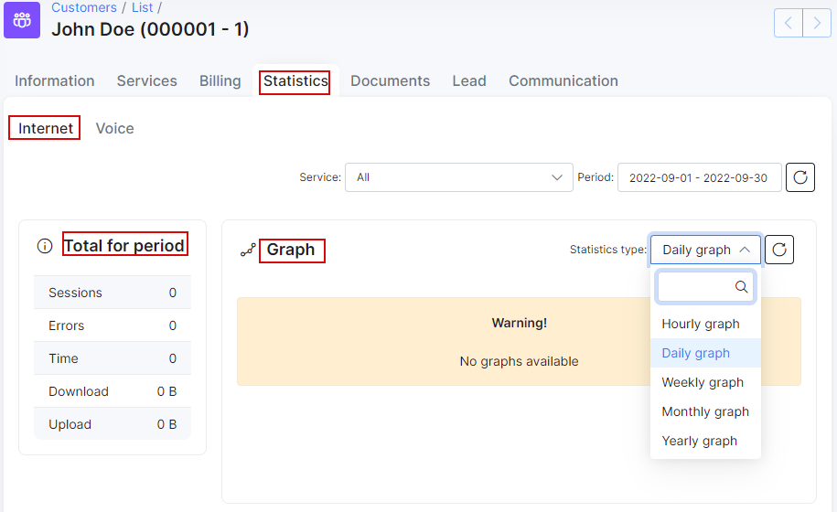
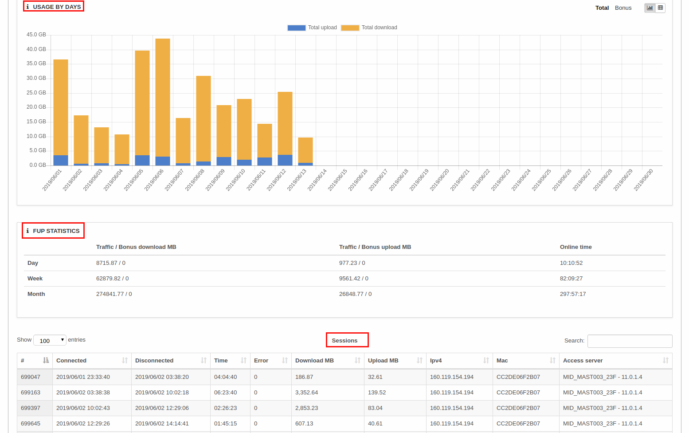
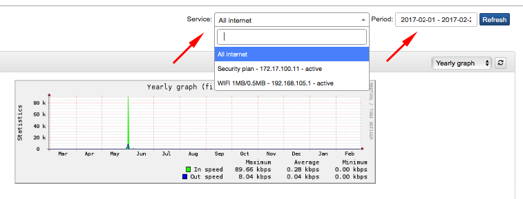
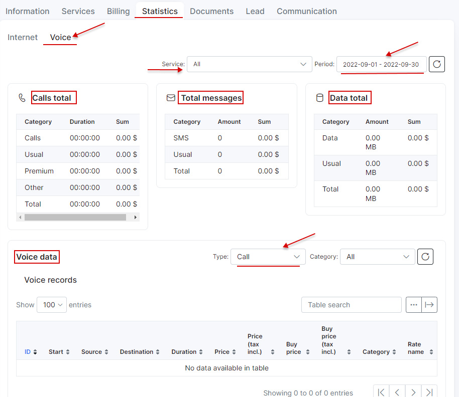

Customer statistics
==========

Customer statistics displays the data usage for Internet and Voice services within a specified period of a customer.

Customer's internet statistics are divided into 5 main sections:

* **Total for period** - here we can see the number of sessions, errors, time in total, downloaded and uploaded amounts of data. The basic summary for usage statistics.

* **Graph** - displays statistics for a selected period of time.
You can set up an hourly, daily, weekly, monthly or yearly graph to be displayed, which will represent the maximum, minimum and average data transfer speeds.

* **Usage by days** - will show the usage statistics for a specified day.

* **FUP statistics** - displays used traffic and bonus traffic (if tariff plan configured with bonus traffic) relating to FUP.

* **Sessions** - will show all sessions for a certain period of time with connected/disconnected times, number of errors, amount of downloaded and uploaded MB etc.

If a customer uses/has multiple services, it is possible to navigate between them or choose the *All Internet option*, where all services usage statistics will be represented. It is also possible to set a filter to show data usage for either a specific time period or service(s).

Customer voice statistics consists of 4 main sections:

* **Calls total** the total duration and cost of calls for each type listed.

* **Message total** the amount of sent messages and costs thereof.

* **Data total** the total data usage in MB.

* **Voice records** displays all calls and messages(it is also possible to set a filter for a type or category).
