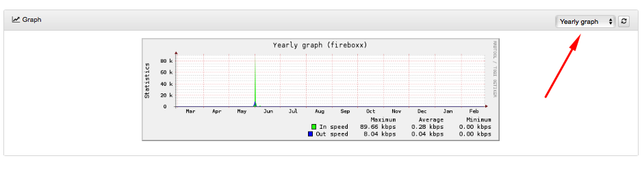
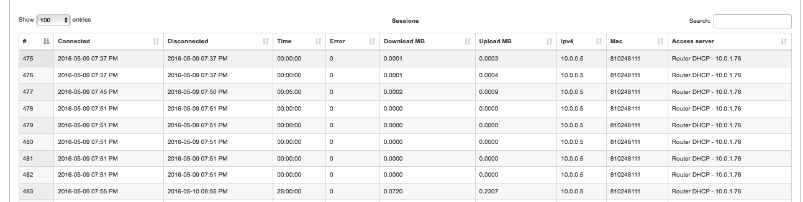

Customer statistics
==========

Customer statistics displays his Internet usage for a certain period of time.

Customer statistics is divided into 3 main sections:

* **Total for period** where will be shown number of sessions, errors, time in total, downloaded and uploaded amount of data.
* **Graph** which will show statistics for a certain period of time.
You can set up an hourly, daily, weekly, monthly and yearly graph to be displayed, where you will see maximum, minimum and average data transfer speed.

  

* **Sessions**, where in form of table will be shown all sessions for a certain period of time with connected/disconnected time, number of errors, amount of downloaded and uploaded MB etc.

  

If customer uses few services it is possible to choose preferable one or All Internet option, where all services will be shown. It is also possible to set a filter for particular period of time or services to be displayed.

