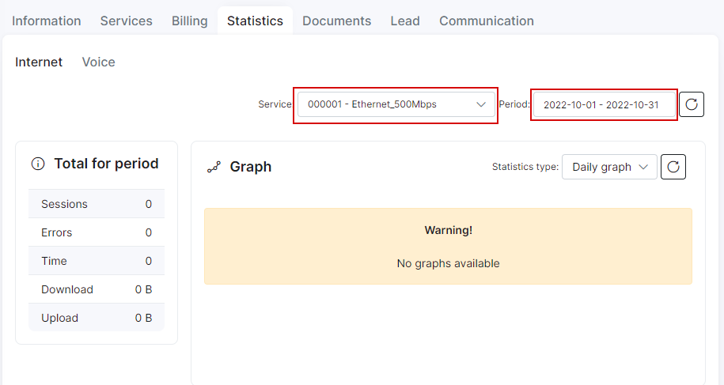

Customer statistics
==========

Customer statistics displays his Internet and Voice usage for a certain period of time.

Customer internet statistics is divided into 5 main sections:

* **Total for period** where will be shown number of sessions, errors, time in total, downloaded and uploaded amount of data.
* **Graph** which will show statistics for a certain period of time.
You can set up an hourly, daily, weekly, monthly and yearly graph to be displayed, where you will see maximum, minimum and average data transfer speed.
* **Usage by days** which will show usage statistics for a certain day.
* **FUP statistics** displays used traffic and bonus traffic(if tariff plan configured with bonus traffic).
* **Sessions**, where in form of table will be shown all sessions for a certain period of time with connected/disconnected time, number of errors, amount of downloaded and uploaded MB etc.

If customer uses few services it is possible to choose preferable one or All Internet option, where all services will be shown. It is also possible to set a filter for particular period of time or services to be displayed.

Customer voice statistics consists of 4 main sections:

* **Calls total** where will be shown duration of calls.
* **Message total** which will show amount of sent messages.
* **Data total** which will show data usage in MB.
* **Voice records** displays all calls and messages(it is also possible to set a filter for a type or category).
