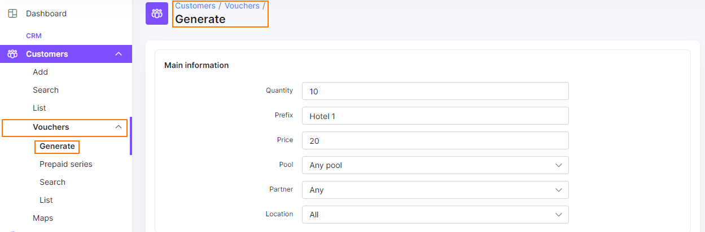
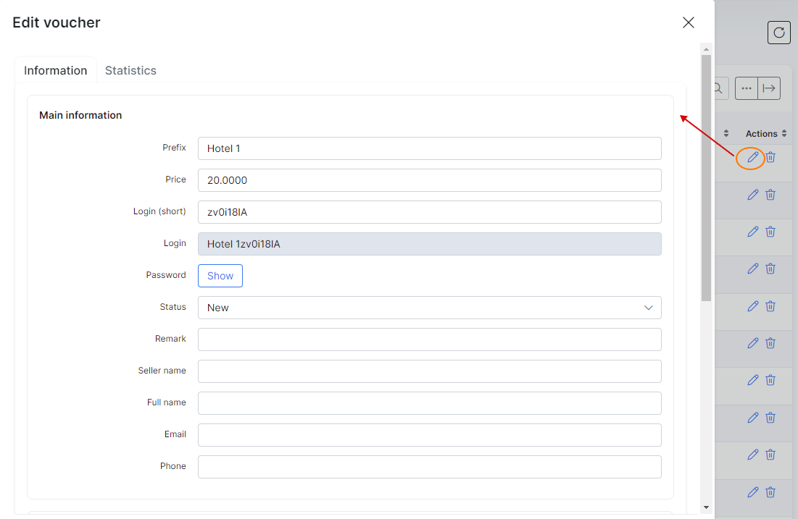
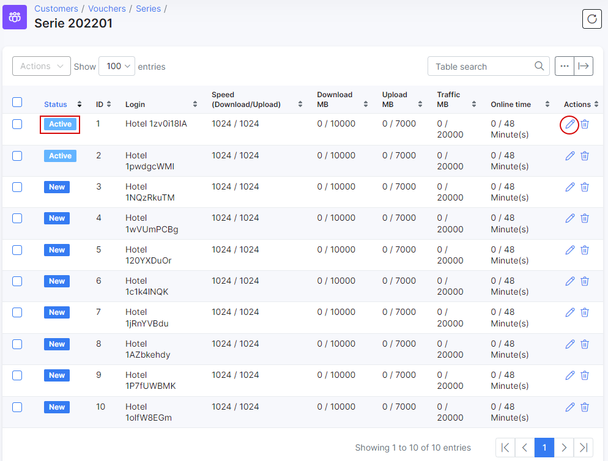
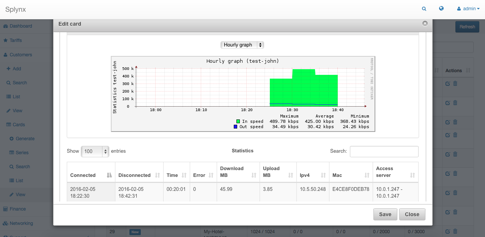

Prepaid vouchers
==========

Within the core of Splynx, we posses many powerful tools but one that stands out from the rest is our unique, self designed and unchallenged Radius server. With this we are able to provide many useful services, to mention one, we give you, Hotspot authentication. This has been successfully implemented in places like hotels and conference halls, etc.

With the use of our radius server, Splynx can provide access to frequent/regular users as well as provide one time access by the means of prepaid voucher generation.

Take a look at the following example of generating a prepaid voucher:

Simply navigate to **Customers** -> **Vouchers** and then **Generate**. This will bring up a window for you to complete the parameters for the new voucher(s) you wish to generate.

Generating vouchers consists of three sections for configuring, *Main Information*, *Limits* and *Expiration*. Each section specifying contributing factors of the vouchers function.

## Main Information

**Qauntity** - the number of vouchers you wish to generate 
**Prefix** - prefix of characters to use when generating multiple vouchers 
**Price** - the price of the voucher  
**Pool** - the ip pool of which the voucher will obtain an ip address  
**Partner** - the partner of which the voucher belongs to  
**Location** - the location of which the voucher belongs to  

## Limits

**Speed (upload)** - maximum upload speed allowed for the voucher 
**Speed(download)** - maximum download speed allowed for the voucher 
**Download** - maximum amount of data allowed for downloadingin Mb 
**Upload** - maximum amount of data allowed for uploading in Mb 
**Traffic** - the total amount of data traffic up/down allowed in Mb 
**Online time(total)** - the total amount of access time allowed in either minutes/hours/days.

## Expiration

**Expiration by** - method of declaring voucher as expired 
**Valid till** - date the voucher will expire

 Once vouchers are generated, you can edit each voucher individually to add the contact details of customers using the voucher cards and a remark for reference.

<icon class="image-icon"></icon> After the vouchers are generated, you do not need to activate them in Splynx (change **Status** to *Active*). These vouchers are ready to use for as soon as it has been generated.

Once a voucher is in use, it is possible to view the statistics, cost of usage and detailed information of the voucher:

The configuration of Hotspots which make use of prepaid vouchers can be found in the [Radius hotspot configuration page](networking/authentication_of_customers/mikrotik_hotspot_radius/mikrotik_hotspot_radius.md).

The following video is a quick tutorial on the configuration of prepaid vouchers in Splynx:

<iframe frameborder=0 height=270 width=350 allowfullscreen src="https://www.youtube.com/embed/JlkTFukRFu0?wmode=opaque">Video on youtube</iframe>
