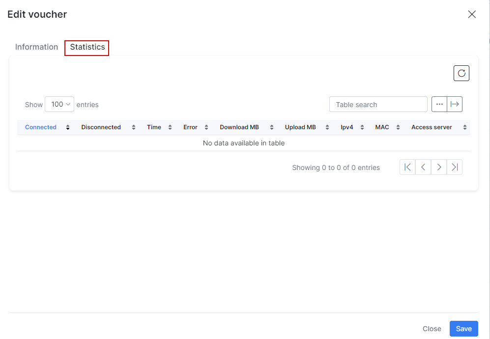

Prepaid vouchers
==========

In Splynx core we have a powerful Radius server which provides different types of services to end users. One of our popular services is hotspot access for hotels, conference halls etc. Soon we will create a module for Splynx that can add PayPal, Cards and Online Registration features. At the moment, you can use Splynx for providing hotspot access to regular customers or generating prepaid vouchers for one time access. Pictures with examples of how to generate customized prepaid vouchers are shown below.

Here you can define voucher prices, download and upload speed, and traffic limit. Once vouchers are generated, you can edit and customize each one, and set up the contact details of customers using the cards.

 After the vouchers are generated, you do not need to activate them in Splynx (do not need to change **Status** to *Active*). They are ready to use.

Each voucher has its own statistics, charge of usage and detailed information:

Configuration of Hotspot for prepaid cards you can find in [Radius hotspot configuration page](../../networking/authentication_of_users/mikrotik_hotspot_radius.md)

The video tutorial below shows configuration of prepaid vouchers in Splynx:

<iframe frameborder=0 height=270 width=350 allowfullscreen src="https://www.youtube.com/embed/JlkTFukRFu0?wmode=opaque">Video on youtube</iframe>
