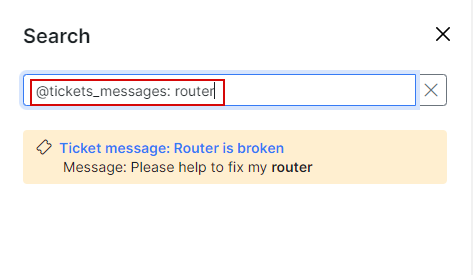
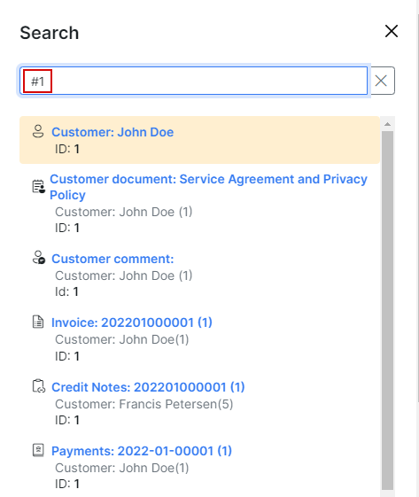
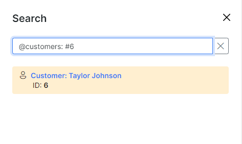

Search
==========

The Search engine in SPLYNX is divided into:

* Searching for a customer;
* Searching for a voucher card;
* Searching within a table;
* Searching the entire system.

## Customer search
To search a customer, click on `Customers Menu → Search`. In the search window you can perform a customized search that will query the customer database.

Here you will be able to use different parameters for searching, such as:

* **Portal login** - the login of the customer;
* **Status** - the options are: New (not yet connected), Active, Inactive (doesn't use services), Blocked, Select all (to select all options);
* **Full name** - the full name of the customer;
* **Email** - email of the customer;
* **Billing email** - email address of the customer only for the billing correspondence;
* **Phone Number** - phone number of the customer;
* **Category** - the options are: Individual,  Business, Select all (to select all options);
* **Location** - [location](administration/main/locations/locations.md) of the customer;
* **Billing type** - it can be Recurring, Prepaid (Custom), Prepaid (Daily), Select all (to select all options);
* **Partner** - one of the [partners](administration/main/partners/partners.md) created or all of them;
* **Tariff plans** - one of the tariff created or all of them;
* **Service** - the options are: Bundle, Internet, Voice, Recurring;

For a more customizable search, you can click on `My Profile → Customer search fields (tab)`and select different fields.

## Voucher card search

To search for a voucher click on `Customers → Menu → Vouchers → Search`. Perform a search in the Prepaid vouchers database with the search options as shown below.

These are the different parameters that are available for searching for vouchers:

* **ID** - ID of the voucher;
* **Series** - the series the voucher belongs to;
* **Prefix** - the voucher's prefix;
* **Status** -  the options are: New, Active, Expired, Used, Disabled, Online, Select all;
* **Login** - the voucher's login, e.g. internet_LlT6BQD7;
* **Full name** - name of the owner;
* **Phone** - phone number of the owner;
* **Email** - email of the owner;
* **Seller name** - name of the seller;
* **Partner** - name of the [partners](administration/main/partners/partners.md);
* **Location** - [location](administration/main/locations/locations.md) where the customer's voucher is based;

## Search inside a table

We can search for particular data inside any table in Splynx. Use the search field of every table and get the complete view as a result.

## Search in the whole system

Also we can search in the whole Splynx system. Use the main search field as shown below:

Please follow these tips for a more efficient search:

- put `@` sign in the search field in order to show all entities to search through

- to search in the necessary entity, choose it from the list or type the name manually, e.g. `@tickets_messages: text`

- to search according to ID, start the search request from `#` sign, then add ID num, e.g. `#609`

- the combination of the methods can be used, e.g. `@customers: #18`

