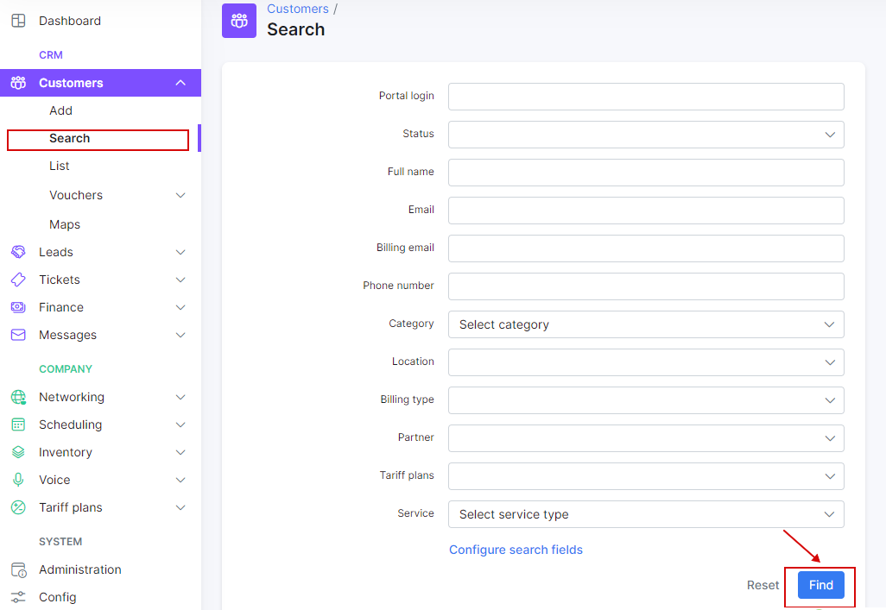
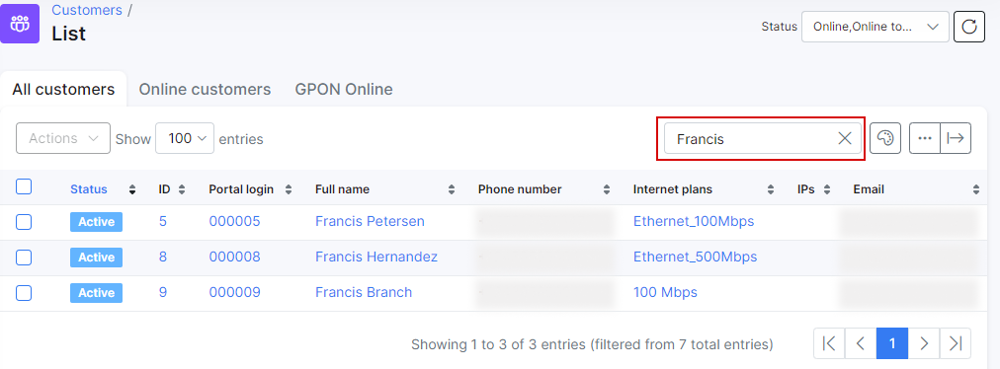

Search
==========

The Search engine in SPLYNX is divided into:

* Searching for a customer or a card
* Searching within a table
* Searching the entire system

## Customer search
To search a customer, click on `Customers Menu → Search`. In the search window it's possible to perform a customized search that will query the customer database.

Here you will be able to use different parameters for searching, such as:

* **ID** - ID of the customer
* **Login** - the login of the customer
* **Status** - the options are: New (not yet connected), Active, Inactive (doesn't use services), Blocked, Select all (to select all options).
* **Type of billing** - it can be Recurring Payments, Prepaid, Select all (to select all options).
* **Email** - email of the customer.
* **Phone Number** - phone number of the customer.
* **Date added** - the date when the customer was added into the system.
* **Category** - the options are: Private person,  Company, Select all (to select all options).
* **Partner** - one of the partners created or all of them.
* **Location** - location of the customer.
* **Tariff plans** - the tariff created
* **Service** - the options are: Internet, Voice, Custom.

For a more customizable search, you can click on `My Profile Menu → Customer` search fields and select different fields.

To search for a voucher click on `Customers → Menu → Vouchers →  Search`. It is possible to do a search in the Prepaid vouchers database with the search option as shown below.

These are the different parameters that are available for searching for vouchers:

* **ID** - ID of the voucher
* **Serie** - the Series the voucher belongs to
* **Prefix** - the voucher's prefix
* **Status** -  the options are: New, Active, Expired, Used, Disabled, Online, Select all
* **Full name** - name of the owner
* **Phone** - phone number of the owner
* **Email** - email of the owner
* **Seller name** - name of the seller
* **Partner** - name of the partner
* **Location** - location where the customer's voucher is based

## Search inside a table

We can search for particular data inside any table in Splynx.
Use the search tab of every table and get the complete view as a result.

## Search in the whole system

Lastly we can also do a full text search in the system. Use the main search tab as shown below:

