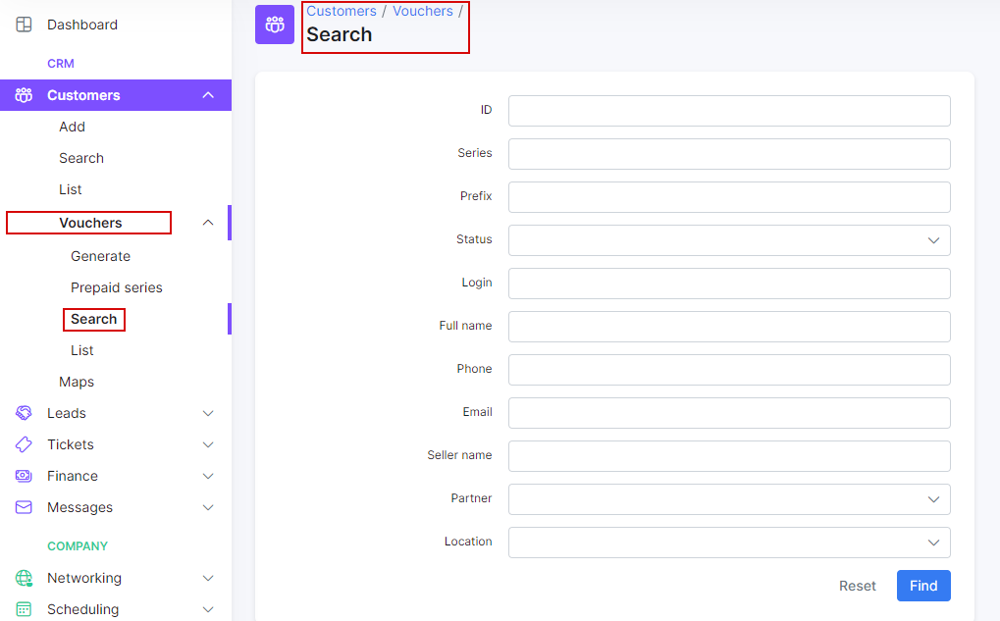

Search
==========

The Search engine in SPLYNX is divided in:

* Search a customer or a card
* Search inside a table
* Search in the whole system

## Customer search
To search a customer,  click on `Customers Menu → Search`. In the poped-up window will be possible to make a search in the customers database.

Here you will be able to use different parameters for the search, such as:

* **ID** - ID of the customer
* **Login** - the login of the customer
* **Status** - the options are: New (not yet connected), Active, Inactive (doesn't use services), Blocked, Select all (to select all options).
* **Type of billing** - it can be Recurring Payments, Prepaid, Select all (to select all options).
* **Email** - email of the customer.
* **Phone Number** - phone number of the customer.
* **Date add** - the date when the customer has been added into database.
* **Category** - the options are: Private person,  Company, Select all (to select all options).
* **Partner** - one of the partners created or all of them.
* **Location** - location of the customer.
* **Tariff** - the tariff created
* **Service** - the options are: Internet, Voice, Custom.

To get a more customizable search, you can click on `My Profile Menu → Customer` search fields and select different fields.

To search a card click on the Customers `Menu → Cards →  Search`. It is possible to do a search in the Prepaid cards database with that option.

Different parameters for searching here can be used, such as:

* **ID** - ID of the customer
* **Serie** - the card's serie
* **Prefix** - the card's prefix
* **Status** -  the options are: New, Active, Expired, Used, Disabled, Online, Select all
* **Full name** - name of the owner
* **Phone** - phone number of the owner
* **Email** - email of the owner
* **Seller name** - name of the seller
* **Partner** - name of the partner
* **Location** - location where the customer's card is based

## Search inside a table

It is possible to search a particular data inside any table in Splynx.
Use the search tab of every table and get the complete view as a result.

## Search in the whole system

It is possible to do a full text search in the system. Use the main search tab as it is shown in the screenshot.

