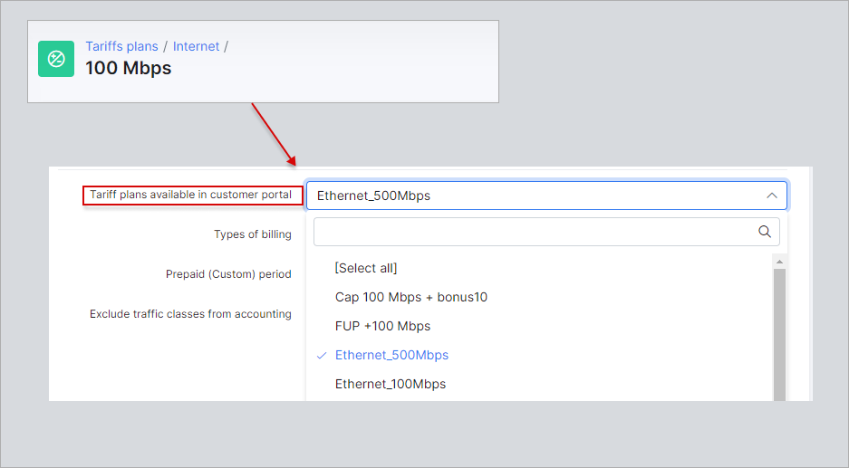
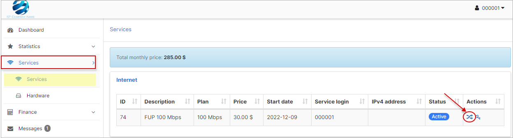
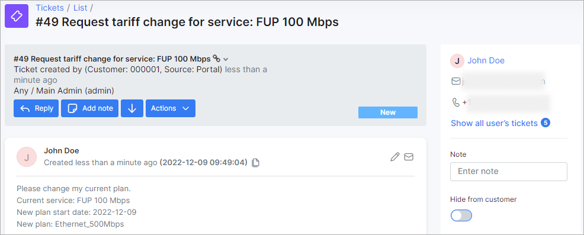
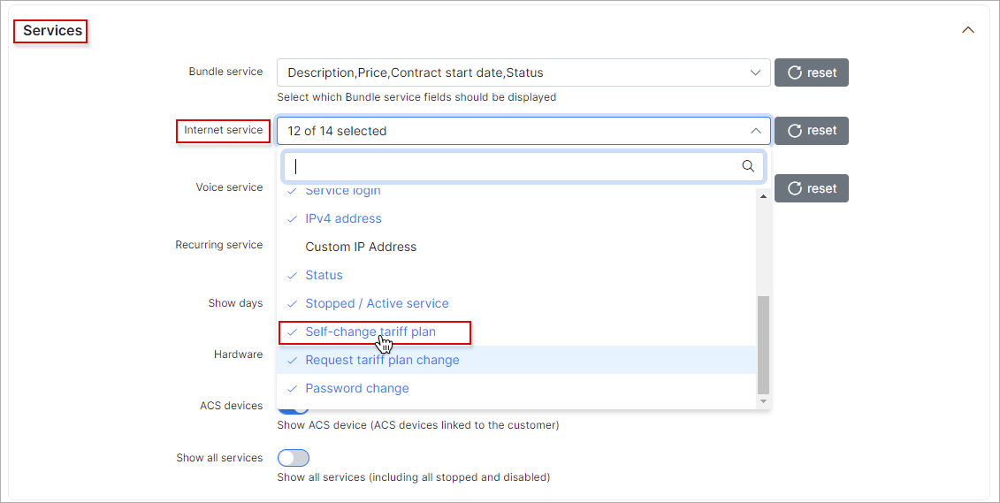
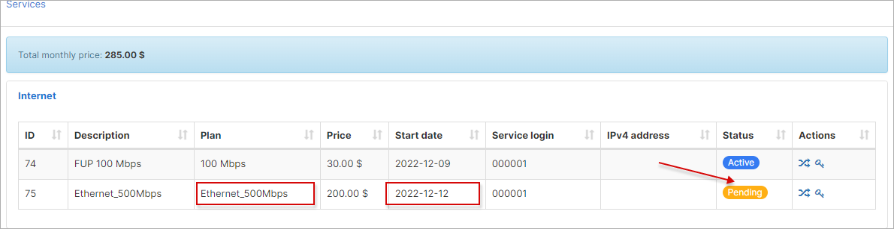

Change Plan from Customer Portal
==========

The variety of Splynx settings complements an out-of-the-box customer portal system to help the customers manage their account. Among other things, the portal lets your customers **request the change** or **change their tariff plans by themselves**. The last self-serve option will reduce the need for your customers to contact your support team for their tariff management. As a result it gives you the time to focus on other important aspects of your business.
This comprehensive guide reviews the settings that the administrator can adjust to enable or disable certain features.

**Important:**

It's required to have more than one *Internet/Voice/Recurring* plan in Splynx in order to send a request or change from one service to another. After that double check if the necessary tariff plans are selected in the `Tariff plans available in customer portal` field of the current customer's plan.

**Example:** a customer uses *Ethernet_100Mbps* as his current Internet service and wants to change it to *Ethernet_500Mbps* plan or just send the request to change the plan by support representative. To maintain such capability, the administrator should [add](configuring_tariff_plans/internet_plans/internet_plans.md) a new *Ethernet_500Mbps* plan into Splynx. Then, go back to the list of all Internet tariff plans and near the *Ethernet_100Mbps*, in *Actions* column, click on <icon class="image-icon"></icon> (Edit) icon, find the field `Tariff plans available in customer portal` in drop down list choose newly created plan (-s) - *Ethernet_500Mbps* and press `Save` button.

Follow the step-by-step guide to configure the required settings:

<b>Request for tariff plan change</b>

**Step 1**

Open `Config → Main → Portal`, click on **Per partner settings** tab, in case you use the different settings for each [Partner](administration/main/partners/partners.md), choose the necessary partner the customer is related to, otherwise use the `Default` one. Be sure that in **Menu** section, in the drop-down list of the field **Items**, the `Services` value is selected.

**Step 2**

Scroll down and find the **Services** section, in the **Internet service** field click on drop down list and select which Internet service fields should be displayed on customer portal. The value `Request tariff plan change` must be selected. After that press `Save` at the bottom of the page.

**Step 3**

In order to check how it works on the customer side, click on **Customers** item on the sidebar, in the **List** on the left sidebar, find the customer with *Ethernet_100Mbps* Internet plan and open the profile. On **Information** tab click on `Actions` button and in drop down list choose `Login as customer` option in order to open portal with logged customer.

**Step 4**

On customer portal on the sidebar click on **Services** item, the active service (-s) will be visible. In *Actions* column click on <icon class="image-icon"></icon> (Change plan) icon.

In new window we can select the **New plan start date**, select the **New plan** (the opportunity to choose the plan is available only when in the field `Tariff plans available in customer portal` is chosen at least one additional tariff), the **Price of change** value will be set according to the parameters in [Change plan](configuration/finance/change_plan/change_plan.md) config.

If other plans are not chosen in the drop-down list of the field `Tariff plans available in customer portal` by administrator, customer can still perform the request to change the plan:

After you press `Request tariff plan change` button, the new window will be opened, the window will be the same as when you create the ticket. Please, write your message or add any other details in this window and press `Create` button.

The new ticket will be created in Splynx for support team.

**Step 5**

The support representative, using admin portal, can change the customer's service in their profile, to do that navigate to **Services** tab and click on the <icon class="image-icon"></icon> (Change plan) icon near the required plan.

<b>Self-change tariff plan</b>

**Step 1**

Open `Config → Main → Portal`, click on **Per partner settings** tab, in case you use the different settings for each [Partner](administration/main/partners/partners.md), choose the necessary partner the customer is related to, otherwise use the `Default` one. Be sure that in **Menu** section, in the drop-down list of the field **Items**, the `Services` value is selected.

**Step 2**

Scroll down and find the **Services** section, in the **Internet service** field click on drop down list and select which Internet service fields should be displayed on customer portal. The value `Self-change tariff plan` must be selected. After that press `Save` at the bottom of the page.

**Step 3**

In order to check how it works on the customer side, click on **Customers** item on the sidebar, in the **List** on the left sidebar, find the customer with *Ethernet_100Mbps* Internet plan and open the profile. On **Information** tab click on `Actions` button and in drop down list choose `Login as customer` option in order to open portal with logged customer.

**Step 4**

On customer portal on the sidebar click on **Services** item, the active service (-s) will be visible. In *Actions* column click on <icon class="image-icon"></icon> (Change plan) icon.

In new window we can select the **New plan** (the opportunity to choose the plan is available only when in the field `Tariff plans available in customer portal` are selected multiple ones), the **Price of change** value will be set according to the settings in [Change plan](configuration/finance/change_plan/change_plan.md).

If other plans are not chosen in the drop-down list of the field `Tariff plans available in customer portal` by administrator, the following warning will be shown on the customer's portal:

After you press `Apply` button, the new service with will be added in `Pending` status. The service will be changed automatically on the date specified.

**NOTE:**

- Provided that two values (`Request tariff plan change` and `Self-change tariff plan`) are simultaneously selected  in `Config → Main → Portal` and no tariffs are chosen in the `Tariff plans available in customer portal` field of the plan, the customer can still make a plan change request from the *Portal*;

- In order to change tariff for multiple customers, please use the following guide - [Tariff Change](configuring_tariff_plans/tariff_change/tariff_change.md).
