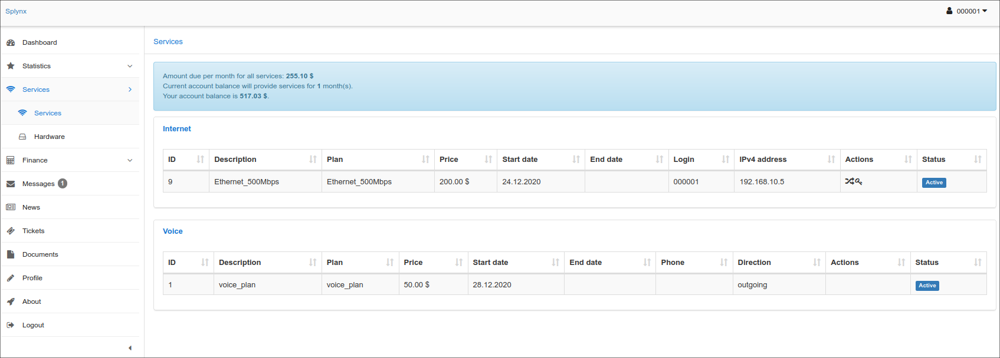
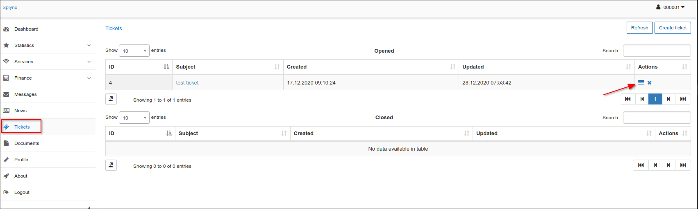
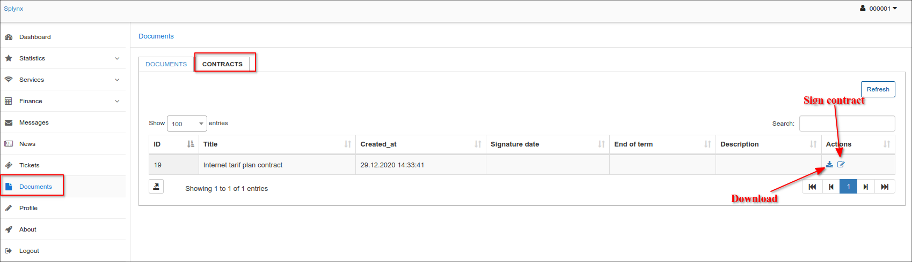
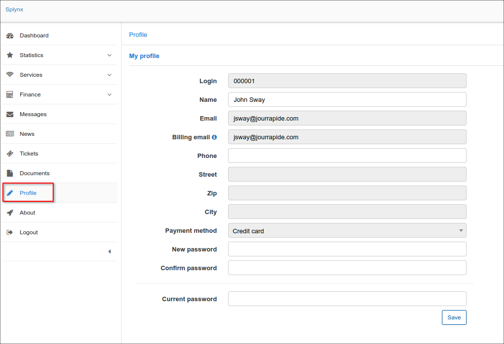

Customer Portal
==========

Customer portal provides for each customer a private access to their accounts containing information on their services, statistics and other financial aspects of provided services. The customers can also check their profile information, latest news and updates, important documents including financial documents and contracts, all messages received or tickets submitted for support team on the Portal.

<icon></icon> You will be able to open the Portal with your Splynx URL + 'portal'

**Example:**

- in case of HTTP: http://10.10.10.10/portal
- in case of HTTPS: https://your.splynx.domain/portal 

Another way to open the Portal - open the *Customer’s Information* tab and click on the `Login as customer` button in the *Actions* menu:

The system will open the customer's Portal in a new window.

------------------------------------------------------------

The navigation panel on the customer portal can display the following modules:

#### Dashboard

It displays general information about the customers account balance, unpaid (proforma) invoices, new messages, new tickets and latest news. If some of the payment add-ons is installed, its widgets will be displayed (only if the entry points are enabled) to pay the specific (proforma) invoice (-s) or top-up the customer account balance.

#### Statistics

It displays statistics of the services the customer has subscribed to and uses. In the top-right corner of the screen, customers can choose which service will be displayed in the statistics and specify the period of time to display statistics for.

#### Services

It displays all the customer's services such as Internet, Voice, Recurring or Bundle services.

The **Hardware** section shows an information about the customer router configured via [ACS](networking/tr069_acs/tr069_acs.md) in Splynx. Using the form a customer can reboot a device, change **SSID** name and **password** to Wi-Fi network:

#### Finance

It displays financial information such as **Transactions**, **(Proforma) Invoices**, **Payments** and **Statements**. Also, the section includes the **form to add/remove the credentials (credit card or bank account)** to the integrated payment services that are provided by installed add-ons in Splynx.
A customer can pay the unpaid invoice by some payment add-on, e.g. [Payment express](payment_systems/payment_express/payment_express.md) or download as PDF the necessary paid invoice or payment receipt by clicking on <icon class="image-icon"></icon> icon in *Actions* column of the relevant table.

A customer can click on <icon class="image-icon"></icon> (Export to) icon to print/copy any table date, e.g. the transactions list or export it to Excel, CSV, PDF file.

Also, a customer can view or download their account [statements](customer_management/customer_billing/customer_billing.md) by invoices/payments or transactions types:

#### Messages

It displays all messages that has been sent to the customer, e.g. via [Mass sending](support_messages/email_messages/email_messages.md).

Click on the subject name to read the message:

#### News

It displays the latest news and updates for the customer. This information will be displayed on *Dashboard* as well.

#### Tickets

All tickets submitted by the customer to the technical support and the support team's responses are displayed here. Click on <icon class="image-icon"></icon> (View) to read the ticket.

A customer can also **create and submit a new ticket** by clicking on the **Create ticket** button at the top-right corner of the page. In new appeared window, a customer can type a **Subject** of the ticket, choose a **Priority** and choose a **Type** of a ticket, as well as attach any files if necessary.

#### Documents

It contains any documents which can be important to a customer, such as technical manuals, agreements, manually created invoices, contracts to sign etc. A customer can **view** and **download** these documents, as well as, **sign the contract** by clicking on the related icon in *Actions* column of the table.

For more information, see [Customer documents](customer_management/customer_documents/customer_documents.md).

#### Profile

It displays a customer's main contact and access information. If the fields are marked in white, customers can modify the information presented in these fields, if they are dimmed, customers can only view this information.

In addition, in this section, a customer can change their password to log in to the Portal.

#### About

It displays the contact information of your company. The information can be added/edited in [Company information](configuration/system/company_information/company_information.md) section.

#### Logout

The option is used to logout from the customer *Portal*.

------------

**Portal configuration**

The **customer Portal can be configured** according your preferences and your company needs in `Config → Main → Portal`.

Suggested read: [Customer Portal](configuration/main_configuration/portal/portal.md) tutorial page.

Also, you might be interested in [How to change plan from customer portal](customer_portal/change_plan_from_customer_portal/change_plan_from_customer_portal.md) guide.
