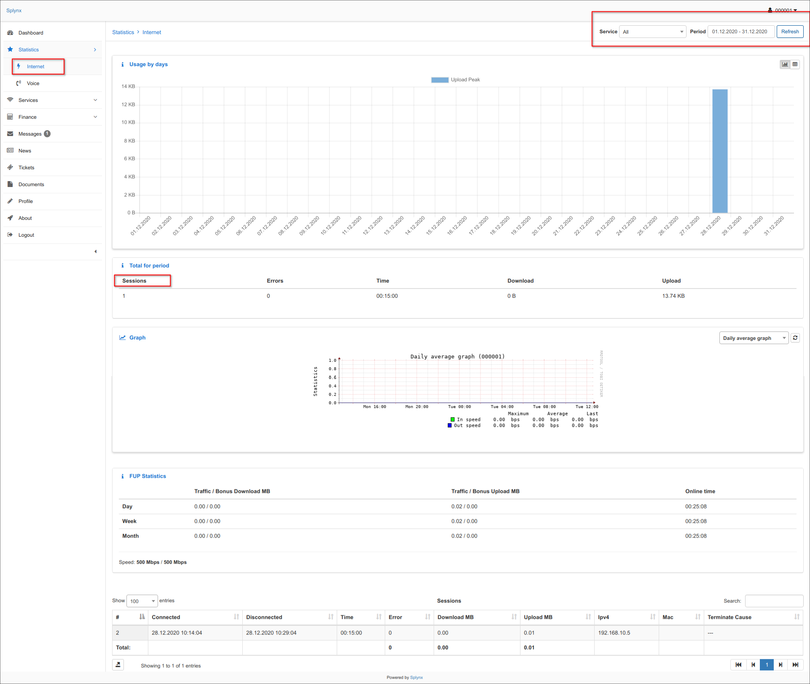
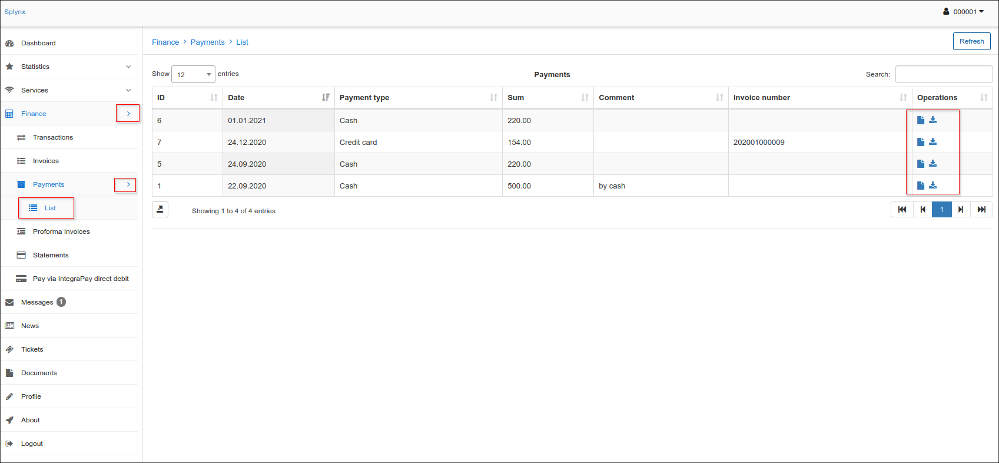
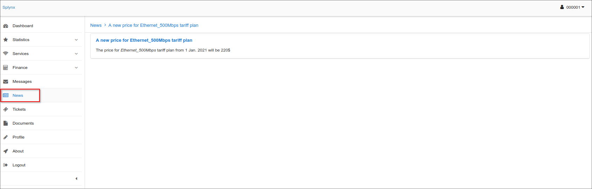

Customer Portal
==========

The customer portal provides each customer private access to their accounts containing information on their services and it's statistic, and financial aspects of provided services. Customers can also check their profile, latest news and updates, important documents including financial documents, all messages received or tickets submitted for support in the customer portal.

The navigation pane in the customer portal can display the following Modules:

* **Dashboard** -  displays general information about the customers current balance, unpaid invoices or proforma invoices, new messages, new tickets and latest news.

* **Statistics** - displays statistics of the services the customer is subscribe to and using. In the top-right corner of the screen, customers can choose which service to be displayed in the statistics and specify the period of time to display statistics for.

* **Services** - displays all the customer's services such as Internet, Voice or Custom services.

* **Finance** - displays financial information such as Transactions, Proforma Invoices, Invoices and Payments. Customer can view or download invoices and payments by clicking on the *View* icon <icon class="image-icon"></icon> or the *Download* icon <icon class="image-icon"></icon> in Operations column of the relevant tables.

* **Messages** - displayes all messages that has been sent to the customer via the Customer portal.
By clicking on the *View* icon <icon class="image-icon"></icon> in the Actions column, customers can read their messages.

* **News** - displays latest news and updates for the customer.

* **Tickets** - displays all tickets submitted by and for the customer, for technical support. By clicking on the *View* icon <icon class="image-icon"></icon> in the Actions column, customers can read their ticket.

Customers can also create and submit a new ticket by clicking on the Create ticket icon at the top-right corner of the page. The "Create ticket" window will appear, where customers can type the Subject of the ticket, choose a Priority, and type a message for their query, as well as upload any files if necessary.

* **Documents** - contains any documents which can be important for a customer, such as Agreements, Additional Agreements, manually created Invoices, Certificates etc. Customers can view and download these documents from here by clicking on the *Download* icon <icon class="image-icon"></icon> in the Actions column of the table.

* **Profile** - displays the customer's main contact and access information.  If fields are marked in white, customers can change information provided in those fields, if they are dimmed, customers can only view that information.

* **About** - Splynx contact information
* **Logout** - Logout from the customer portal

The **customer portal can be configured** according your preferences and your company needs. To configure the Customer portal navigate to `Config → Main → Portal`. The main sections that are configurable here will be:

1. Main
2. Menu
3. Dashboard
4. Profile
5. Statistics
6. Services
7. TOP-UP settings
8. Manual TOP-UP
9. Finance
10. Logout timeout
11. Hotspot
12. Additional attributes in profile.

For more information about configuring the Customer Portal please read our [Customer Portal](configuration/main_configuration/portal/portal.md) tutorial page.
