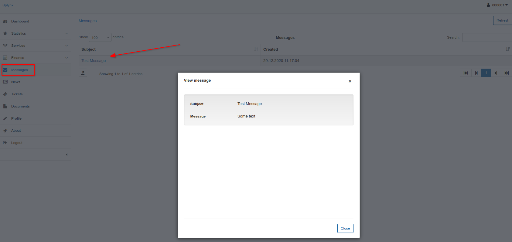

Customer Portal
==========

Customer portal provides each customer a private access to his Account containing information on his services and its statistic, financial aspects of provided services. Customer can also check here his profile, latest news and updates, important documents including financial documents, all messages received or tickets submitted for support.

A Side panel of customer's account in portal can display following Modules:

* **Dashboard** - can display general information about  customer current balance, unpaid invoices or proforma invoices, new messages, new tickets and latest news.

* **Statistics** - shows statistic of the services customer is using. In the top-right corner of the screen customer can choose type of the service to be displayed in statistics and period of time.

* **Services** - show all customer's services such as Internet, Voice or Custom services.

* **Finance** - displays financial information such as Transactions, Proforma Invoices, Invoices and Payments. Here customer can view or download them by clicking on *View* icon <icon class="image-icon"></icon> or *Download* icon <icon class="image-icon"></icon> in Operations column.

* **Messages** - shows all messages has been sent to a customer to Customer portal.
By clicking on *View* icon <icon class="image-icon"></icon> in Actions column customer can read the message.

* **News** - shows latest news and updates for a customer.

* **Tickets** - shows all tickets submitted for technical support. By clicking on *View* icon <icon class="image-icon"></icon> in Actions column customer can read the ticket.

Here customer can also create and submit a new ticket by clicking on Create ticket icon in the top-right corner of the screen. The window "Create ticket" will appear where customer will write Subject of the ticket, choose Priority, write a message and upload any files if needed.

* **Documents** - contains any documents which can be important for a customer, such as Agreements, Additional Agreements, manually made Invoices, Certificates etc. Customer can view and download them from here by clicking on *Download* icon <icon class="image-icon"></icon> in Actions column of the table.

* **Profile** - shows customer's main contact and access information.  If fields are marked in white customer can change information in them, if they are dimmed customer can only view that information.

* **About** - Splynx contact information
* **Logout** - Logout from customer's account

**Customer portal can be configured** according your and your company needs. To configure Customer portal click on `Config → Main → Portal`. The main sections to configure here will be:

1. Main
2. Menu
3. Dashboard
4. Profile
5. Statistics
6. Services
7. Finance
8. Additional attributes in profile.

Detailed information about configuring Customer Portal can be found here - Portal. [Portal](configuration/configuration.md)
