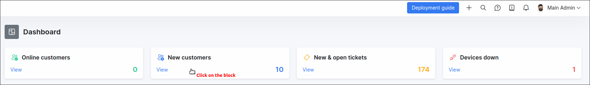

Dashboard
=========

Dashboard is the main control panel in Splynx which will help you check financial and customer statistics on a daily basis. From the dashboard, you can also monitor system performance and immediately get information about your network health and other modules.

At the top of the live dashboard you can find the number of online customers, the number of new customers, new and open tickets as well as the number of devices that are down in your network, in summarized information boxes or if you looking for more detailed lists of data provided in the boxes, we've conveniently added view buttons to the boxes so you can quickly navigate to the full lists.

**Live dashboard** is divided into 6 main parts:

_System status_ <icon class="image-icon"></icon> - displaying information on free memory, last DB backup, last remote backup, etc.

_Customers_ <icon class="image-icon"></icon> - representing statistics about new, active, online, online today, blocked customers, etc.

_Networking_ <icon class="image-icon"></icon> - a brief count of the number of routers, IPv4 networks, Monitoring, public and private addresses etc.

_Finance_ <icon class="image-icon"></icon> - a convenient table with the statistics of unpaid/ paid, debit transactions and payments for the current and last months.

_CRM_ <icon class="image-icon"></icon> - a count of all leads, quotes and deals in the system.

_Tickets_ <icon class="image-icon"></icon> - a quick list of tickets grouped by the status thereof.

The navigation pane is located on the left side of the page, with the following modules:

[Tariffs](configuring_tariff_plans/configuring_tariff_plans.md) - The list of all your services and products in the system.

[CRM](crm/crm.md) - Your prospective client management platform.

[Customers](customer_management/customer_management.md) - Your customizable list off all customers in the system.

[Tickets](tickets/tickets.md) - Your in-house ticketing system and the home of your support communications.

[Finance](finance/finance.md) - Your business in a financial aspect.

[Inventory](inventory/inventory.md) - Physical products and equipment is managed here.

[Networking](networking/networking.md) - The powerful Splynx networking management platform.

[Support](support_messages/support_messages.md) - Your support communications system for all your customers.

[Scheduling](scheduling/scheduling.md) - Your technical staff manager.

[Voice](voice/voice.md) - The Voice home of your voice rates and CDR processing.

[Administration](administration/administration.md) - The administrative page of your Splynx server.

[Config](configuration/configuration.md) - Where all configurations for each module is done.

[My profile](my_profile/my_profile.md) - A profile page of the administrator currently logged into the system.

Logout - Logout from the system.
