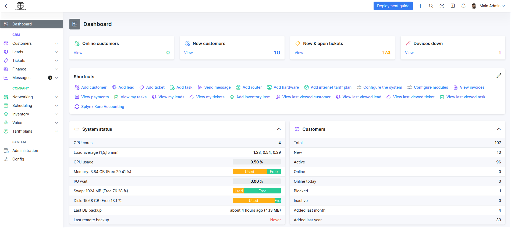
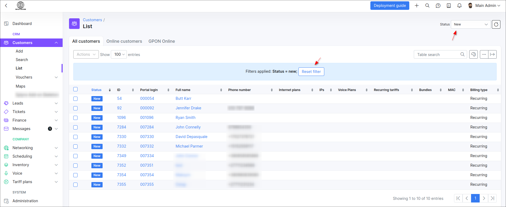
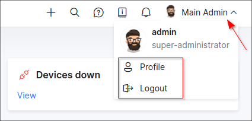
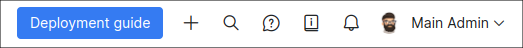

Dashboard
=========

**Dashboard** is the main control page in Splynx which will help you check financial and customer statistics on a daily basis. From the dashboard, you can monitor system performance and immediately get information about your network devices health and the state of other modules. Using the **shortcuts** gives you access to regular actions in Splynx.

At the top of the live dashboard you can find the blocks with the summarized information about the number of **online customers**, **new customers**, **new and open tickets** and the number of **devices down** in your network.

In order to open a more detailed list of the data presented in the blocks, use the buttons withing the blocks, it helps to quickly jump to the full list of necessary information.

### Shortcuts

On this panel can be configured and pinned the quick actions available in Splynx. The list of actions depends on the role of the account. Note, when we install at least one add-on on the system, the `Install add-ons` item will change to `Configure modules` one.

**Example:**

We can navigate to `Config → Integrations → Add-ons`, find the necessary add-on and click on `Install`, but it's faster to click on `Install add-ons` action in *Shortcuts* panel.

### Live dashboard

Live dashboard is divided into **6 main parts**:

**System status** <icon class="image-icon"></icon> - displaying information on free memory, last DB backup, last remote backup, etc.

**Customers** <icon class="image-icon"></icon> - representing statistics about new, active, online, online today, blocked customers, etc.

**Networking** <icon class="image-icon"></icon> - a brief count of the number of routers, IPv4 networks, Monitoring, public and private addresses etc.

**Finance** <icon class="image-icon"></icon> - a convenient table with the statistics of unpaid/ paid, debit transactions and payments for the current and last months.

**CRM** <icon class="image-icon"></icon> - a count of all leads, quotes and deals in the system.

**Tickets** <icon class="image-icon"></icon> - a quick list of tickets grouped by the status thereof.

### Main sidebar

The navigation sidebar on the left side has the following modules:

**CRM:**

- [Customers](customer_management/customer_management.md) - the configurable list of all customers in the system;

- [Leads](crm/leads/leads.md) - the configurable list of all leads in the system;

- [Tickets](tickets/tickets.md) - the ticketing system and the place of support communication;

- [Finance](finance/finance.md) - all aspects related to your finance;

- [Messages](support_messages/support_messages.md) - the support communication system for all your customers;

**COMPANY:**

- [Networking](networking/networking.md) - the networking management platform;

- [Scheduling](scheduling/scheduling.md) - the *To Do* list for your technical staff;

- [Inventory](inventory/inventory.md) - the physical devices and the equipment are managed here;

- [Voice](voice/voice.md) - the voice rates and CDR processing management;

- [Tariff Plans](configuring_tariff_plans/configuring_tariff_plans.md) - the list of all your services and products in the system;

**SYSTEM:**

- [Administration](administration/administration.md) - the administrative page of your Splynx server;

- [Config](configuration/configuration.md) - the place where all settings for each module are located.

In the upper right corner of the page the **ACCOUNT** menu is located with the next modules:

- [My Profile](my_profile/my_profile.md) - the profile page of the administrator currently logged into the system;

- `Logout` - the option to logout from the system

### Top bar features

| Icon  | Description  |
| ------------ | ------------ |
| <icon class="image-icon"></icon>   **Quick addition** | the following actions available: `Add lead`, `Add customer`, `Add ticket`, `Add task`.  |
| <icon class="image-icon"></icon>   **Search** |the global search of Splynx. |
| <icon class="image-icon"></icon>   **Help and Support**| create a new ticket for Splynx support.   |
| <icon class="image-icon"></icon>   **Documentation** | open the documentation in the sidebar. Each article can be opened in a new window. |
| <icon class="image-icon"></icon>   **Notifications** | the list of recent notifications.|

**Quick addition**

If you are on some Splynx page, other than *Dashboard*, you can easily perform actions such as `Add lead`, `Add customer`, `Add ticket`or `Add task` by clicking on quick action icon.

**Global search**

[→ How to use the global search in Splynx](customer_management/search/search.md)

**Help and Support**

The action is used to create a ticket for Splynx support team. Please, use this option when it's strictly necessary and after the related documentation is examined.

**Documentation**

The instant access to the appropriate documentation in the Splynx window. Depending on which page you are on, the necessary manual will open in the right sidebar after clicking on the icon. The manual can be opened in a separate tab of the web browser and you can navigate to the `Table of contents` of the full documentation as well.

**Notifications**

The list of the recent events in Splynx, e.g. a new ticket was received, etc.

 
 

**Enjoy your work with Splynx!**
