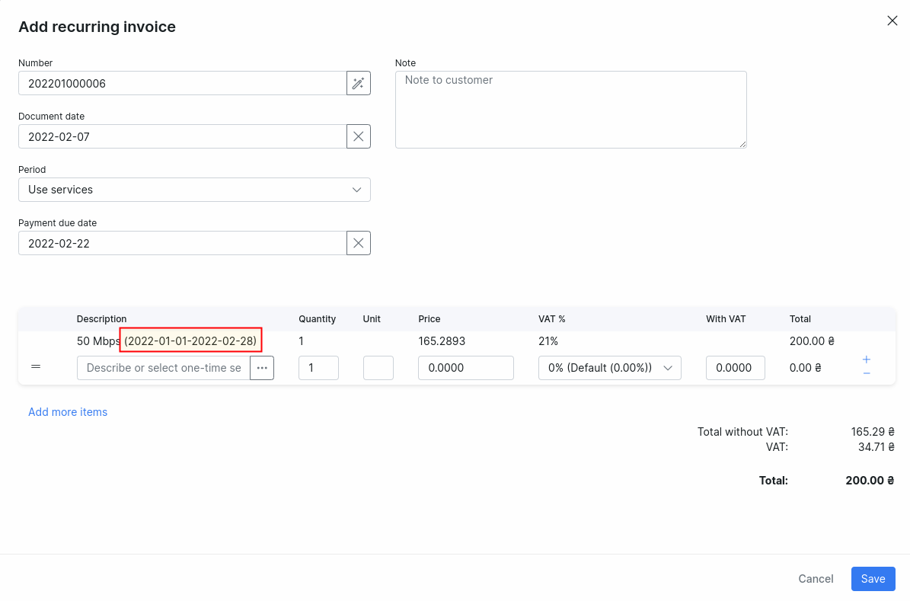
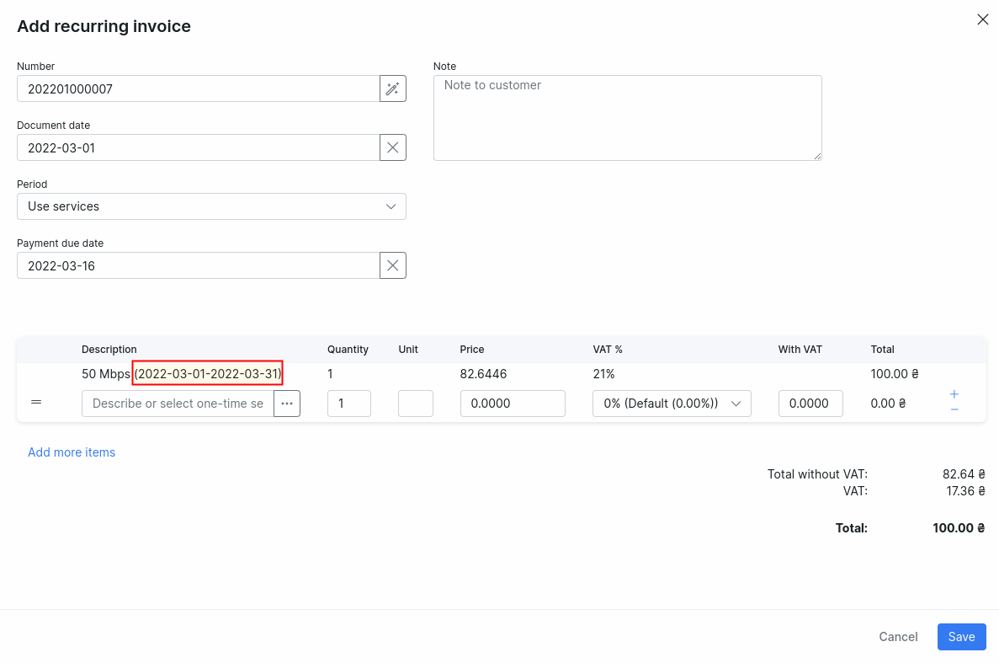
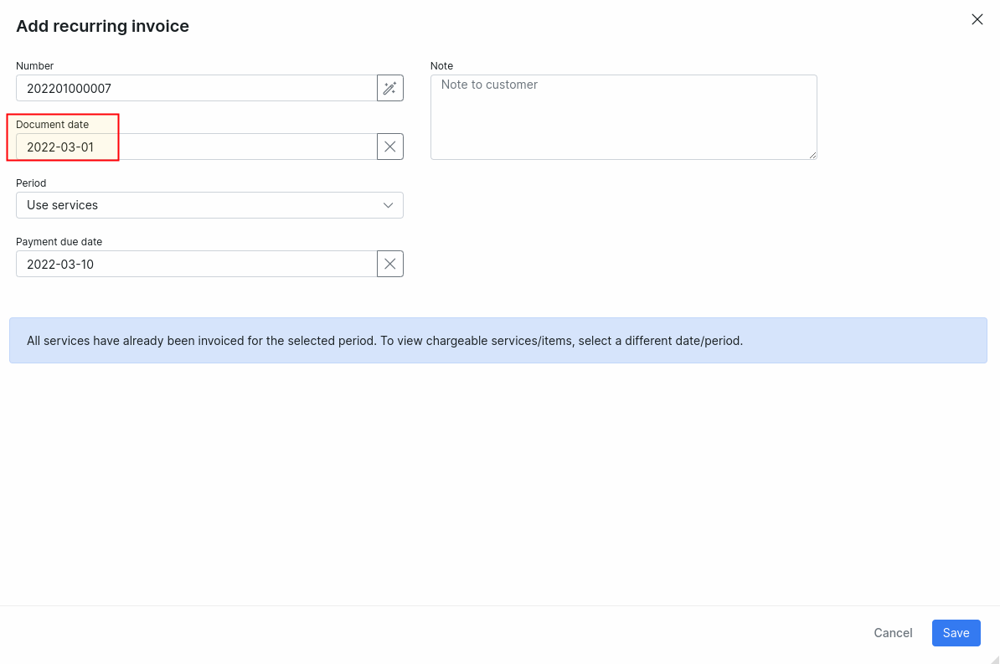

Disabled services in finance preview. Explanation of service's end/start dates in billing run.
=================

Sometimes our clients are confused with the situation when some service continue to charge even when the status is disabled. Another confusing situation is when after update of start/end date, in charge preview Splynx tries to charge this service for extra months. In most cases this is related to uncharged period for this service.

First of all, keep in mind that services with statuses **Stopped** and **Archived** are not included in the billing run, Splynx just ignores services with such statuses.
It means that you can update start/end dates for such services and it won't make affect on billing.

**!NOTE** Stopped service with the start date in the future, will be activated automatically at that date.

Services with statuses **Active**, **Pending** and **Disabled** are included in the billing run and it's quite obvious for Active and Pending services, but what about Disabled? For Disabled services it's crucial to have the start date and the end date and for correct billing run this service must be charged for entire period from the start date till the end date. Let's have a look on examples:

On 7 Feb. 2022 I created an internet service with start date = 2022-01-01:

Now I'm going to create a recurring invoice for this customer to charge this service:

As you can see this service is going to be charged for 2 months (January and February) because Splynx noticed that January wasn't charged before.

Let's imagine the situation when this customer paid this invoice but decided to stop using this service starting from March 2022.

As you can see from the screenshot this service is accounted till 2022-02-28:

To disable this service in a correct way the end date should be set to 2022-02-28 as well:

In this case, in next billing run for March this service won't be charged because period from the start date (2022-01-01) till the end date (2022-02-28) is charged and paid. But when the end date is empty, and status is disabled Splynx will generate a finance preview for March for this disabled service:

Alternatively, this service can be placed to **Stopped** or **Archived** in the end of charged period to avoid charging in next billing run:

