Applying Credit
=============

## How to apply Credit to future invoices

In certain cases, you may have a customer with a positive balance however it is not enough to pay for the cost of their services on the next invoice. So the customer wants this positive balance to be deducted from the next invoice. Let's use an example to illustrate the process of applying credit to a customer's account.

For example, the customer's account balance is $10:

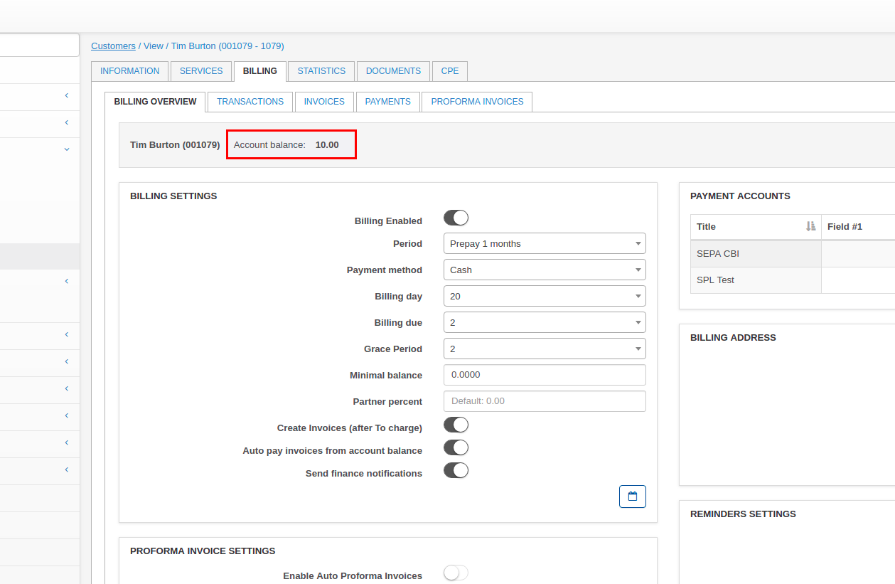

From the list of transactions you can see That the customer's first payment was more than invoiced amount:

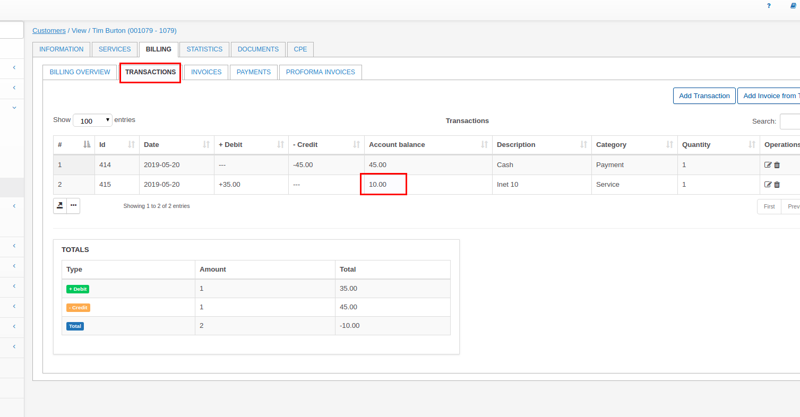

From the Services tab, you can see the tariff price is $35:

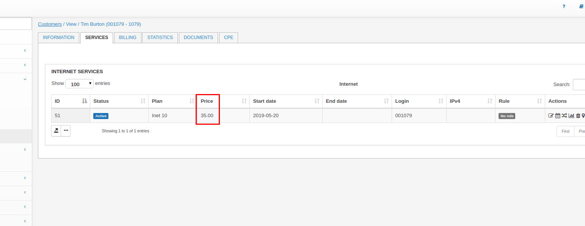

If you were to charge the customer for the next invoice, you will see the price of the service again on the invoice preview:

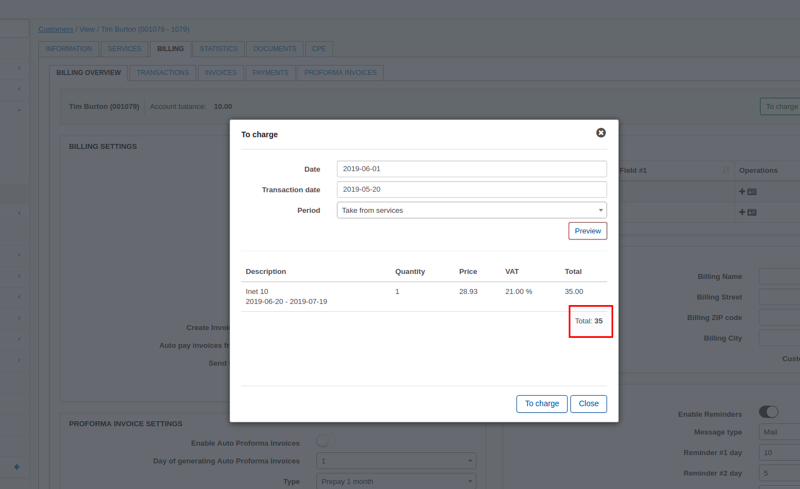

To resolve this issue and apply $10 credit to the future invoice,  the next steps should be taken:

1. Create a Debit transaction with the same Total as account balance (Description and Category doesn't really matter, this is for your personal reference):

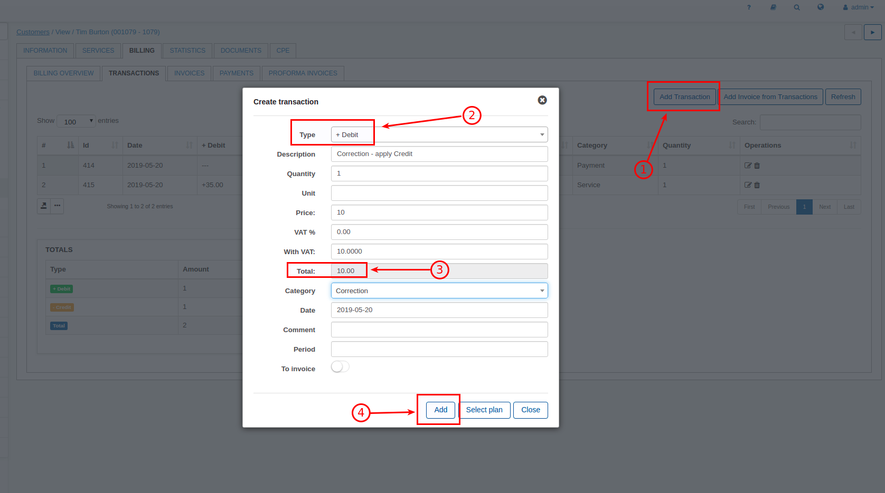

2. Create a Credit transaction with the same Total as account balance, but it's **critical to turn on the "To invoice" toggle**:

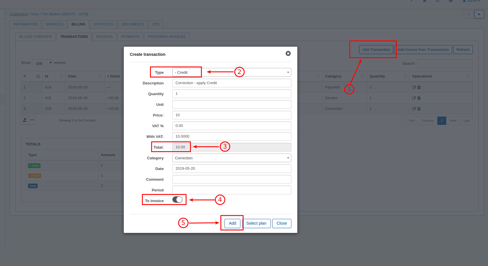

That's all you need to do  - only two transactions. Then we can check the customer's balance (it's the same - $10):

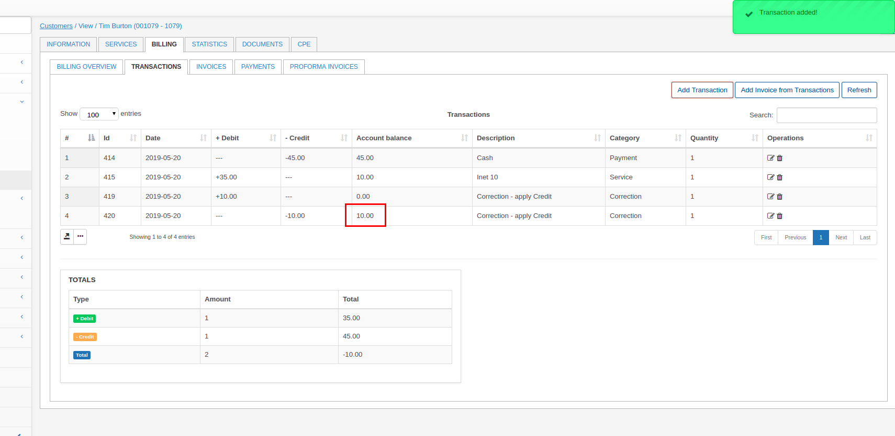

The final step will be to charge the customer for the future invoice with the "Charge & Invoice" button in the Billing overview tab or simply wait for the next billing day for the system to create the invoice automatically:

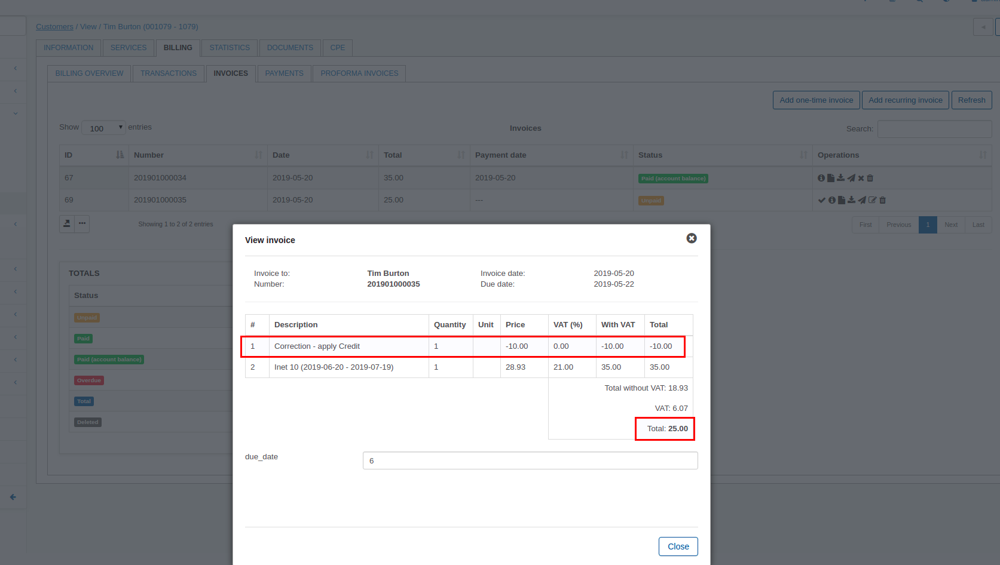

As you can see - the new invoice includes the Credit correction transaction and the reduced total amount.

_Notice: Please don't worry if the preview via the Charge & invoice button does not show the Credit transaction - it is normal. The invoice will be correct, with Credit transaction if these steps were taken._

## How to apply credit to customer accounts with invoices

Credit note can be created in Splynx by means of invoices.

When you create a invoice in Splynx with a negative amount (-), Splynx automatically changes the tax invoice to a credit note.

To apply credit with invoices, please follow the steps below:

1. Navigate to the respective customer's billing tab and enter the invoice section:

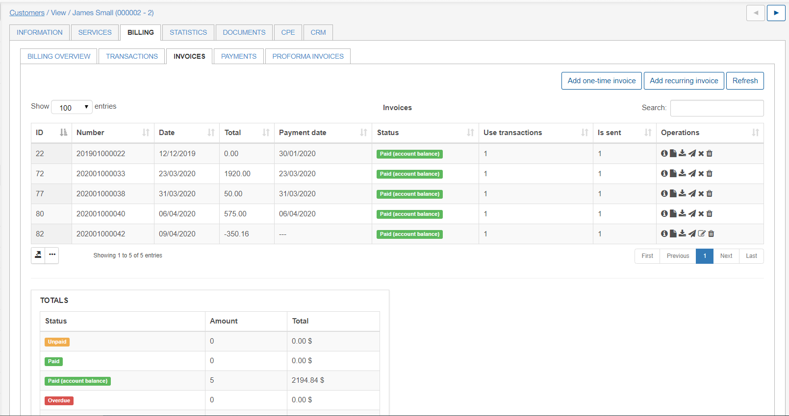

2. Add a one time invoice by clicking on the  "Add one-time invoice" button located about the table on the right, a window will appear for you to add the details:

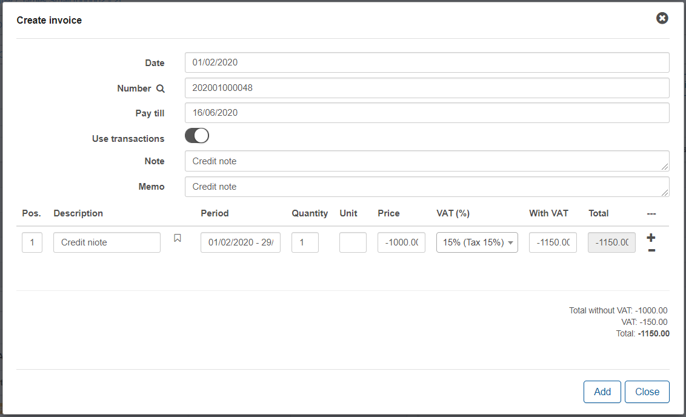

Dates can be specified if need be. Notes for the customer and a memo for yourself is recommended. Add a description of your choice for the credit note. The period is optional and the most important part is to add a amount with a negative value "-".

Once the invoice has been created it will appear in the list of invoices and can be operated with the tools in the actions column.

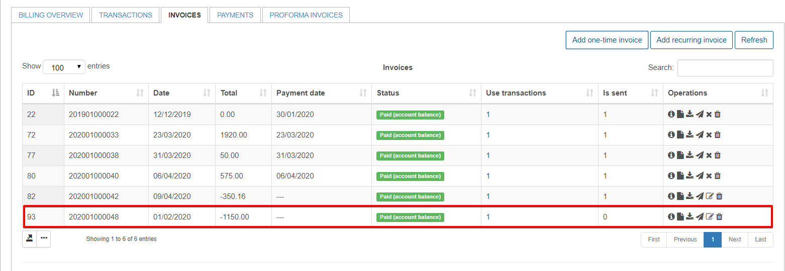

The customer will now have an updated account balance with the amount added to the total.

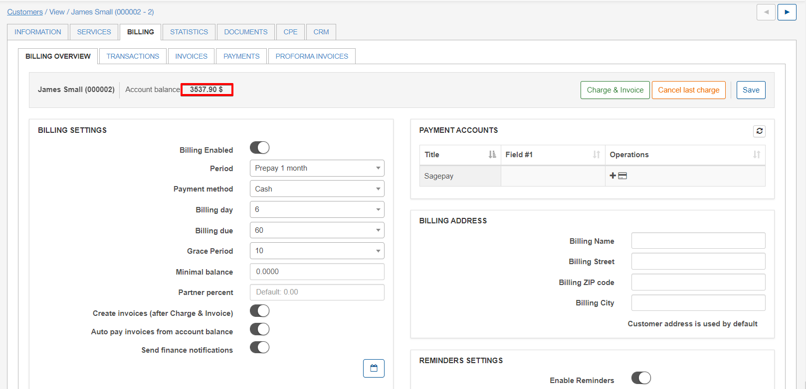
