Bank statement processing
==========

The bank statement processing feature lets you reconcile payments receivable with invoices issued by paring them, so it can proceed multiple payments. Bank payment transactions are automatically processed by Splynx handlers – small modules created for each bank file format.

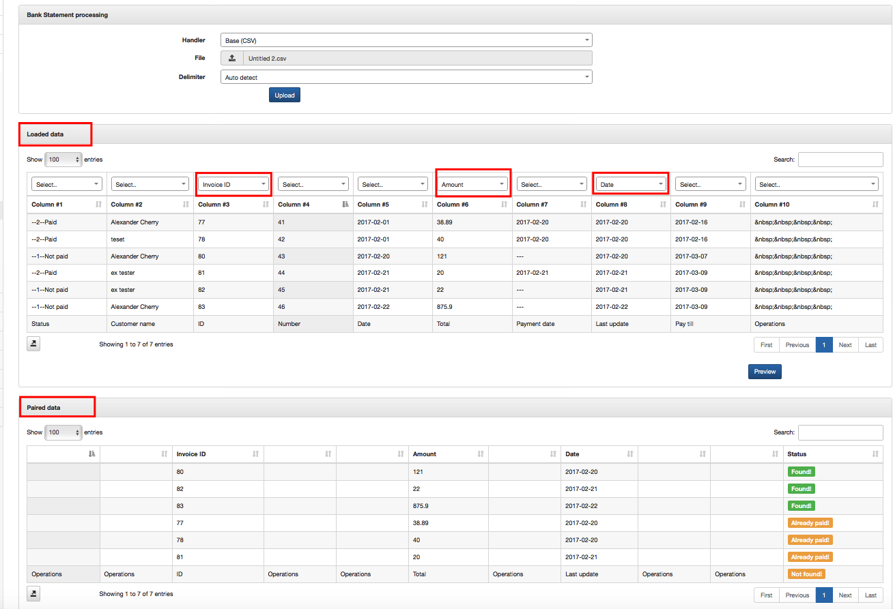

---
Bank statement processing starts with **importing bank statement format file** into Splynx. For each bank different handler can be used. We can also connect your bank to email processing bank statements.

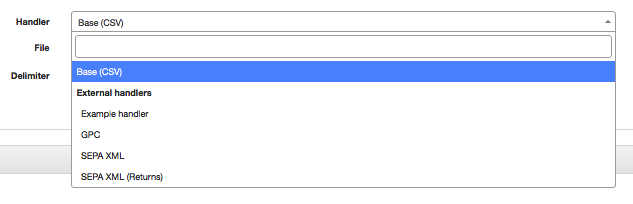
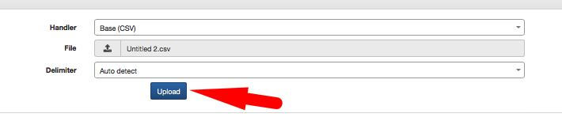

---
When the file's been downloaded next step is **to set up matching criteria** for bank statement processing and click on *Preview*.

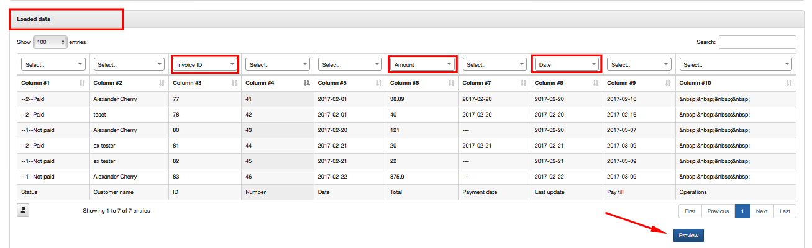

---
The table with paired data will appear where we can **check all matches** with payments and invoices. To finish process multiple payments click on Process button below the table.

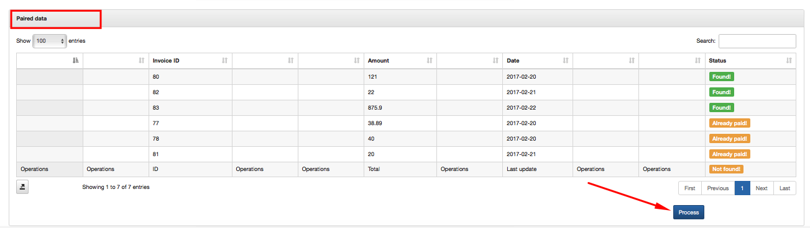

---
The message will appear that payments **paired successfully**. Then, in Bank Statements History (`Bank Statements → History`) you will be able **to check downloaded file** with information in the table about status of bank statement importing, records, processed payments and errors.

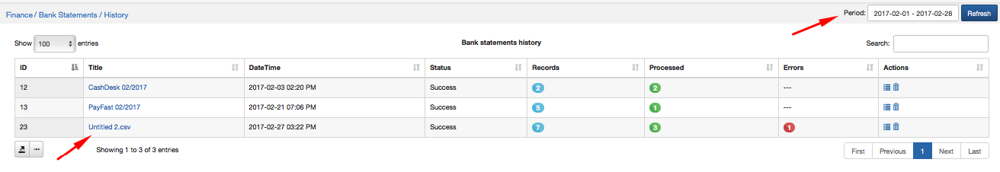

It is possible to see processed payments from particular bank statement more detailed. If you click on View option <icon class="image-icon"></icon> in Actions  or on a title of each file in Title column, the window will pop-up with description of every status of processed payment.

Payments with Error or Ignored status can be checked and **paired manually** by clicking on  icon <icon class="image-icon"></icon> in Actions. Payments will be in Ignored status when they've been already paid, but you can always double check them and manually pair.

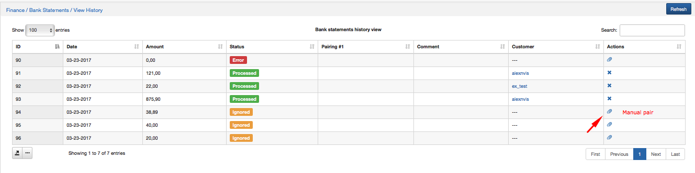

When you click on Manual pair icon <icon class="image-icon"></icon>, a new window will pop-up, where you can search for a customer by entering his ID, Login, Contact details, Partner, Status, etc. in Customer section of the table.

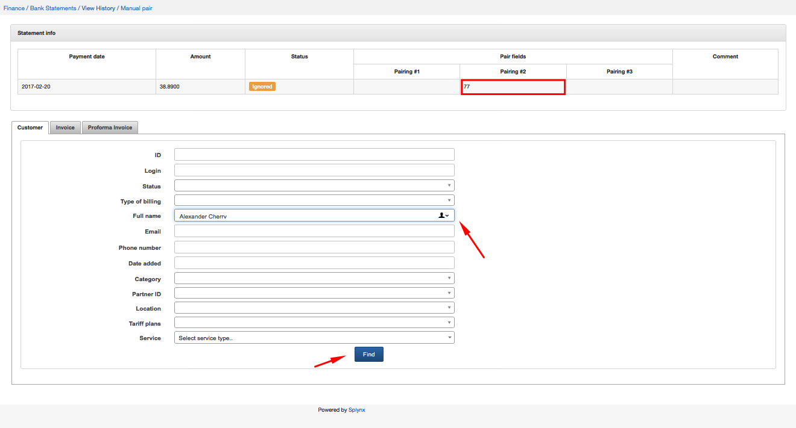

You can also search by entering Invoice number or Proforma Invoice number in Invoice section or Proforma Invoice section of the table or check all invoices/proforma invoices for a particular period.

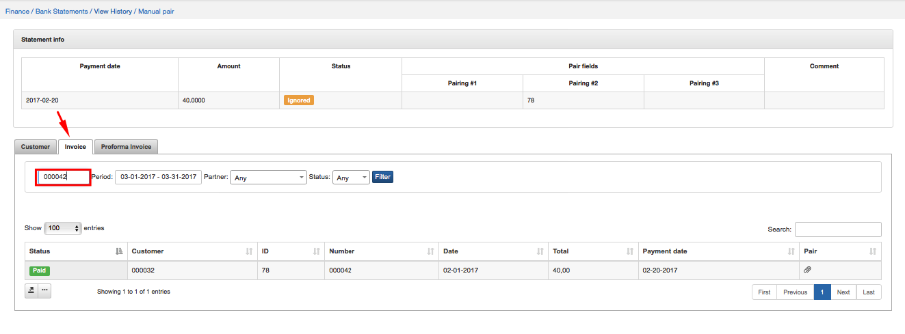

When you find a customer who's payment needs to be paired, click on *Manual pair* icon <icon class="image-icon"></icon> in Pair column of the table. The window will pop-up where you will confirm the paring.

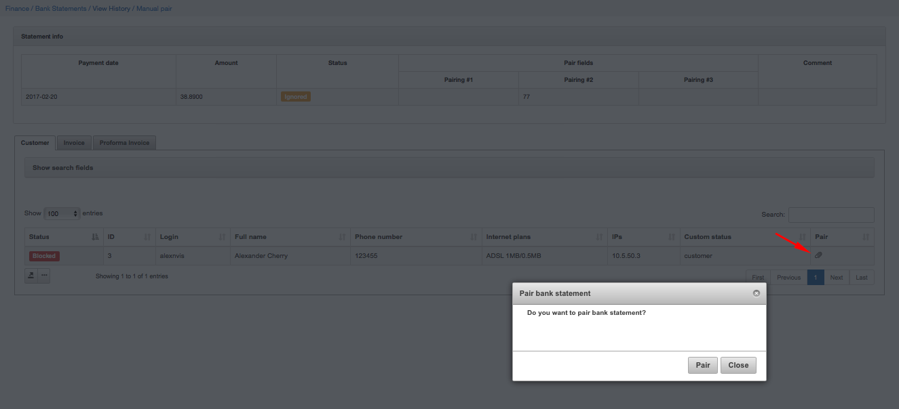

After manual paring is done the status of the payment in a Bank statements history view (`Finance → Bank Statements → View History`) will be marked as *Manually paired*.
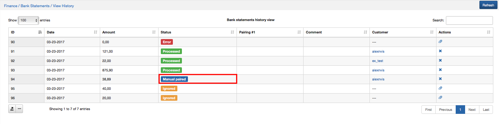
