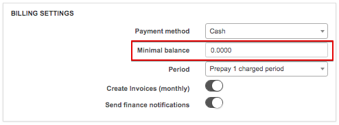

Billing engine
==========

In this section, we describe the difference between Recurring and Prepaid billing of a customer.
Let's start with the financial dashboard, which shows us a quick overview regarding information about your Splynx financial status:

Quick totals for the following data and buttons to direct to a list for each:

* Debit transactions
* Payments
* Paid Invoices
* Unpaid invoices
* Payment requests
* Unpaid requests

Totals data for the above mentioned for each of the following periods:

* Last Month
* Current Month
* Next Month

The dashboard also includes the following mini-reports in form of graphs:

* Invoicing for period (VAT Included)
* Payments for period (VAT Included)
* Top 10 payers
* Top 10 debtors
* Monthly recurring revenue
* Average revenue per user

Each of the graphs can be customized to view provided time frames for specific partners and locations.

A separate table is also included with information on all overdue invoices

## Recurring billing engine

Recurring billing is the best solution for ISP's charging customers' a fixed price on a recurring basis typically at the beginning of the billing cycle. The Recurring type of billing is selected by default in the Splynx global configuration.

You can set up a **recurring billing** for a customer in the Customer Information section (`Customers → View`), by clicking on *Type of billing* option and choosing *recurring billing* as a type of billing.

---------
**Recurring Invoices** can be issued every month in advance with *Prepay* or in *Postpay* Mode.

The logic around prepay is, for example, on the 1st of May, Splynx will generate invoices for the period of 1 - 31 of May.

Postpay means that Splynx will generate invoices on the 1st of May for the period of 1-30 of April.

Customers using the recurring billing type can be set to use Postpay or Prepay mode, navigate to `Customers → View → Billing → Billing overview`.

In Billing settings, click on the "Period" drop-down list and choose between Postpay or Prepay mode with options to pay up to 12 months in advance.

Choose a *Payment Method* for recurring billing, options available are Cash, Bank Transfer, Credit Card, PayPal, Refill Card, BrainTree and others when installed and configured.

---------
The next step of setting up "Recurring billing" will be to choose the *Billing day*, *Billing due day* and a *Grace period*.

* **Billing day** - the day invoices will be generated automatically.
* **Billing due day** _ the last day the customer has to make a payment before getting blocked.
* **Grace period** - the number of days after the billing due until the system will automatically mark the customer status as inactive and
In our example, we choose the 1st day of the month as the billing day and 15 days thereafter, as the Billing due day. This means that invoices will be generated on 1st day of the month and if the customer fails to make a payment before or on the 15th day of the month, the customer will be blocked and his services will be suspended.
**Minimal balance** - the minimum amount funds to be available in the customer's account after service charges to avoid being blocked, this field is 0.0000 by default.

Bear in mind, although the customer is blocked and their services suspended, the system will still account for the services from a billing perspective.

The system will only stop accounting for customer billing when the status has changed to

## Prepaid billing engine

Prepaid billing is used when ISP's charge customers in advance for services and only provide them with access for certain periods of time. When the time period has been reached and the customer's account balances are not sufficient to pay for the continuation of services, the customer is disconnected until payments are made to continue services.

To configure **Prepaid type of billing** we start by changing the _Billing type_ of the customer to "Prepaid (Custom).

The next step is to choose the *Payment method*,  options are Cash, Bank Transfer, Credit Card, PayPal, Refill Card, BrainTree and others when additional methods are installed.

Then we define the minimum amount of funds to be available in the customer's account after service charges to avoid being blocked in the *Minimal balance* field, this field is 0.0000 by default.

Customers can be charged for daily, monthly or by any custom periods, (for example, one week), with the use of prepaid tariff custom periods.

By default, all prepaid tariffs are set to charge customers monthly.

However, it is possible to set any desirable period. Simply change the Prepaid Period of the service to **Days amount** and select the desired amount of days.

The next step is to set the 'Period' in the customer's billing settings `Customer → Billing → Billing overview`.  Any desired charged period can be set, to suit the unique needs of customers and every ISP.

After configuring the customer's prepaid billing parameters, we need to add a payment to the customer’s account by clicking on the Add payment button in `Customer → Billing → Payment`. For example, 30 USD has been added, to activate their services.

After the deposit has been made we then proceed to activate the customer's services by manually charging the customer with the **Charge & Invoice** button.

After charging the customer 30 USD and the customer is provided with access for one month.

If the option to Create invoices (*after charge&invoice*) is enabled in finance settings under `Config / Finance / Settings`, Splynx will generate an invoice for consumed services on the first day of the next month.

When using the Prepaid daily option, Splynx calculates the daily rate of the plan and charges the customer every day. Let's imagine that a customer's service costs 40 USD. There are 31 days in July, so the daily rate will be 1,29 USD.

The following day the customer's balance will be changed from 40 USD to 38,71 USD, deducting the cost of services for the day, and this will continue to decrease every day according to the customer's plan.

---
In the situation, when the customer has added 20 USD on a deposit, he will get access for 15 days only. Once the balance reaches “0”, Splynx will block him. Also, one transaction has been added, which shows how much we charged. This transaction is updated every day and it shows the total amount of money that has been taken from the customer’s deposit.
