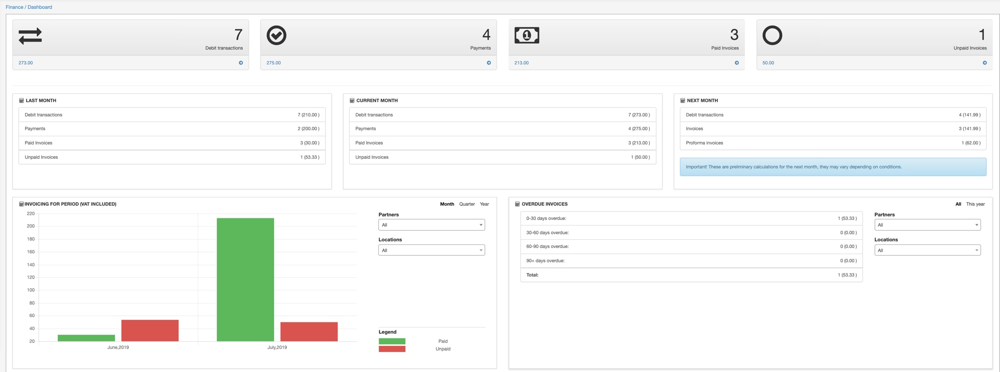
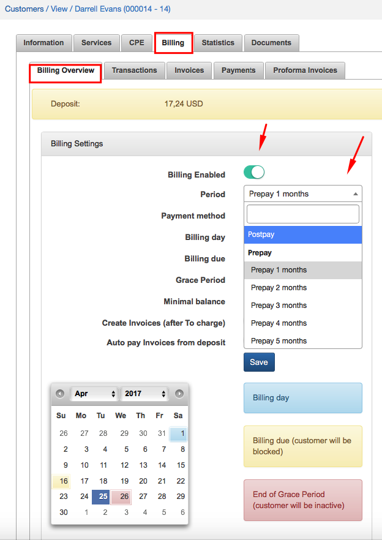
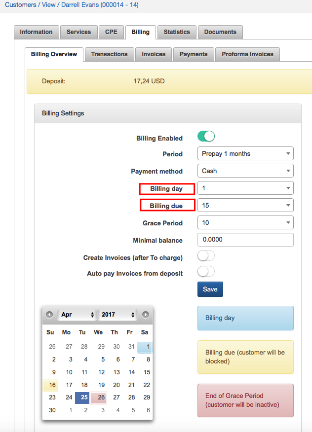
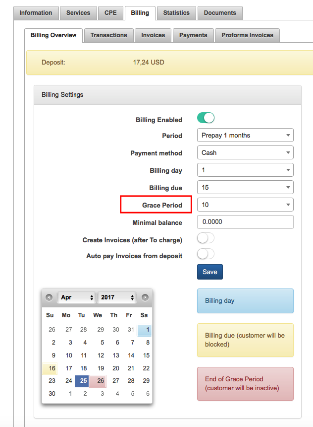
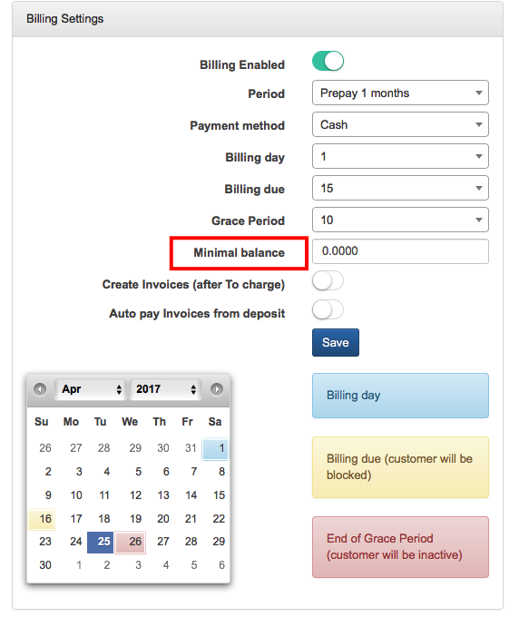
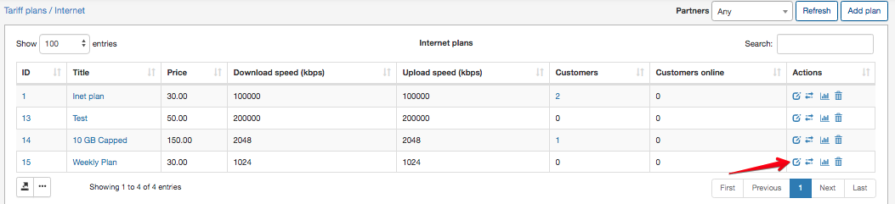
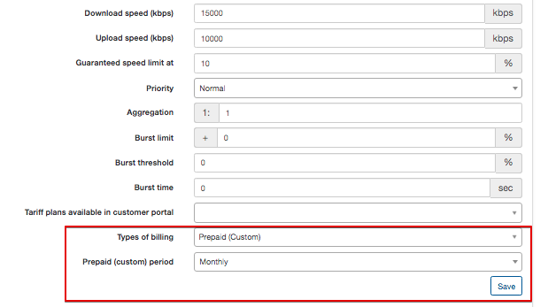
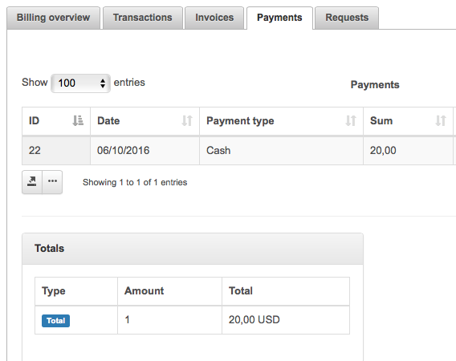
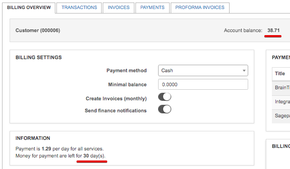

Billing engine
==========

In Billing engine section we describe the difference between Recurring and Prepaid billing of the customer.
Let's start with financial dashboard that shows us information about Splynx financial status:

* Debit transactions
* Payments
* Paid Invoices
* Unpaid invoices

The dashboard also includes the following mini reports:
* All invoices for a set period
* Invoices that are overdue
* Top 10 payers
* Top 10 debtors
* Monthly recurring revenue
* Average rate per user

In particular, it shows the current month and last month statistics.

## Recurring billing engine

Recurring billing is the best solution for ISP charging customer a fixed price on a recurring basis typically at the beginning of the billing cycle. Recurring type of billing is set by default in Splynx global configuration.

You can **set up recurring type of the payment** for a customer in Customer Information section (`Customers → View`) by clicking on *Type of billing* option and choosing *Recurring payments* as a type of billing.

---------
**Recurring Invoices** can be issued every month in advance *Prepay* or in *Postpay* Mode.

One month in advance means, for example, that 1st of May Splynx will generate invoices for 1-31 of May.

Postpay means that Splynx generates invoices on 1st of May for the period of 1-30 of April.

You can set up Prepay or Postpay mode of recurring payments in `Customers → View → Billing → Billing overview`.

In Billing settings click on Period and choose Postpay or Prepay mode with options to pay up to 12 months in advance.

Choose a *Payment Method* for recurring payment, such as Cash, Bank Transfer, Credit Card, PayPal, Refill Card, BrainTree and others.

---------
The next step of setting up Recurring payments will be to choose the *Billing day* and *Billing due day*.

* **Billing day** is a day of Invoice generating.
* **Billing due day** is the last day when customer have to make a payment before get blocked.

In our example we choose 1st day of the month as a billing day and 15th day of the month as Billing due day, which means that Invoice will be generated on 1st day of the month and if customer don't make a payment until 15th day of the month, the next day he will be in blocked status.
Even though customer will have blocked status, his services will be still accounted.

---
You can choose a **Grace period** - time when customer will have inactive status. In our example it will be 10 days, which means after 10th day customer's status will be automatically changed for inactive and his services won't be accounting.

**Minimal balance** defines the customer balance in Recurring payment and is set by default to "0" in Global configuration, but it it possible to set it up here individually for a customer.

## Prepaid billing engine

Prepaid billing is used when ISP charges customer in advance and provide him access for certain period of time. When balance of the customer reaches set limit, he is disconnected.

**To set up Prepaid type of billing** we need to change the billing type of customer to Prepaid (Custom).

The next step is to choose *Payment method*,  such as Cash, Bank Transfer, Credit Card, PayPal, Refill Card, BrainTree and others.

Then we define what is the value of customer’s balance when Splynx will block his access to internet.
By default it is set to “0”, but it can be changed in configuration of each customer inside of the field “Minimal balance”.

Starting from Splynx v.2.3 it is possible to charge customers **daily, monthly or by any custom period (like one week)**  with the custom prepaid plans.

By the default all prepaid tariff services are set to charge customers monthly.

However it is possible to set any desirable period. Simply change the Prepaid Period of the service to **Days amount**.

The next step is to set the 'Period' in customer's billing settings `Customer → Billing → Billing overview`. It is possible to set any desired charged period to suit the unique needs of customers and every ISP.

After setting up “Prepaid” type, we need to add a payment to customer’s account by clicking on Add payment  button in `Customer → Billing → Payment`. For example, 30 USD has been added.

The deposit of the customer changed to 30 USD and we can manually charge the customer by clicking **Charge & Invoice** button.

After all the customer was charged 30 USD and provided with access for one month.

If option Make invoices (*after to charge*) is enabled, Splynx will generate an invoice for consumed services on a first day of the next month.

---
In case, we set the Prepaid daily option, Splynx calculates the daily rate of the plan and charges user every day. Let's imagine that customer's service cost 40 USD. There are 31 days in July, so daily rate will be 1,29 USD.

Tomorrow customer's balance will be changed from 40 USD to 38,71 USD and will continue decreasing every day according to his plan.

---
In the situation, when customer has added 20 USD on a deposit, he will get access for 15 days only. Once the balance reaches “0”, Splynx will block him. Also one transaction has been added, which shows how much we charged. This transaction is updated every day and it shows the total amount of money that has been taken from customer’s deposit.
