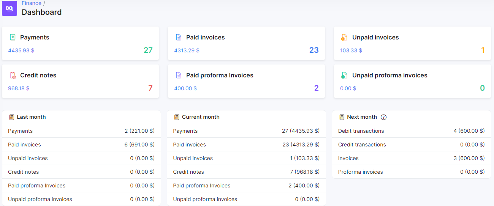
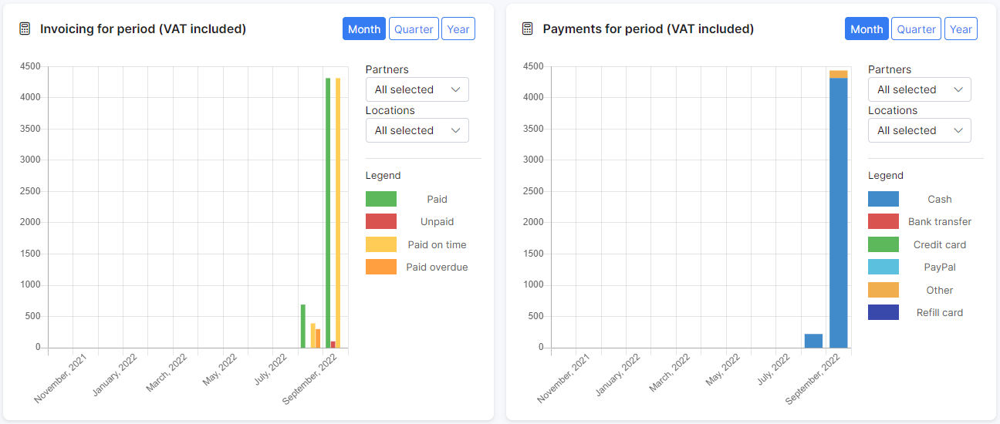
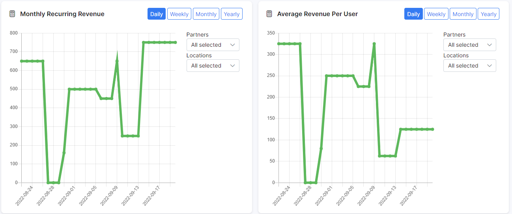
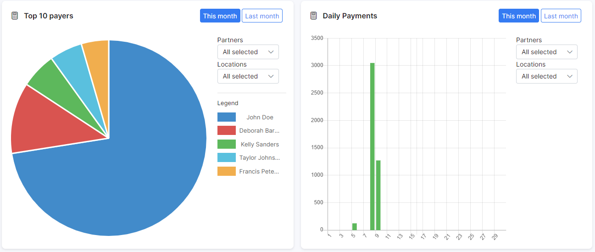

Billing engine
==========

In this section, we describe the difference between Recurring and Prepaid billing of a customer.
Let's start with the financial dashboard, which shows us a quick overview regarding information about your Splynx financial status:

Quick totals for the following data and buttons to direct to a list for each:

* Debit transactions
* Payments
* Paid Invoices
* Unpaid invoices
* Payment requests
* Unpaid requests

Totals data for the above mentioned for each of the following periods:

* Last Month
* Current Month
* Next Month

The dashboard also includes the following mini-reports in form of graphs:

* Invoicing for period (VAT Included)
* Payments for period (VAT Included)
* Top 10 payers
* Top 10 debtors
* Monthly recurring revenue
* Average revenue per user

Each of the graphs can be customized to view provided time frames for specific partners and locations.

A separate table is also included with information on all overdue invoices

In Splynx we support both Recurring and Prepaid types of billing. For tutorials and more information on each of these types and how to use them in Splynx, please follow each page respectively:

[Recurring Billing](finance/billing_engine/recurring_billing/recurring_billing.md)

[Prepaid Billing](finance/billing_engine/prepaid_billing/prepaid_billing.md)
