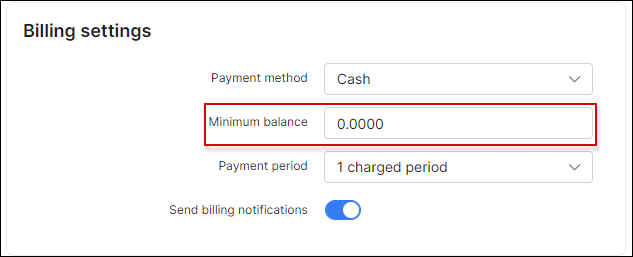
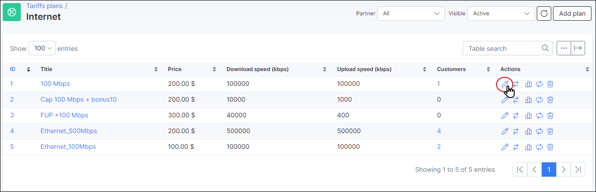
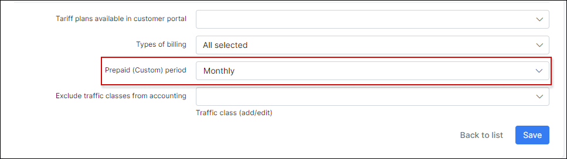
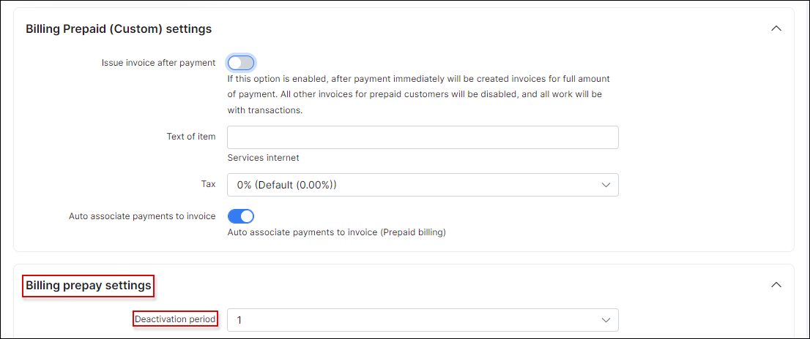
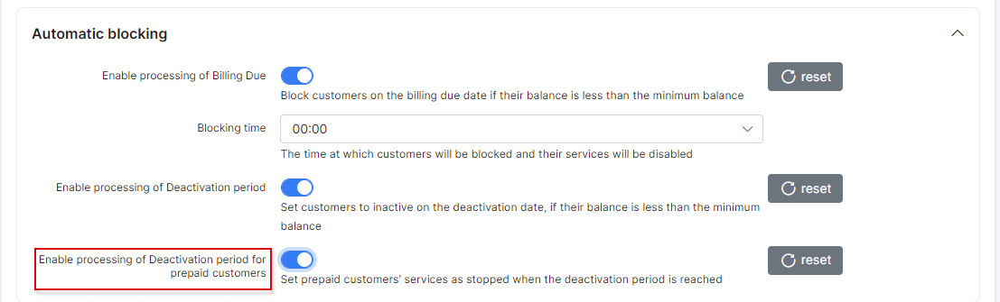

## Prepaid billing

Prepaid billing is used when ISPs charge customers in advance for services and only provide them with access for certain periods of time. When the time period has been reached and the customer's account balances are not sufficient to pay for the continuation of services, the customer is disconnected until payments are made to continue services.

To configure **Prepaid type of billing** change first **Billing type** of the customer to *Prepaid (Custom)*.

The next step is to choose **Payment method**. Options are Cash, Bank Transfer, Credit Card, PayPal, Refill Card and others when additional methods are installed.

Then define **Minimum balance** of funds to be available in the customer's account after service charges to avoid being blocked. This field is 0.0000 by default.

***************************************************************
Customers can be charged monthly or by any custom periods, (for example, one week), with the use of prepaid tariff custom periods.

By default, all prepaid tariffs are set to charge customers monthly.

However, it is possible to set any desirable period. Simply change **Prepaid (Custome) period** of the service to *Amount of days* and select the desired amount of days.

*********************************************************
The next step is to set **Payment period** in the customer's billing settings `Customer → Billing → Billing config`.  Any desired charged period can be set, to suit the unique needs of customers and every ISP.

**************************************************************
After configuring the customer's prepaid billing parameters, we need to add a payment to the customer’s account by clicking on `Add document` button and selecting *Payment* from the drop-down list in *Billing → Finance documents*. For example, 30$ has been added, to activate their services.

After the deposit has been made we then proceed to activate the customer's services by charging the customer with `Add document` button and selecting *Recurring invoice* from the drop-down list in *Billing → Finance documents*.

After charging the customer 30$, the customer is provided with access to the service for one month. We find this information here:

***************************************************************
If the option to Auto create invoices (after charging) is enabled in finance settings under *Config → Finance → Settings*, Splynx will generate an invoice for consumed services on the first day of the next month.

**Please note that Deactivation period for prepaid customers can be configured in *Config → Finance → Settings***:

Please remember to start your deactivation period, it is necessary to enable the processing of deactivation period under *Config → Finance → Automation*:

