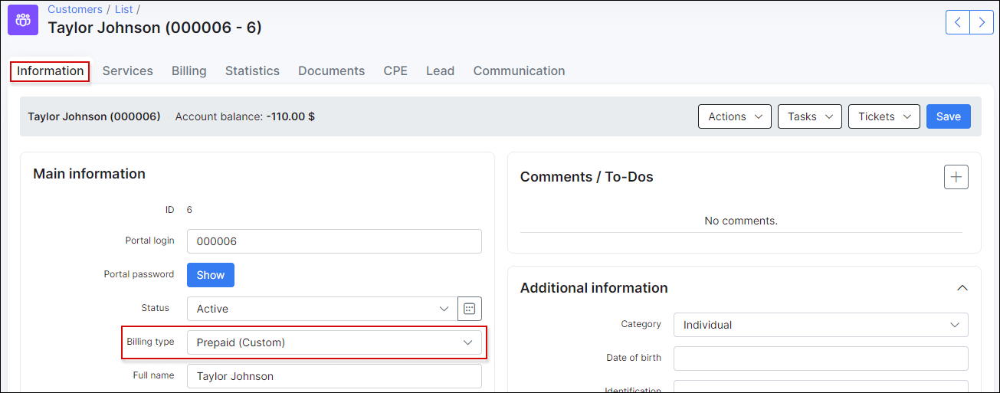
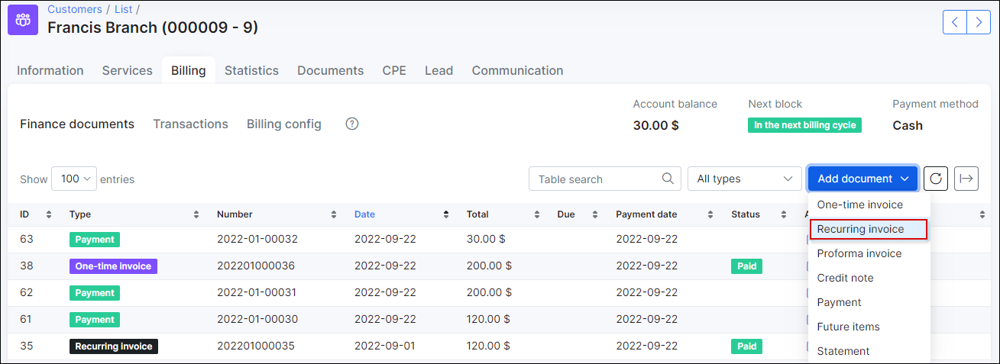

## Prepaid billing engine

Prepaid billing is used when ISP's charge customers in advance for services and only provide them with access for certain periods of time. When the time period has been reached and the customer's account balances are not sufficient to pay for the continuation of services, the customer is disconnected until payments are made to continue services.

To configure **Prepaid type of billing** we start by changing the _Billing type_ of the customer to "Prepaid (Custom).

The next step is to choose the *Payment method*,  options are Cash, Bank Transfer, Credit Card, PayPal, Refill Card, BrainTree and others when additional methods are installed.

Then we define the minimum amount of funds to be available in the customer's account after service charges to avoid being blocked in the *Minimal balance* field, this field is 0.0000 by default.

Customers can be charged for daily, monthly or by any custom periods, (for example, one week), with the use of prepaid tariff custom periods.

By default, all prepaid tariffs are set to charge customers monthly.

However, it is possible to set any desirable period. Simply change the Prepaid Period of the service to **Days amount** and select the desired amount of days.

The next step is to set the 'Period' in the customer's billing settings `Customer → Billing → Billing overview`.  Any desired charged period can be set, to suit the unique needs of customers and every ISP.

After configuring the customer's prepaid billing parameters, we need to add a payment to the customer’s account by clicking on the Add payment button in `Customer → Billing → Payment`. For example, 30 USD has been added, to activate their services.

After the deposit has been made we then proceed to activate the customer's services by manually charging the customer with the **Charge & Invoice** button.

After charging the customer 30 USD and the customer is provided with access for one month.

If the option to Create invoices (*after charge&invoice*) is enabled in finance settings under `Config / Finance / Settings`, Splynx will generate an invoice for consumed services on the first day of the next month.

When using the Prepaid daily option, Splynx calculates the daily rate of the plan and charges the customer every day. Let's imagine that a customer's service costs 40 USD. There are 31 days in July, so the daily rate will be 1,29 USD.

The following day the customer's balance will be changed from 40 USD to 38,71 USD, deducting the cost of services for the day, and this will continue to decrease every day according to the customer's plan.

---
In the situation, when the customer has added 20 USD on a deposit, he will get access for 15 days only. Once the balance reaches “0”, Splynx will block him. Also, one transaction has been added, which shows how much we charged. This transaction is updated every day and it shows the total amount of money that has been taken from the customer’s deposit.

***Please note that Grace periods for prepaid customers can be configured un Config / Finance / Settings***:

Please remember if you would like your grace periods to work it is necessary to enable the processing of grace periods under *Config / Finance / Automation*:

