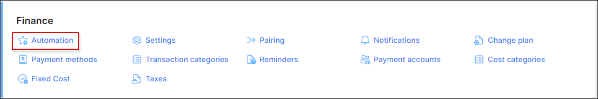

## Recurring billing

Recurring billing is the best solution for ISPs to charge customers a fixed price on a recurring basis, typically at the beginning of the billing cycle. The Recurring type of billing is selected by default in the Splynx global configuration.

You can set up a **recurring billing** for a customer in the Customer's Information section, by clicking on *Billing type* option and selecting *Recurring* as a type of billing.

---------
**Recurring invoices** can be issued every month in advance with *Prepaid* or *Postpaid* Mode.

The logic around prepaid is, for example, on the 1st of May, Splynx will generate invoices for the period of 1 - 31 of May.

Postpaid means that Splynx will generate invoices on the 1st of May for the period of 1-30 of April.

Customers using the recurring billing type can be set to use Postpaid or Prepaid mode in months. For this, navigate to customer's **Billing** → **Billing config** tab.

In *Billing settings*, click on *Payment period* drop-down list and choose Postpaid or number of months in Prepaid mode with options to pay up to 12 months in advance.

Select a *Payment Method* for recurring billing, options available are Cash, Bank Transfer, Credit Card, PayPal, Refill Card and others when installed and configured.

---------
The next step of setting up "Recurring billing" will be to choose *Billing day*, *Payment due* and a *Deactivation period*.

* **Billing day** - the day invoices will be generated automatically (default value is `1`st day of the month. The available values are from `1` to `28`).

<b style="color: #FD841F;">Explanation on the Billing day values</b>

Billing day is the automatic date of invoice creation and also the start of the billing period (for one month).
Example: Setting to 1 means billing from 1st to end of month and 10 means billing from 10th to the 9th of the next month. 

The billing day value is limited to 28 to allow us to create invoices on the same day of every month consistently. Thus limited to 28 because of February.
Should you wish to create invoices on any day between the 29th and 31st you can choose between the 28th or the 1st to create your invoices on these days instead.

The start of the actual billing cycle, however, (from which date the customer will be billed from) is determined by the service start date, this will always pro-rate from the service start date to the end of the first billing cycle and then continue to bill as per the normal billing period.
Example A: If a customer service start date is 15 March and the billing day is set to 1, an invoice generated in March will show the customer being billed from 15 March - 31 March, the next invoice will show 1 April - 30 April etc.
Example B: If a customer service start date is 15 March and the billing day is set to 1, an invoice generated in April will show the customer being billed from 15 March - 30 April.

If you would like to create an invoice on a different date to that of the billing day then the History and Preview tool should be used to create the invoice preview batch on a desired day.
Example: If you would like to create the invoice batch for April, on the 25th of March, then you would navigate to the history and preview tool on the 25th of March, select 1 April as the Date and click preview. This will create the batch which can be previewed and ultimately confirmed once you are satisfied with the data. All invoices and transactions will then be created and invoices will be sent according to the configured notification settings.

* **Payment due** - the amount of days after the billing day the customer has to make payments before getting blocked.

* **Next Block** - the number of days the customer has left to make the payments for the invoices.

The status can be in three colors (showing the rest of the days):

_Green_  - there is still relatively sufficient time for the customer to make payment before being blocked. The status '_In the next billing cycle_' shows that the customer has already paid for invoices for the current month and has no outstanding payments.

_Yellow_ - shows that a little time remained until the invoices should be paid.

 _Red_ - the customer is running out of time and will be blocked soon or the customer has already been blocked.

The administrator can edit the date of charge, it will extend the customer blocking date and it won't affect the current billing settings.

**Note:** The blocking date is calculating from the first unpaid charge, by editing the date of charge, you just change the date when the invoice was created, it extends the blocking date because the billing due date also applies to the invoice date creation.

* **Deactivation period** - the number of days after the billing due until the system will automatically mark the customer status as inactive and
in our example, we choose the 1st day of the month as the billing day and 15 days thereafter, as the Billing due day. This means that invoices will be generated on 1st day of the month and if the customer fails to make a payment before or on the 15th day of the month, the customer will be blocked and his services will be suspended.

***Please note that it is important to enable deactivation period processing under *Config → Finance → Automation*, for your deactivation period to work as expected***:

* **Minimum balance** - the minimum amount funds to be available in the customer's account after service charges to avoid being blocked, this field is 0.0000 by default.

**Please note that although the customer is blocked and their services suspended, the system will still account for the services from a billing perspective.**

**The system will only stop accounting for customer billing when the status is changed to _Inactive_**.
