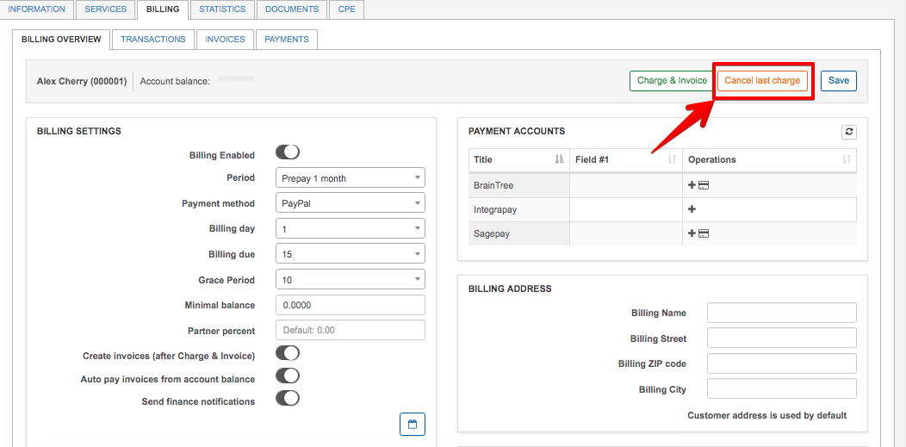
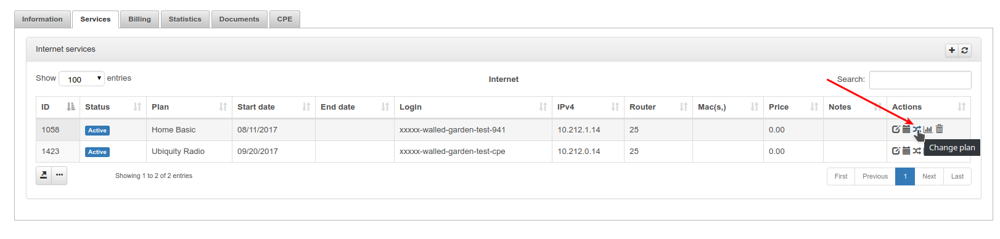
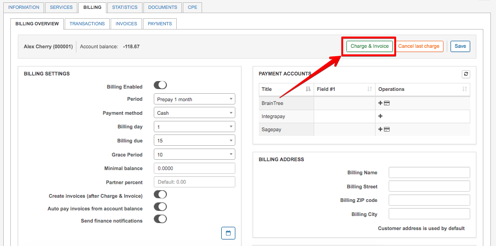
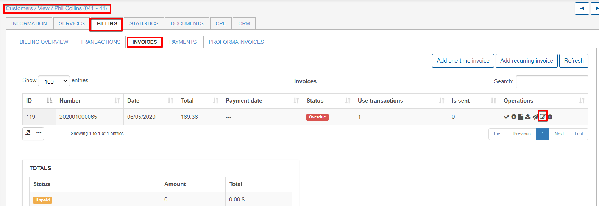
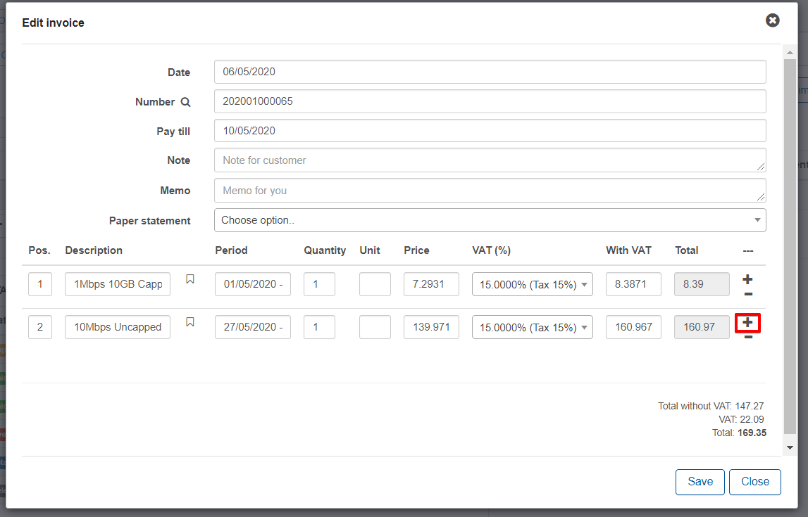
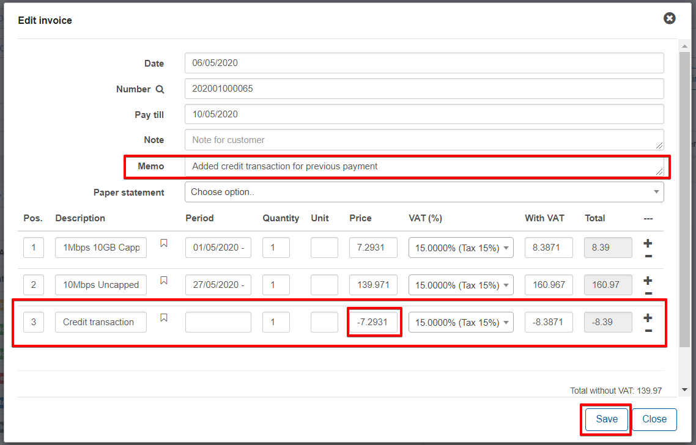
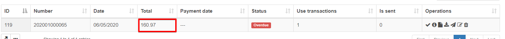

Change service in the charged period
====================================

Sometimes you need to change services for customers, but old services are already charged for and therefore the system does not allow you to do this for the current month but only for the next month.

To resolve this issue you have to go through the next steps:

1. Cancel the last charge using the button on the customer's billing tab in `Customers / View / Billing overview`:

2. Now the option to change the desired service will be available/possible. So, navigate to the 'Services' tab and change the service using the "Change plan" button.

3. The last step, you have to charge customer again using the "charge & Invoice" button in the Billing tab:

Please be advised that when charging the customer after the change of plan, it is very important to select the correct date to include all transactions on the invoice generated.

In the scenario where the invoice generated does not include the customer's prior payment. It will then be necessary to add a credit transaction to the invoice.

## Adding a credit transaction

Navigate to the customer and perform the change plans as per the steps above. Thereafter, navigate to the invoice generated after re-charging the customer and edit the invoice:

Simply add the credit transaction with a negative value :

For referencing purposes, it is good practice to add a relevant note in the memo to record the reason for editing.

Once all these values have been entered, you will notice that the invoice total has been changed according to the credit transaction added:

**Attention!** All the steps above are for recurring billing customers only.
