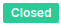
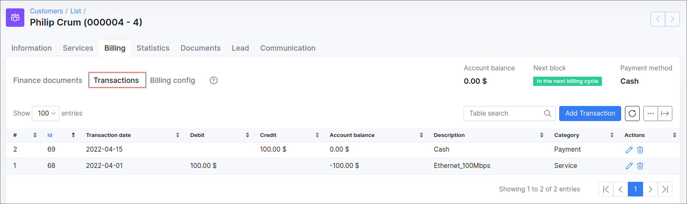
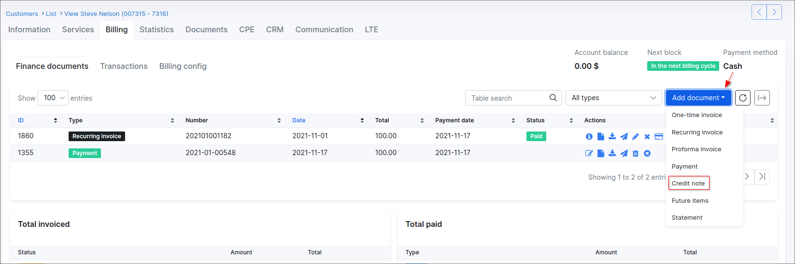
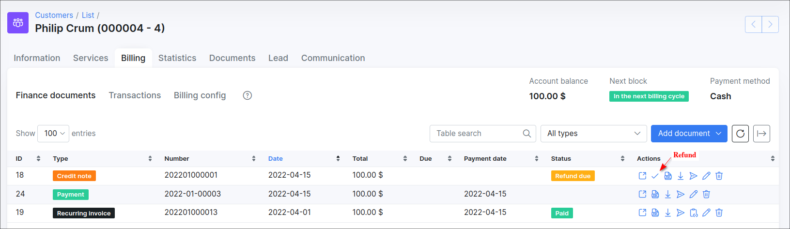
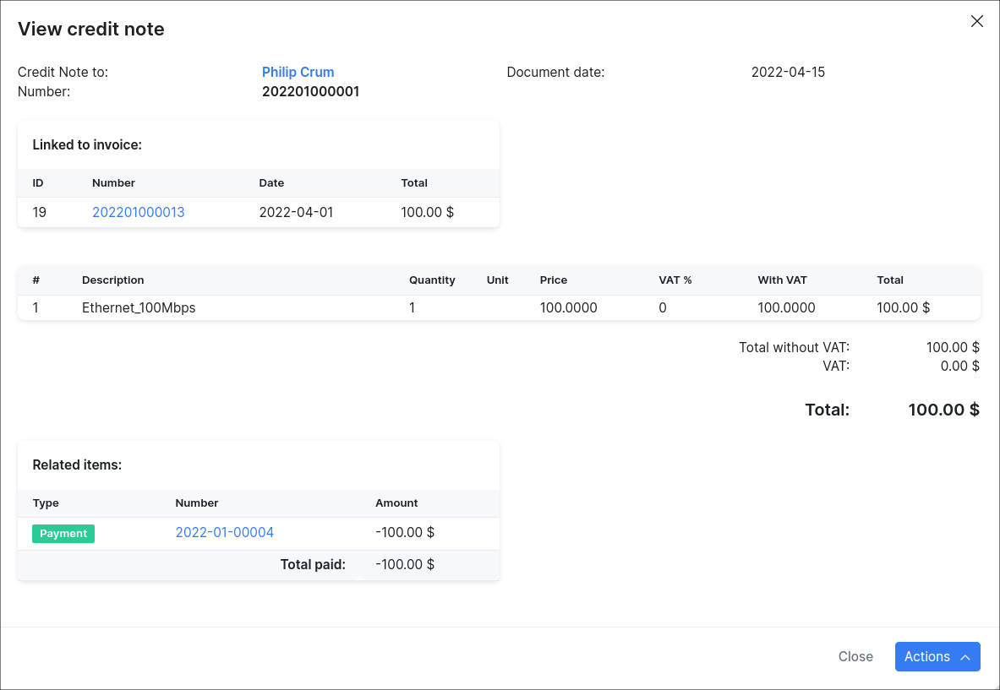
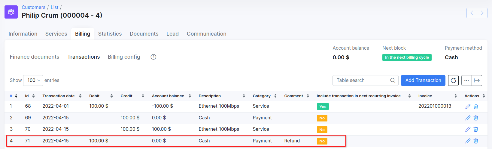
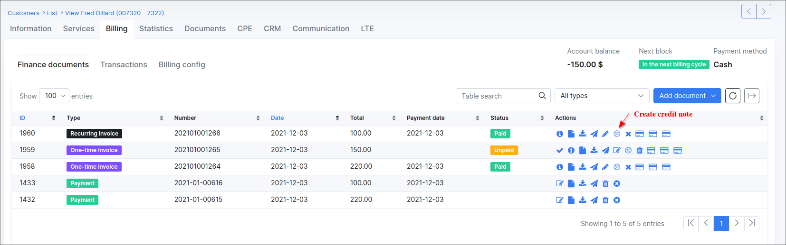
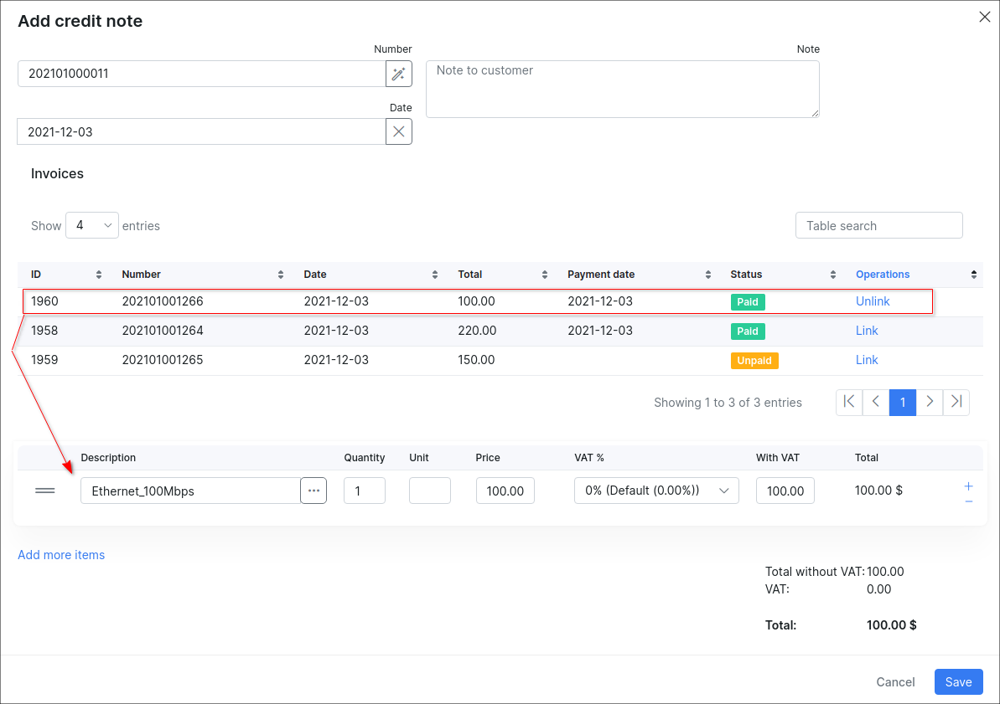
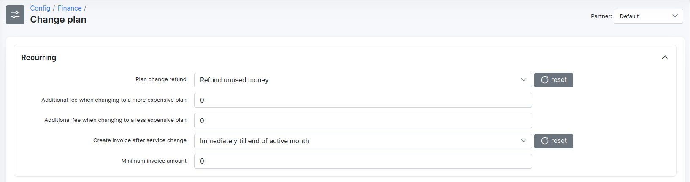
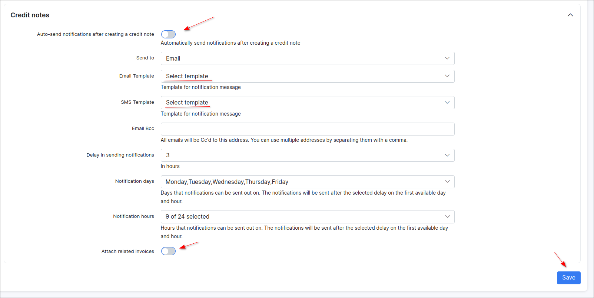

Credit Notes
==========

The **Credit note** is a kind of negative invoice designed to give a refund on part or all of the invoice amount. To be precise, it is a document issued to indicate a return of funds in the event of a service cancellation, network equipment return, miscalculation of price/tax/discount in the invoice or other specified circumstances.

Sometimes we can send a customer an invoice and then realize that we have overcharged them for certain services or network stuff. Instead of canceling the original or recreating a new invoice, which can confuse the customer in accounting processes, we can issue a credit note to correct the total.

------------

#### Getting started with Сredit notes: available actions and statuses

Let's consider in details the *Credit notes* statuses and the actions that can be applied to:

| Status  | Description  |
| ------------ | ------------ |
| <icon class="image-icon"></icon> | the initial status of a new credit note. It means that the money in the credit note has been refunded to the customer's balance, but the customer has not yet taken money out from the SIP. The `Credit` transaction will be created. On the other hand, this status is also set when the amount of credit note is more than the total amount of unpaid invoice, the rest of money will be added to the customer's account balance. |
| <icon class="image-icon"></icon>  | the administrator sets this status when the customer has withdrawn money from the account balance to the credit card or has taken money in cash. The specific amount of money will be withdrawn from the customer's balance. The new `Debit` transaction (the *Refund* payment with the negative sum) will be created. If the credit note is in the `Refund due` status (its amount was greater than the total amount of the unpaid invoice, it was partially used) and we are going to refund it, the payment will be created for the remaining amount. The refund payment can be removed, as a result, the credit note status will be changed back to `Refund due`, the `Credit` transaction will be re-created and the money will be returned to the customer's balance. |
| <icon class="image-icon"></icon>  | it means that the credit note was completely used to pay off the unpaid invoice. If the amount of the credit note is less than or equal to the total of the unpaid invoice, the credit note will be closed and the invoice will be partially paid or fully paid. |
| <icon class="image-icon"></icon>  | it means that the credit note was **Marked as deleted**. In this case the credit note item remains visible in the Finance documents but the `Credit` transaction will be removed. The amount of credit note money that has been added to the account balance will be deleted. Not to be confused with **Delete completely** action.  |

<icon class="image-icon"></icon> **NOTE:**

- A created credit note can only be edited if it is in the `Refund due` status and at the same time is not linked to an invoice;

- If a credit note is in the `closed` or `refunded` status, only the *Note* field can be edited;

- A credit note that has already been synced to any accounting system (e.g. Xero), cannot be deleted.


| Action  | Description  |
| ------------ | ------------ |
| <icon class="image-icon"></icon> View  | to view the details of the credit note.  |
| <icon class="image-icon"></icon> Refund  | the administrator should choose this action when a customer withdrew money from the balance to the credit card or took the money out in cash from the SIP. |
| <icon class="image-icon"></icon> View PDF  | to view the credit note according to its [template](configuration/system/templates/templates.md) in Splynx. |
| <icon class="image-icon"></icon> Download PDF  | to download the generated credit note PDF file. |
| <icon class="image-icon"></icon> Send  | send the credit note to customer's email or portal. The specific template can be loaded or saved as new one in a new window.  |
| <icon class="image-icon"></icon> Edit  | used to edit the details of the credit note: note, status, link/unlink to the invoice etc.|
| <icon class="image-icon"></icon> Delete  | can be applied to the credit note in `Refund due` or `Delete` status. In case a credit note is in `Refund due` status, two options are available to choose from:  **Marked as deleted** and **Delete completely**. If a credit note is in `Deleted` status, only **Delete completely** action can be applied to remove a credit note from the finance documents list. |

------------


#### Creating a credit note


**Example #1:**

Let's say we have the customer who uses the Internet service for $100. And an ISP should give the money back to the customer.

1. The customer has been invoiced for 100$ for the service (the account balance = `-100`). The invoice was paid successfully by the customer (the balance = `0`);




2. For some reason, a provider should give the money back to the customer. So, the administrator should open the customer profile (`Customers → List`), click on the `Billing → Finance documents` tabs, press the `Add document` button and choose the `Credit note` item in the drop down list.




In the new window you can **link**/**unlink** only **one** related paid/unpaid invoice to the current credit note. Moreover, it's possible to use the option `Add more items` to add the additional item (-s) and specify its **Description**, **Price** etc. Use `-` sign which is to the right of the line to remove the unnecessary items.

If the invoice is linked - all items (transactions) of such invoice will be added to the new credit note with all details. After that press `Add` button, the new credit note with `Refund due` status will be created.


At this stage the sequence of transactions will be the following:


3. The customer has decided to withdraw money from the balance in cash. After the customer receives the money, the administrator will refund the credit note by pressing <icon class="image-icon"></icon> icon in the *Actions* column.
As a result, at this moment the customer's balance = `0` because the customer withdrew the money.








---

**Example #2:**

You can immediately create a credit note and link it to the existing invoice in customer profile.

Find the necessary invoice in customer's `Finance documents` and click on <icon class="image-icon"></icon> icon to create a credit note.

<icon class="image-icon"></icon> **NOTE:** You cannot create a credit note to the invoice with `Deleted` (*Mark as Deleted*) status.



In such case, the related invoice (and its transaction) will be automatically linked to this credit note.



If necessary, you can change the price, description etc. of an included item or add a new one.

---

<icon class="image-icon"></icon> **IMPORTANT:**

- In Splynx v3.1 we could add the invoice with negative price amount, but in v4.0 this feature is deprecated. Such invoice cannot be created now. Please, use the *Credit notes* function instead. Please note that the items with negative price value can be added to the credit note, but at the the same time the credit note total price cannot be with the negative amount, it can only be equal to `0` or  greater than `0`. This rule also applies to the creation of an invoice. The invoice with negative item (-s) can be linked to credit note as well;


- In case the customer with existing *Credit notes* is converted back to the lead, the credit note item (-s) can be found in `History → Billing → Credit Notes` of the lead account;

- If the customer's service was charged (the recurring invoice was created and it was paid) and the administrator changed the service/plan to a new one in customer profile - a money for the unused period will be refunded to the customer's balance as *Credit note* (it's assumed that the `Refund unused money` option is enabled in `Config → Finance → Change plan`).

<details style="font-size: 15px; margin-bottom: 5px;">
<summary><b>Click here for more details</b></summary>
<div markdown="1">



</div>
</details>


  For example, the initial Internet service price = 200$ and the new Internet service price = 100$, in such case we will have the next result:


<details style="font-size: 15px; margin-bottom: 5px;">
<summary><b>Click to see the detailed explanation</b></summary>
<div markdown="1">


```     
April 2022 = 30 days.

200$/30 days = 6.6666$.

The service was changed on April 16 (New plan start date = April 16).

As a result, the initial Internet service start date - 2021-04-01 and End date - 2021-04-15 and the new Internet service start date - 2021-04-16.

30 days - 15 days = 15 days of initial paid Internet service left.

15 days * 6.66$ = 99.99$ ~ 100$ (for the Credit note, this amount will be added to the customer's account balance).

But we have other 15 days for the new Internet service.

The new Internet service price = 100$ / 30 days = 3.3333$.

3.33$ * 15 days = 49.99$ ~ 50$ (price of the new Internet service).

The new recurring invoice will be paid from the account balance and 50$ will remain on the balance.

```
</div>
</details>

 - Pay attention, if the service is planed to be changed (the new service is in `pending` status), the *Credit note* will be created immediately. In case the customer changed their mind, do not forget to correct the customer's finance documents manually, e.g. to remove newly created *Credit note*, *Recurring* invoice.

------------

#### Credit notes in Finance

All issued *Credit notes* can be found in `Finance → Credit Notes`. In case the module is not visible on the left sidebar of Splynx, you can enable it in *Config → Integration → Main modules*.


With the use of a filter, it is possible to display credit notes by its **Number**, **Period** of time, **Partner** or **Status** (*Any, Refunded, Refund due, Deleted, Closed*). Below the table of *Credit notes* you'll find the **Totals** table that displays a total of all credit notes by their status and the amount of credit notes in each status.


To export the list of *Credit notes*, click on `Export` button, in a new window specify the **Period** of time, **Export type** (*CSV, PDF files in archive, One PDF file, Template, External handler*) etc.


Alternatively, once you have selected the required *Credit note (-s)* in the table, click on `Actions` button and select the required option in drop down menu.


------------

#### Template of Credit note

Credit notes in PDF format are fully customizable with [templates](configuration/system/templates/templates.md). You can create a new template using the different [variables](configuration/system/templates/templates_variables/templates_variables.md) or edit the build-in templates in *Config → Templates* (Type: **Credit Note PDF**). Then, open *Config → System → Company Information*, find the field `Credit Note PDF Template` and in drop down list choose the template that will be used by default in Splynx.

------------

#### Notifications

To **configure the notifications after credit note is created**, navigate to *Config → Finance → Notifications → Global (tab) → Credit notes* and set the required settings.



------------

#### Logs

The log with all *Credit notes* operations can be found in *Administration → Logs → Operations*. Click on <icon class="image-icon"></icon> icon to view more details.


