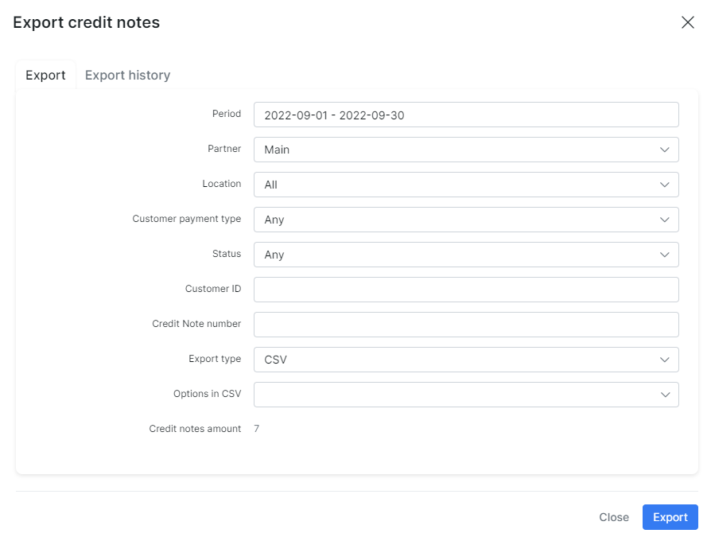

Credit Notes
==========

The **Credit notes** is a document issued to indicate a return of funds in the event of a service cancellation, network equipment return, miscalculation of price/tax/discount in the invoice or other specified circumstances. Sometimes we can send a customer an invoice and then realize that we have overcharged them for certain goods or services. Instead of canceling the original or recreating a new invoice, which can confuse the customer in accounting processes, we can issue a credit note to correct the totals.

------------

Credit notes are negative invoices designed to give a refund on part or all of the invoice amount.

Let's consider in details the *Credit notes* statuses and the actions that can be applied to:

| Status  | Description  |
| ------------ | ------------ |
| <icon class="image-icon"></icon> | the initial status of a new credit note. It means that the money has been refunded to customer's balance but customer has not yet physically taken money out from SIP. The `-Credit` transaction will be created. The specific amount of money will be added on customer balance.|
| <icon class="image-icon"></icon>  | the administrator sets this status when a customer withdrew money from the balance to the credit card or took the money physically. The `+Debit` transaction will be created. The specific amount of money will be withdrawn from the customer's balance. The new *Refund* payment with the negative sum amount will be created. |
| <icon class="image-icon"></icon>  | it means that the credit note was **Marked as deleted**. In this case the credit note item remains visible in Splynx but the `-Credit` transaction will be removed. Some specific amount of money will be withdrawn from the customer's balance. Not to be confused with **Delete completely** action.  |

| Action  | Description  |
| ------------ | ------------ |
| <icon class="image-icon"></icon> View  | to view the details of the credit note.  |
| <icon class="image-icon"></icon> Refund  | the administrator should choose this action when a customer withdrew money from the balance to the credit card or took the money physically from SIP. |
| <icon class="image-icon"></icon> View PDF  | to view the credit note according to its template in Splynx. |
| <icon class="image-icon"></icon> Download PDF  | to download the generated credit note pdf file. |
| <icon class="image-icon"></icon> Send  | send the credit note to customer's email or portal. The specific template can be loaded or saved as new one in a new window.  |
| <icon class="image-icon"></icon> Edit  | used to edit the details of the credit note: note, status, link/unlink to the invoice etc.|
| <icon class="image-icon"></icon> Delete  | can be applied to the credit note with `Non refunded` or `Delete` status. In case a credit note is in `Non refunded` status, two options are available to choose from:  **Marked as deleted** and **Delete completely**. If a credit note is in `Deleted` status, only **Delete completely** action can be applied to remove a credit note from the Splynx. |
| <icon class="image-icon"></icon> Edit payment  | can be applied to the credit note with `Refunded` status. In new window we can change/add payment type, date, sum, comment, note/memo etc. |
| <icon class="image-icon"></icon> Delete payment  | The *Refund* payment will be remove and credit note status will be changed to `Non refunded`. The `+Debit` transaction will be re-created and the money will be returned to the customer balance. |

**Example - Creating a credit note:**

Let's imagine that we have the customer who uses a 100$ Internet service. And a SIP should give the money back to the customer.

1. The customer has been invoiced for 100$ for the service (the balance = `-100`). The invoice was paid successfully by customer (the balance = `0`);

2. For some reason, the SIP should give the money back to the customer. So, the administrator should open the customer profile (`Customers → List`), click on `Billing → Finance documents` tabs, press `Add document` button and choose `Credit note` in drop down list.

In new window you can add the **Note** to the customer, to link/unlink the related paid/unpaid invoice to the current credit note and specify the **Description**, **Price** etc. After that press `Add` button, the new credit note with `Non refunded` status will be created.

At this stage the sequence of transactions will be the following:

3. The customer decides to withdraw money from the balance to the credit card. After the customer receives the money, the administrator will refund the credit note by pressing <icon class="image-icon"></icon> icon in the *Operations* column.
As a result, at this moment the customer's balance = `0` because the customer withdrew the money.

**Note:**

- In Splynx v3.1 we could add the invoice with negative price value, but in v3.2 this feature is deprecated. Such invoice cannot be created now. Please, use the *Credit notes* function;

- In case the customer with existing *Credit notes* is converted back to the lead, the items of credit notes can be found in `History → Billing → Credit Notes`;

- If the customer's service was charged (the recurring invoice was created and it was paid) and the administrator changed the service/plan - a money for the unused period will be refunded to the customer's balance as *Credit note* (it's assumed that the `Refund unused money` option is used in `Config → Finance → Change plan`). For example, the initial Internet service price = R200 and the new Internet service price = R100, in such case we will have the next result:

Also, pay attention, if the service is planed to be changed (the new service is in `pending` status), the *Credit note* will be created immediately. In case the customer changed their mind, do not forget to correct the customer's finance documents, e.g. to remove newly created *Credit note*, *Recurring* invoice.

------------

All issued *Credit notes* can be found in `Finance → Credit Notes`. In case the module is not visible on the left sidebar of Splynx, you can enable it in `Config → Integration → Main modules`.

With the use of a filter, it is possible to display credit notes by its **Number**, **Period** of time, **Partner** or **Status** (Any, Paid, Refunded, Non refunded, Deleted). Below the table of *Credit notes* you'll find a *Totals* table that displays a total of all credit notes by their status and the amount of credit notes in each status.

To export the list of *Credit notes*, click on `Export` button, in a new window specify the **Period** of time, **Export type** (*CSV, PDF files in archive, One PDF file, Template, External handler*) etc.

Alternatively, once you have selected the required *Credit note (-s)* in the table, click on `Actions` button and select the required option in drop down menu.

Credit notes in PDF format are fully customizable with [templates](configuration/system/templates/templates.md). You can create a new template using the different [variables](configuration/system/templates/templates_variables/templates_variables.md) or edit the build-in templates in `Config → Templates` (Type: **Credit Note PDF**). Then, open `Config → Company Information`, find the field `Credit Note PDF Template` and in drop down list choose the template that will be used by default in Splynx.

------------

The log with all *Credit notes* operations can be found in `Administration → Logs → Operations`. Click on <icon class="image-icon"></icon> icon to view more details.

