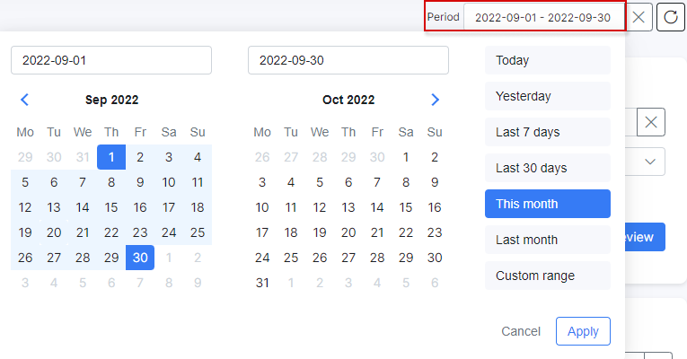
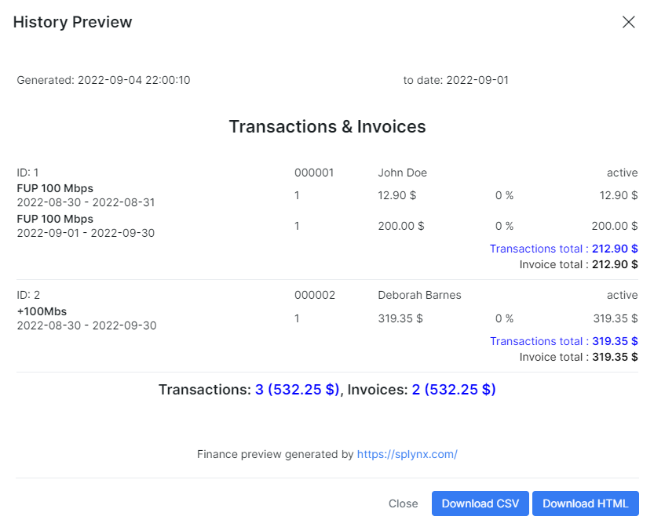
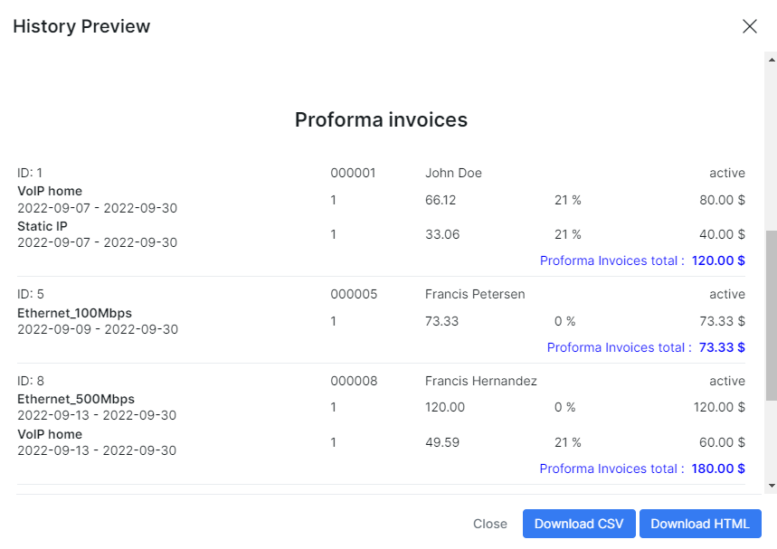

History & Preview
==========

Preview is autogenerated at 2:00 AM on billing day, auto confirmation is made at 22:00. It shows all transactions, invoices and proforma invoices issued for a particular period of time. It is possible to set a filter by period of time  according your needs, for example, custom range for a few months or half of the year.

When you click on icon <icon class="image-icon"></icon> in Operations column a window will appear with all transactions, invoices and proforma invoices issued for that period. You can download the list of transactions and invoices in HTML format.

---
History Preview could be a useful feature for the **mass billing**, when you need to double-check customer's services and prices for a group of customers before issuing invoices for them. It is possible to do by creating proforma invoices for customers, who is due to pay, and checking them in a history preview.

How to create Proforma invoices (automatic and manual creation) were mentioned  in [Proforma invoices](finance/proforma_invoices/proforma_invoices.md). After proforma invoices (for a particular day) will be created you can check the full list of them in `Finance → Proforma Invoices`.

Then click on icon <icon class="image-icon"></icon> in Operations column in `Finance → History Preview` and download file with all proforma invoices for the period that need to be checked. The rest of invoices and transactions for that date will also be there.

