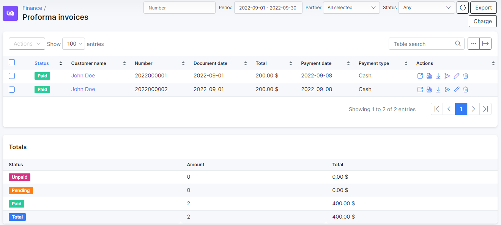

History & Preview
==========

History and preview is the home of mass invoice generation. Here we generate and issue invoices for all customers in the system.

  All transactions, invoices and proforma invoices generated for a particular period of time are displayed in previews and can be filtered by a period of time according to your needs, for example, a custom range for a few months or half of the year.

When you click on the <icon class="image-icon"></icon> download icon, in the actions column a window will appear with all transactions, invoices and proforma invoices generated for that period. You can download the list of transactions and invoices in HTML or CSV format to review the list before confirming it to be issued.

---
History & Preview can be a useful feature for **mass billing** when you need to double-check customer's services and prices for a group of customers before issuing invoices to them. This is possible to do, by creating proforma invoices for customers, who are due to pay, and checking them in a preview.

How to create Proforma invoices (automatic and manual creation) is mentioned in [Proforma invoices](finance/proforma_invoices/proforma_invoices.md). After proforma invoices (for a particular day) are created, you can check the full list of proforma invoices for all customers in `Finance → Proforma Invoices`.

Then click on icon <icon class="image-icon"></icon> in the Actions column in `Finance → History Preview` and download file with all proforma invoices for the period that need to be checked. The rest of the invoices and transactions for that date will also be there.

