Invoices
==========

An invoice is a commercial document that specifies a transaction between a buyer and a seller.
If goods or services were purchased on credit, the invoice usually specifies the terms of the deal,
and provides information on the available methods of payment.
An invoice is also known as a bill or sales invoice.

Splynx provides the ability to work with or without invoices.
Without issuing invoices, Splynx just receives payments and charges customers each invoice period without creating an official document. When invoicing is required, Splynx is able to generate invoices automatically, or an administrator can issue invoices manually.

Invoices can be created conjointly or separately. Invoices in PDF format are fully customizable.
All documents generated by Splynx can be exported in different formats for printing or sending to the end-users.

* **All issued Invoices** can be found in `Finance → Invoices`. With the use of a filter, it is possible to display invoices by Period of time, Partner or Status (Any, Paid, Unpaid, Deleted). Beneath the list/table of invoices you'll find a totals table that displays a total of all invoices by their status, the number of invoices in each status and the total amount of money paid and unpaid in each status of invoices.
  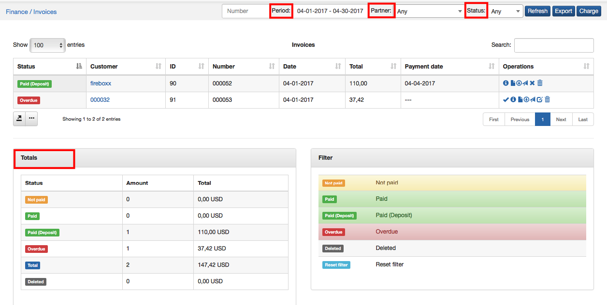

* **To print or to export the list of invoices** for accounting purposes, go to `Finance → Invoices` and click on `Export`.

  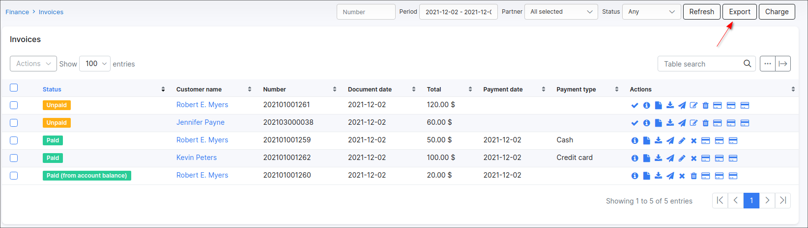

---
In the export window, you can choose the period of time and the export type/format (PDF, CSV, external handler, etc.).

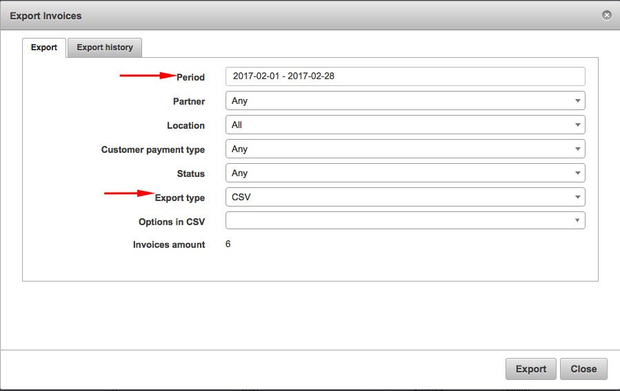

* There are a number of operations that can be executed with the icons in the "Actions" column, <icon class="image-icon">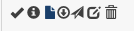</icon>.
* To view an invoice with the view icon<icon class="image-icon"></icon>, it is necessary to configure an invoice template first in `Config → System → Templates` and also to specify the use of the selected/modified template in `Config → System → Company information`.

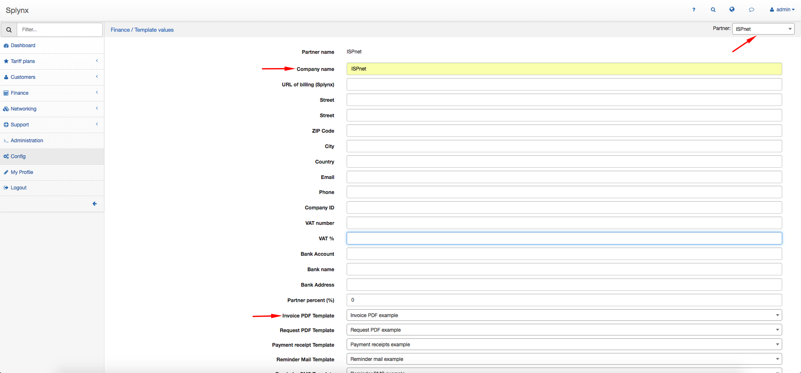

On the  **Company information** page, we define the partner and the PDF template (Invoice PDF example by default).
Once the PDF template is defined, it will be possible to view the invoice in PDF format.

---

Finance formats displayed on the invoice are customizable. Click on `Config → Main → Localization`,  to define the currency and other finance settings.

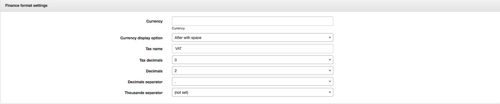

Please note that all templates can be customized, navigate to `Config / Templates /` Choose the type of templates to display/work with and simple edit or add a new template you wish to use:

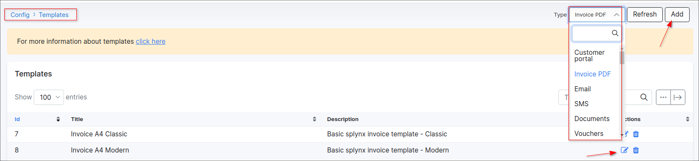

---
**global billing settings** of invoices for all customers can be found in `Config → Finance → Settings`.

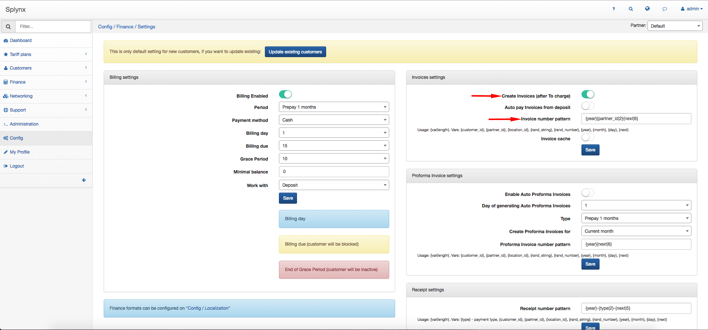
## Parameter descriptions:

**Create invoices (after Charge & Invoice)** - enables/disables automatic invoice generation after using the to *Charge&Invoice* button in `Customers → View → Billing Overview →  `

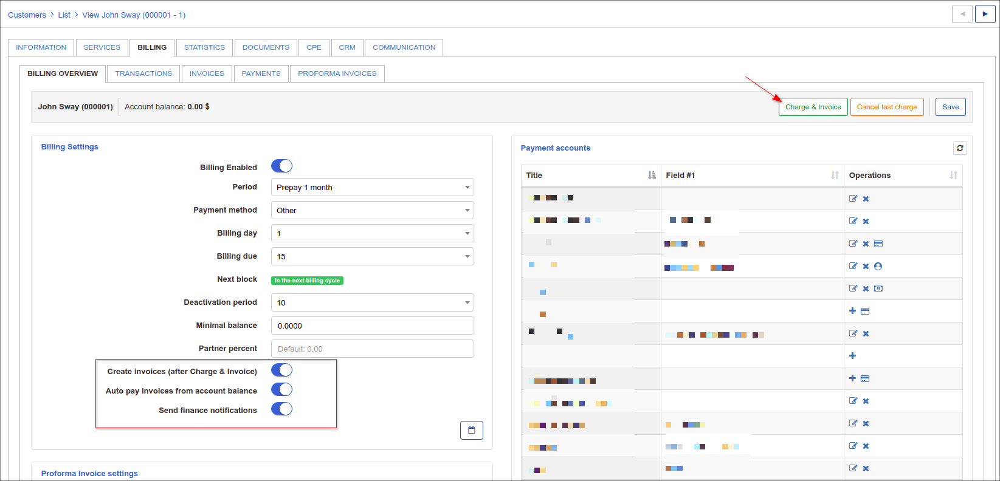

In the Invoices Settings is also possible **to set an invoice issuing automatically** and to define the invoice number pattern.

When the option *"Create Invoices (after charge & invoice)"* is not selected in Finance settings, you are to generate invoices manually by clicking on *"Add Invoice from transaction"* in the Transactions tab under `Billing → Transactions`.

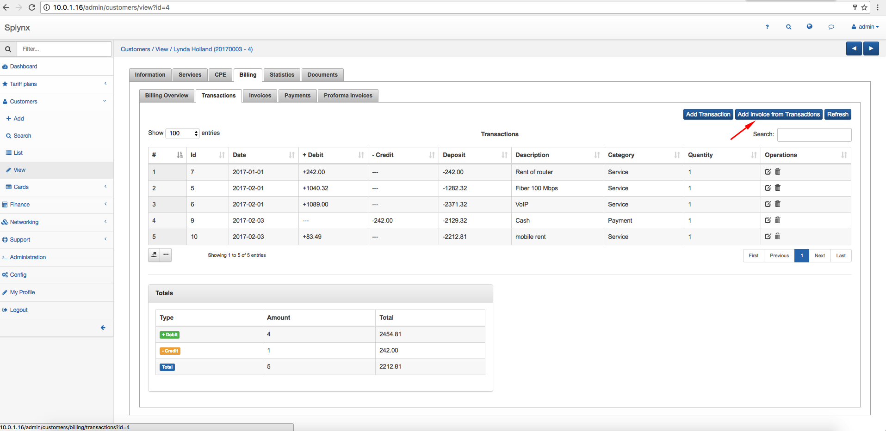

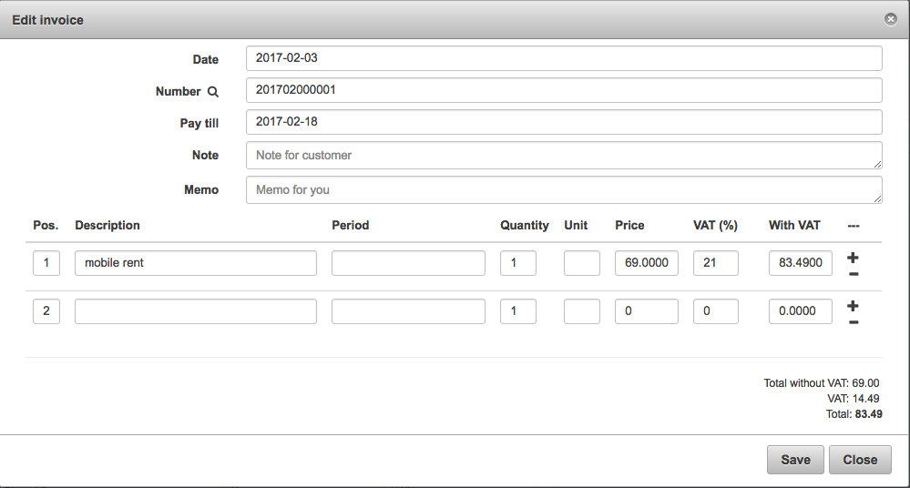.

---
Another way to **create Invoices** is to use the *Add One-Time invoice* or *Add recurring invoice* buttons in `Billing → Invoices`, where you can enable the **Use transactions** option, type a description and period of service, an optional note for the customer or memo for yourself. The recurring invoice option allows the creation of an invoice the will be issued on a recurring basis, separately from the global billing cycle.

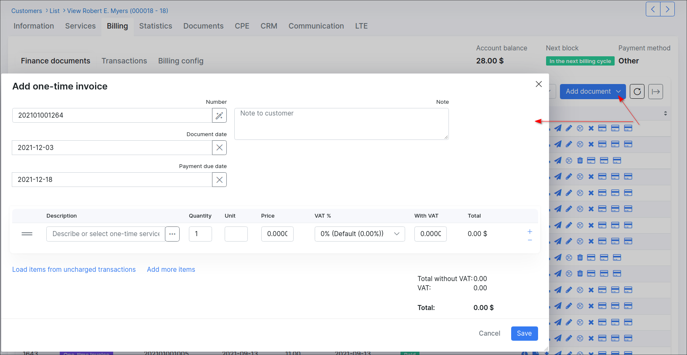

To edit an invoice with the <icon class="image-icon"></icon> icon, click on the tab `Billing → Invoices`.

It is also possible to send invoices via email with the <icon class="image-icon"></icon> icon (if the email server is [configured](configuration/main_configuration/email_config/email_config.md)) in `Billing → Invoices`.
You can write a message body or choose a template to populate it.

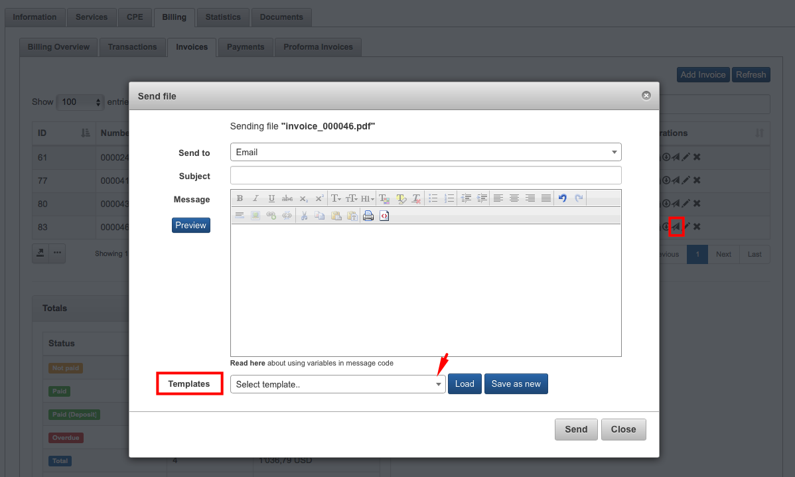

You can also type a new message body and save it as a new template.

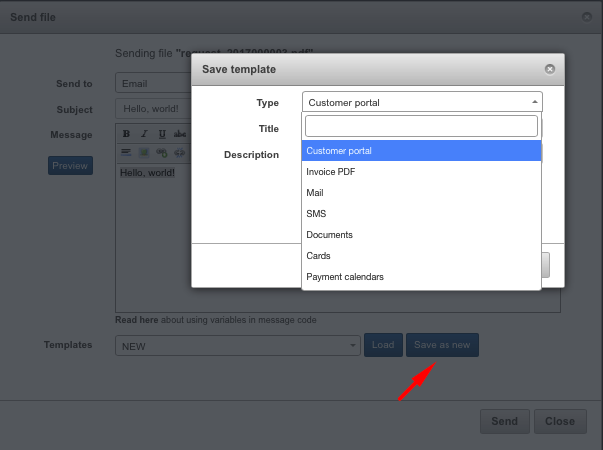
