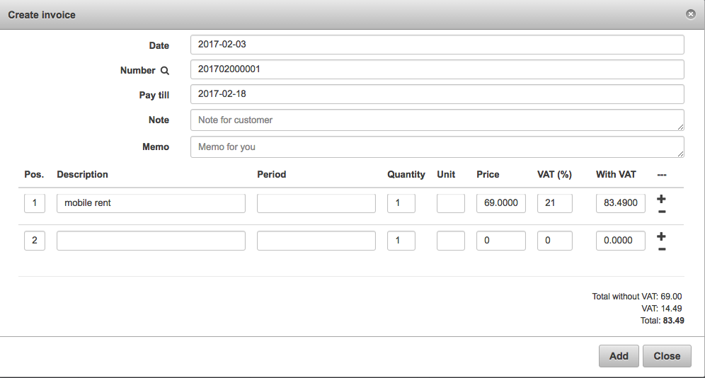

Invoices
==========

**An invoice** is a commercial document that specify a transaction between a buyer and a seller.
If goods or services were purchased on credit, the invoice usually specifies the terms of the deal,
and provide information on the available methods of payment.
An invoice is also known as a bill or sales invoice.

Splynx provides the ability to work with or without invoices.
Without issuing invoices, Splynx just receives payments and charges customers each invoice
period without creating an official document. When invoicing is required,
Splynx is able to generate invoices automatically, or the administrator can issue invoices manually.
Invoices can be created conjointly or separately. Invoices in PDF format are fully customizable.
All documents generated by Splynx can be exported to different formats to the end users for
printing or sending.

* **All issued Invoices** can be found in Finance → Invoices. It is possible to range them by Period of time, Partner or Status (Any, Paid, Unpaid, Deleted). Under the list of Invoices will be a Table called "Total", which displays all Invoices for a particular period of time by their status, number of Invoices in each status and amount of money paid and unpaid in each status of Invoice.
  

* **To print or to export the list of invoices** for accounting purposes, click on `Finance → Invoices` and click on `Export`.
  

---
In export you can choose the period of time and the export type (PDF, CSV, external handler etc.).

* It is possible **to operate on every invoice** with the icons  in the column Operations.
* **To view an invoice** with , it is necessary to configure an invoice template first in `Config →System→Templates` and define an invoice template in `Config → Finance →  Template Values`.

In the page Template values, it is possible to define the partner and the PDF template (Invoice PDF example by default).
Once the PDF template is defined, the invoice will be visible.

---

The invoice is customizable. Click on Config → Main → Localization, where it is possible to define the currency and other finance settings.

---
There are **global billing settings** for all customers in `Config → Finance → Settings`.

## Billing Settings

* **Billing Enabled** - enable billing for customer
* **Period** - it can be prepay or postpay
* **Payment Method** - it is possible to select how the customer will pay
* **Billing day** - when the customer will be charged
* **Billing due** - when the customer will be blocked
* **Grace Period** - when the customer's services will be disabled
* **Minimal balance** - minimal balance for the customer
* **Work with** - it can be with the Deposit or the Balance

More information about Invoices global configuration can be found here - [Finance configuration](../finance.md).

In Invoices Settings is also possible **to set an invoice issuing automatically** and to define the invoice number pattern.

When option *"Make Invoices (after To charge)"* is not selected in `Billing Overview → Billing Settings`, it is possible to generate an invoice manually by clicking on *"Add Invoice from transaction"* in the Transactions tab.

.

---
Another way to **create Invoice** is by clicking on *Add Invoice* in `Billing → Invoices`, where you can enable Use transaction option, write a description and period of service, note for customer or memo for yourself.

To edit an invoice with  icon, click on the tab `Billing → Invoices`.

It is also possible to send the invoice via email with  icon (if the email server is [configured](../../configuration/main_configuration/email_config/email_config.md)) in `Billing → Invoices`.
You can write a message body or choose it from templates and load it.

You can also write here a message body and save it as a new template.

