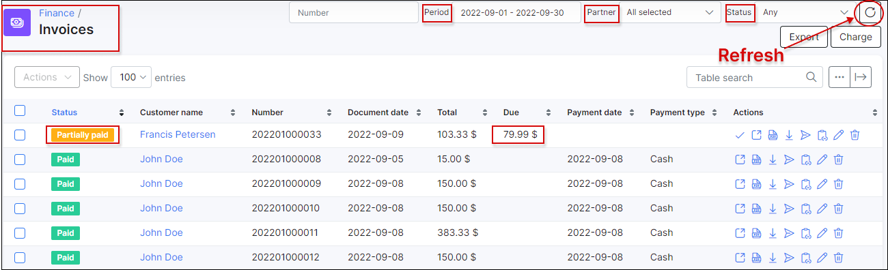
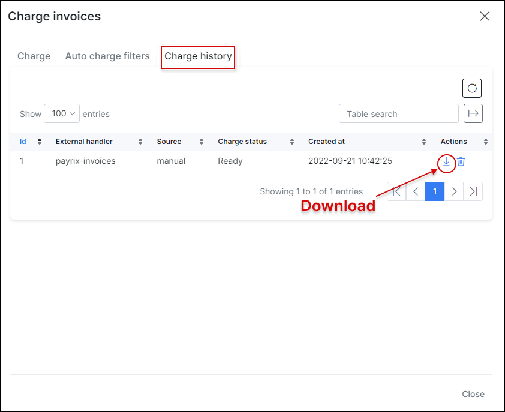
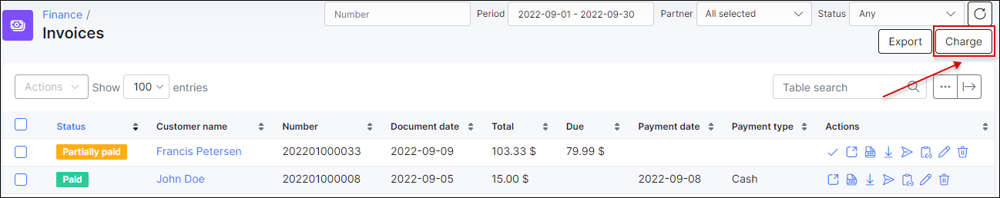

Invoices
==========

An invoice is a commercial document lists the goods or services you have supplied to your customer and what they owe you in return. It includes the cost of the products purchased or services rendered to the customer, the names of the seller and customer, description and price of goods or services and the terms of payment.

The invoices are considered as the tax documents if your business is registered for VAT (value added tax), you are not allowed to simply remove an invoice from sales records. It's required to issue invoices in line with specific regulatory requirements and to keep copies to show what revenue you earned and any tax you might have collected on the sale. The invoice can be annulled with a [**Credit note**](finance/credit_notes/credit_notes.md) if issued incorrectly.

**Splynx provides the ability to work with or without invoices**:

- without issuing invoices, Splynx just receives payments and charges customers each invoice period without creating an official document.

- when invoicing is required, Splynx is able to generate invoices automatically or an administrator can issue invoices manually.

The invoices can be created for all required customers in Splynx or for an individual one. The invoices in PDF format are fully customisable with [templates](configuration/system/templates/templates.md).

All documents generated by Splynx can be exported in different formats (PDF, CSV, Excel) for printing or sending to the end-users.

---

**All issued Invoices** can be found in `Finance → Invoices`.

With the use of a filter, it is possible to display invoices by **Period** of time, **Partner** or **Status** (`Any`, `Paid`, `Unpaid`, `Pending`, `Deleted`).

Beneath the list/table of invoices you'll find the table **Totals** that displays a total of all invoices by their status, the number of invoices in each status and the total amount of money in each status of invoices.

<icon class="image-icon"></icon> **NOTE:**

* The statistics of `Partially paid` invoices will be included in the `Unpaid` category of the **Totals** table in `Finance → Invoices`.

To **export the list of invoices** for accounting purposes, open `Finance → Invoices` and click on **Export** button.

In the export window, you can choose the period of time and the export type/format (PDF, CSV, external handler, etc.).

Alternatively, once you have selected the required invoices, you can export them using one of the following actions `One PDF file`, `PDF files in archive`or `Export` in the mass **Actions** drop down menu.

---

If one of the [payment add-ons](payment_systems/payment_systems.md) is configured for customers in Splynx, you can manually **charge the invoices all at once** using the **Charge** button at the top right corner of the table or you can use the same named option in the mass **Actions** drop down menu by selecting the required invoices before.

<icon class="image-icon"></icon> **Important:**

- Using the **Charge** button at the top-right corner of the page, the charge operation will be applied to all invoices according to the selected period in the panel, including invoices with the `Overdue` and `Pending` statuses;

- Using the **Charge** option in mass **Actions** menu, the charge operation will be applied only to selected invoices in the list.

In new window specify the necessary options for invoice charge:

- **Period** - the time period when the invoices were created;

- **Partners** - the service [provider](administration/main/partners/partners.md) to which the customer is assigned to;

- **Location** - the customer [location](administration/main/locations/locations.md);

- **Customer payment type** - the [method](configuration/finance/payment_methods/payment_methods.md) that is used by customer to make payments;

- **Status** - the status of invoice, by default is used `Unpaid`;

- **Total** - the total sum of the invoice, the amount can be specified by `=`(equal to), `<`(less than) and `>` (greater than) sings;

- **Customer ID** - the customer id within the Splynx;

- **Invoice number** - the number of invoice in Splynx, usually the format `{year}{partner_id|2}{next|6}` is used by default, it can be changed in `Config → Finance → Settings`;

- **External handler** - requires one of the [payment add-ons](payment_systems/payment_systems.md) in Splynx to be installed, as a result this determines which handler we can choose here;

- **External handler parameters** - the additional parameters that can be used with a specific handler. These may vary depending on the selected handler. For example with `paymentexpress` handler we can set `chunk size` parameter in order to split generated CSV file (used only for *PxPay* processing interface in *Payment Express*); With `netcash_do` handler we can set `action date` parameter to specify the date of affected transaction (-s), etc. ;

- **Confirm charge** - the toggle allows to confirm the charge;

- **Amount** - the quantity of invoices to be issued for charge;

- **Total sum** - the total final price at which customers are invoiced;

- **Due sum** - the actual price that is charged because some invoices have been partially paid;

- **Preview** - the button helps to check the invoices information before performing the charge.

Once charged successfully, payment statements and batch files will be created and sent to payment add-on side and the issued invoices will be in **Pending** state. It will take some time for payments or bounced payments to be received. Then the status of the invoices will be changed to **Paid**.

To download the charge result files click on the link under the **Preview** button or click on the <icon class="image-icon"></icon> icon under the **Charge history** tab.

Splynx checks for any payments and allocates them to the correct invoice, as a result the invoices will become `Paid` or `Unpaid`. You can check the status of the **payment statements** for the charge invoices in `Finance → Payment Statements → History`

---

The **invoice charging process can be automated** using the **Auto charge filter**.

Open `Finance → Invoices`, click on the **Charge** button and navigate to the **AUTO CHARGE FILTERS** tab. Then press the **Add** button.

<icon class="image-icon"></icon> **NOTE:**

- **Auto charge filter doesn't require any confirmation from the administrator, so use it with caution.**

<icon class="image-icon"></icon> **Important:**

- **To make Auto Charge work properly you should navigate to `Config → Finance → Automation` and ensure that the value in `Date to use on finance elements` field is set to `Real date of issuing`.**

<b>→ Explanation</b>

Why we **cannot** use the `Billing date` value in the **Date to use on finance elements** field for Auto charge filter?

Let's say that we have the default settings in `Config → Finance → Automation`:

`Confirmation period (days)` = **3**;

`Date to use on finance elements` = **Billing date**;

And `Billing day` = **1** for the customers in Splynx (the option is located in  `Config → Finance → Settings`)

Consequently, the invoices will be auto-generated and will be visible for customers on the 4th day of the next month, but the date creation of such invoices is the 1st day of the month. The Auto Charge filter won't find the invoices on 1st day of the month because they are not visible to customers. When the 4th day arrives, the Auto filter will not charge the invoices because its creation date is the 1st day of the month.

In new window specify the necessary options for auto charge filter:

- **Enabled** - the toggle to enable/disable the filter;

- **Period** - date when the filter starts;
  - **Day of issue** - the same day when the invoice is created;
  - **Day after issue** - the day after the invoice is created;
  - **Day before due date** -the day before the invoice is created;
  - **On due date** - the amount of days after the billing day the customer has to make payments before getting blocked (usually it's 15th day of the month);
  - **+N days after issue** - X days after the invoice was created, the number can be specified in new field **Days after issue**;

- **Partners** - the service [provider](administration/main/partners/partners.md) to which the filter is applied to;

- **Location** - the customer [location](administration/main/locations/locations.md) to which the filter is applied to;

- **Customer payment type** - the customer's [method](configuration/finance/payment_methods/payment_methods.md) to make payments;

- **Status** - the status of the invoice to which the filter applies;

- **Total** - the total sum of the invoice to which the filter applies, the amount can be specified by `=`(equal to), `<`(less than) and `>` (greater than) sings;

- **Customer ID** - the customer id within the Splynx;

- **External handler** - requires one of the [payment add-ons](payment_systems/payment_systems.md) in Splynx to be installed, as a result this determines which handler we can choose here. **External handler parameters** can be specified as well for some add-ons;

Then, press **Save** button. To edit the created filter click on <icon class="image-icon"></icon> icon.

<icon class="image-icon"></icon> **NOTE:**

- The filter will be triggered on the selected day in **Period** field **at 11:59 PM**;

- The result of the charge execution can be checked under the **Charge history** tab, the value in the **Source** column should be `auto`.

---

Suggested read: [Customer billing](customer_management/customer_billing/customer_billing.md).
