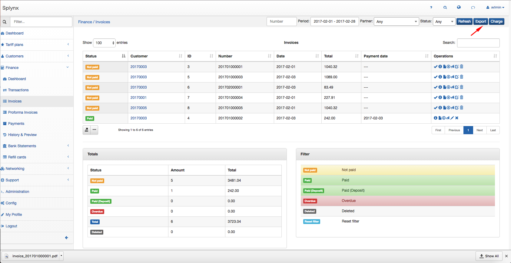
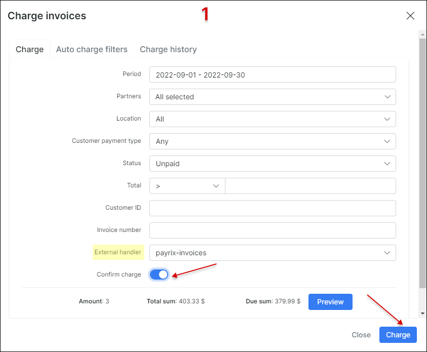
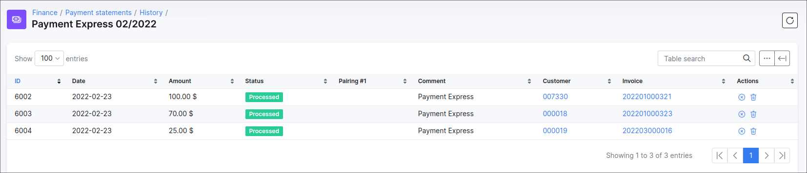

Invoices
==========

An invoice is a commercial document lists the goods or services you have supplied to your customer and what they owe you in return. It includes the cost of the products purchased or services rendered to the customer, the names of the seller and customer, description and price of goods or services and the terms of payment. The invoices are considered as the tax documents if your business is registered for VAT (value added tax), you are not allowed to simply remove an invoice from sales records. It's required to issue invoices in line with specific regulatory requirements and to keep copies to show what revenue you earned and any tax you might have collected on the sale. The invoice can be annulled with a [credit note](finance/credit_notes/credit_notes.md) if issued incorrectly.

**Splynx provides the ability to work with or without invoices**.
Without issuing invoices, Splynx just receives payments and charges customers each invoice period without creating an official document. When invoicing is required, Splynx is able to generate invoices automatically or an administrator can issue invoices manually.

The invoices can be created for all required customers in Splynx or for an individual one. The invoices in PDF format are fully customisable with [templates](configuration/system/templates/templates.md).

All documents generated by Splynx can be exported in different formats (PDF, CSV, Excel) for printing or sending to the end-users.

---

* **All issued Invoices** can be found in `Finance → Invoices`. With the use of a filter, it is possible to display invoices by **Period** of time, **Partner** or **Status** (`Any`, `Paid`, `Unpaid`, `Pending`, `Deleted`). Beneath the list/table of invoices you'll find the table **Totals** that displays a total of all invoices by their status, the number of invoices in each status and the total amount of money in each status of invoices.

<icon class="image-icon"></icon> **NOTE:** Statistics of `Partially paid` invoices will be included in the `Unpaid` category of the **Totals** table.

Let's consider the **invoice statuses** in details:

| Status  | Description |
| ------------ | ------------ |
| <icon class="image-icon"></icon> | the invoice has been created, but the customer has not made any payments towards the balance |
| <icon class="image-icon"></icon> | the invoice has not been paid and is not yet past the due date but payment is sent for processing. Once the invoice payment is processed successfully, the invoice will be updated to either a `Paid` or `Unpaid` status. If the due period has been exceeded and the amount hasn't been paid, the status will be changed to `Pending Overdue` or `Overdue` status  |
| <icon class="image-icon"></icon> | the invoice was paid from customer's balance, a status is applied only if customer has enough funds |
|<icon class="image-icon"></icon> | the customer only pays a part of the total amount of the invoice.  |
| <icon class="image-icon"></icon> | no payment was received for this invoice and the `Payment due` date has already passed |
| <icon class="image-icon"></icon> | the invoice was marked as deleted. If we apply the `Mark as deleted` option for unpaid invoice, the invoice will be marked as deleted and its auto (`+Debit`) transaction (-s) will be removed. The manual transaction (-s), that was added to the invoice, will remain (even when `Delete completely` option was used) in any case. It's required to remove it manually |

---

To **export** the list of invoices for accounting purposes, open `Finance → Invoices` and click on **Export** button.

In the export window, you can choose the period of time and the export type/format (PDF, CSV, external handler, etc.).

Alternatively, once you have selected the required invoices, you can export them using one of the following actions `One PDF file`, `PDF files in archive`or `Export` in the mass **Actions** drop down menu.

---
If one of the [payment add-ons](payment_systems/payment_systems.md) is configured for customers in Splynx, you can manually **charge the invoices all at once** using the **Charge** button at the top right corner of the table or you can use the same named option in the mass **Actions** drop down menu by selecting the required invoices before.

In new window specify the necessary options for invoice charge:

- **Period** - the time period when the invoices were created;

- **Partners** - the service [provider](administration/main/partners/partners.md) to which the customer is assigned to;

- **Location** - the customer [location](administration/main/locations/locations.md);

- **Customer payment type** - the [method](configuration/finance/payment_methods/payment_methods.md) that is used by customer to make payments;

- **Status** - the status of invoice, by default is used `Unpaid`;

- **Total** - the total sum of the invoice, the amount can be specified by `=`(equal to), `<`(less than) and `>` (greater than) sings;

- **Customer ID** - the customer id within the Splynx;

- **Invoice number** - the number of invoice in Splynx, usually the format `{year}{partner_id|2}{next|6}` is used by default, it can be changed in `Config → Finance → Settings`;

- **External handler** - requires one of the [payment add-ons](payment_systems/payment_systems.md) in Splynx to be installed, as a result this determines which handler we can choose here;

- **External handler parameters** - the additional parameters that can be used with a specific handler. These may vary depending on the selected handler. For example with `paymentexpress` handler we can set `chunk size` parameter in order to split generated CSV file (used only for *PxPay* processing interface in *Payment Express*); With `netcash_do` handler we can set `action date` parameter to specify the date of affected transaction (-s), etc. ;

- **Confirm charge** - the toggle allows to confirm the charge;

- **Preview** - the button helps to check the invoices information before performing the charge.

>Once charged successfully, payment statements and batch files will be created and sent to payment add-on side and the issued invoices will be in **Pending** state. It will take some time for payments or bounced payments to be received. Then the status of the invoices will be changed to **Paid**.

To download the charge result files click on the link under the **Preview** button or click on the <icon class="image-icon"></icon> icon in **Charge history** tab.

Splynx checks for any payments and allocates them to the correct invoice, as a result the invoices will become *paid* or *unpaid*. You can check the status of the **payment statements** for the charge invoices in `Finance → Payment Statements → History`

---

The  **invoice charging process can be automated** using the **Auto charge filter**. Open `Finance → Invoices`, click on **Charge** button and select **AUTO CHARGE FILTERS** tab. Then press **Add** button.

<icon class="image-icon"></icon> **NOTE:** **Auto charge filter doesn't require any confirmation from the administrator, so use it with caution.**

<icon class="image-icon"></icon> **To make Auto Charge work properly you should navigate to `Config → Finance → Automation` and ensure that the value in `Date to use on finance elements` field is set to `Real date of issuing`.**

<b>Explanation</b>

Why we **cannot** use the `Billing date` value in the **Date to use on finance elements** field for Auto charge filter?

Let's say that we have the default settings in `Config → Finance → Automation`:

`Confirmation period (days)` = **3**;

`Date to use on finance elements` = **Billing date**;

And `Billing day` = **1** for the customers in Splynx (the option is located in  `Config → Finance → Settings`)

Consequently, the invoices will be auto-generated and will be visible for customers on the 4th day of the next month, but the date creation of such invoices is the 1st day of the month. The Auto Charge filter won't find the invoices on 1st day of the month because they are not visible to customers. When the 4th day arrives, the Auto filter will not charge the invoices because its creation date is the 1st day of the month.

In new window specify the necessary options for auto charge filter:

- **Enabled** - the toggle to enable/disable the filter;

- **Period** - date when the filter starts;
  - **Day of issue** - the same day when the invoice is created;
  - **Day after issue** - the day after the invoice is created;
  - **Day before due date** -the day before the invoice is created;
  - **On due date** - the amount of days after the billing day the customer has to make payments before getting blocked (usually it's 15th day of the month);
  - **+N days after issue** - X days after the invoice was created, the number can be specified in new field **Days after issue**;

- **Partners** - the service [provider](administration/main/partners/partners.md) to which the filter is applied to;

- **Location** - the customer [location](administration/main/locations/locations.md) to which the filter is applied to;

- **Customer payment type** - the customer's [method](configuration/finance/payment_methods/payment_methods.md) to make payments;

- **Status** - the status of the invoice to which the filter applies;

- **Total** - the total sum of the invoice to which the filter applies, the amount can be specified by `=`(equal to), `<`(less than) and `>` (greater than) sings;

- **Customer ID** - the customer id within the Splynx;

- **External handler** - requires one of the [payment add-ons](payment_systems/payment_systems.md) in Splynx to be installed, as a result this determines which handler we can choose here. **External handler parameters** can be specified as well for some add-ons;

Then, press **Save** button. To edit the created filter click on <icon class="image-icon"></icon> icon.

<icon class="image-icon"></icon> The filter will be triggered on the selected day in **Period** field **at 11:59 PM**. The result of the charge execution can be checked in **Charge history** tab, the value in **Source** column should be `auto`.

---

* In `Finance → Invoices` there are a **number of operations** that can be executed with the icons in the **Actions** column:

| Action  | Description  |
| ------------ | ------------ |
|<icon class="image-icon"></icon>  |  View an invoice |
|<icon class="image-icon"></icon>   | View an invoice as a PDF file  |
|<icon class="image-icon"></icon>   | Download an invoice as a PDF file  |
|<icon class="image-icon"></icon>   | Send an invoice via Email/SMS or as a message to Customer portal |
|<icon class="image-icon"></icon>   | Edit a payment  |
|<icon class="image-icon"></icon>   | Create [credit note](finance/credit_notes/credit_notes.md) for the current invoice  |
|<icon class="image-icon"></icon>   | Delete an invoice with/without transaction |
|<icon class="image-icon"></icon>   |Pay an invoice|

The same operations with invoices you can find in [Customer billing](customer_management/customer_billing/customer_billing.md) too.

<icon class="image-icon"></icon> **NOTE:** To **delete a payment associated with an invoice**, navigate to `Billing → Finance documents` in customer profile, choose `Payment` from the select menu of document type field and click on the <icon class="image-icon"></icon> (Delete) icon next to the necessary payment item.

* To **view an invoice** with the view icon<icon class="image-icon"></icon>, it is necessary to configure an **invoice template** first in `Config → System → Templates` and also to specify the use of the selected/modified template in `Config → System → Company information`.

On the **Company information** page, we define the [partner](administration/main/partners/partners.md) and the PDF [template](configuration/system/templates/templates.md) (`Invoice A4 Classic` item is selected as an example by default).
Once the PDF template is defined, it will be possible to view the invoice in PDF format.

---

[Finance formats](configuration/main_configuration/localization/localization.md) displayed on the invoice are customizable. Click on `Config → Main → Localization`,  to define the currency and other finance format settings.

Please note that all [templates](configuration/system/templates/templates.md) can be customized, navigate to `Config / Templates /` Choose the type of templates to display/work with and simple edit or add a new template you wish to use:

---

In `Config → Finance → Settings` can be found the global **Invoices settings** for all customers in Splynx system. In this menu, you can also define the **Invoice number format**, by default is used `{year}{partner_id|2}{next|6}`.

You might also be interested in [Finance settings](configuration/finance/finance_settings/finance_settings.md) description.

## Options description:

**Auto create invoices** - toggle enables/disables an automatic invoice generation for specific customer when the **Charge & Invoice** was used in `Customers → View → Billing Overview`

The global option to **Enable automatic issuing** is located in `Config → Finance → Automation` (see [Automation](configuration/finance/automation/automation.md)).

When the toggle **Auto create invoices** is not enabled in customer's `Billing → Billing config` tab, you can create invoice manually using the **Add document → One-Time invoice** or **Add document → Recurring invoice** buttons in `Billing → Finance documents` tab, during the step of invoice creating you can modify the next options: -

- **Number** - a number will be generated automatically. You can generate a new number using the button next to the field (an icon of magic wand). The invoice format number can be set in [Finance settings](configuration/finance/finance_settings/finance_settings.md);
- **Document date** - a transaction creation date;
- **Period** (only for a *Recurring* invoice ) - a period for which the invoice will be charged;
- **Payment due date** - the date by which the invoice must be paid. Please note, if you set the *Payment due date* value greater than the value in the *Payment due* field in the customer's *Billing config*, the customer will still be blocked the day after *Payment due*, but the *Recurring* invoice won't be with `Overdue` status;
- **Note** - some additional notes for the customer;
- **Select plan** - if the tariff plans have been created, you can select the necessary one in the selection menu. For a *Recurring* invoice, the plan will be loaded automatically, it's based on the service (-s) the customer uses;
- **Description** - a plan description, loaded automatically if you select a plan from the selection menu;
- **Quantity** - a property that is measured, e.g. `3`;
- **Unit** - a standard quantity against which a quantity is measured, e.g. `hour`; which is unit of the above quantity (in most cases, cannot be applied for a recurring invoice with service plan. But can be used for *One-time* invoices, where payment is made per hour);
- **Price** - a price of the plan, the value will be loaded automatically if the plan is chosen from the selection menu;
- **VAT %** - *Value Added Tax* is a flat tax levied on an item. Learn more about [Taxes](configuration/finance/taxes/taxes.md);

Also, the option `Load items from uncharged transactions` in the *One-time* invoice can be used to add the future item that was created with the option `Include transaction in next recurring invoice` and such transaction has not yet been included to any charge. Note that the future item will automatically be added to the *Recurring* invoice.

<icon class="image-icon"></icon> **NOTE:**

- If a *transaction* is added manually using the **Billing → Transactions → Add Transaction** button with the `Include transaction in next recurring invoice` option, transaction will not be removed during the deletion of created invoice (*One-time* or *Recurring*) with it or using **Cancel last recurring invoice** button. Such the unlinked transaction can only be deleted manually;

- The items with negative price value can be added to the invoice, but the invoice total price cannot be with the negative amount, it can only be equal to `0` or  greater than `0`;

- Statistics of `Partially paid` invoices will be included in the `Unpaid` category of the **Totals** table.

<b>click here to see the step-by-step example</b>

So, if the invoice includes at least one manual transaction and we are going to remove this invoice, such transaction can be remove only manually. Let's check it:

**STEP 1**

Create a transaction (future item) with the `Include transaction in next recurring invoice` option:

**STEP 2**

Add some service to customer, e.g. Internet service

**STEP 3**

In `Billing → Billing config` press **Charge & Invoice** button to charge the customer

**STEP 4**

Double check if the manual transaction has been added to newly created invoice

**STEP 5**

Delete the invoice completely using <icon class="image-icon"></icon> icon in `Billing → Finance documents` tab. Or press **Cancel last recurring invoice** button in `Billing → Billing config` tab. The current invoice includes the auto (charge for service - step 3) and manual transactions (it was added manually in step 1).

The next warning message will be shown:

If we apply `Cancel last recurring invoice` and the invoice includes not only manual transaction (-s), the warning message will be the next:

**STEP 6**

Check if the manual transaction is present in `Billing → Transactions`. Mind, that it can only be removed manually.

Also, take into consideration the following:

- during the converting a [quote](crm/quotes/quotes.md) to the invoice in customer's profile (`CRM → Quotes` tabs) or the converting some lead account to customer one, the auto transaction will be created. If we remove the created invoice, the auto transaction will be removed as well;

- if we create the invoice manually e.g. using **Add document -> One-time invoice** button and after that remove such invoice, the transaction will be removed automatically;

These statements and example above also apply to `delete` option in drop-down menu with mass **Actions** in `Finance → Invoices`.

For more information about transactions, see [Transactions guide](finance/transactions/transactions.md).

---

While deleting the unpaid invoice in customer's profile in `Billing → Finance documents` tab, it's possible to use `Mark as delete` option instead of delete invoice completely. The option can be useful when we want to have a fuller context of the customer's billing flow.

In this case, the invoice will be marked as deleted, its auto transaction (-s) will be removed. The manual transaction (-s) (future item) related to the invoice will remain in any case. But such transaction can be deleted manually.

<icon class="image-icon"></icon> **NOTE:** The invoice (-s) with `Deleted` status cannot be reverted back to `Unpaid` status, only **Delete completely** option can be applied.

---

To **edit an unpaid invoice** click on the <icon class="image-icon"></icon> icon in customer's `Billing → Finance documents` tab.

---

It is also possible **to send invoice (-s) via email** with the <icon class="image-icon"></icon> icon (if the email server is [configured](configuration/main_configuration/email_config/email_config.md)) in `Billing → Invoices`.
You can write a message body or choose a template to populate it.

You can also type a new message body and save it as a new template.

---
