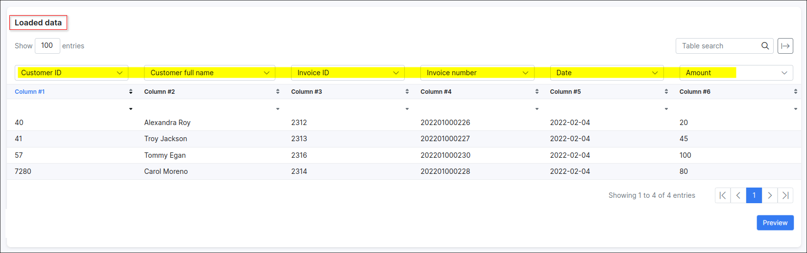
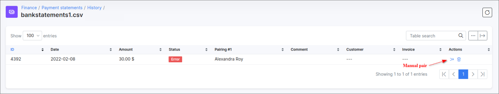
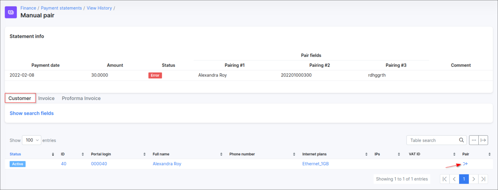
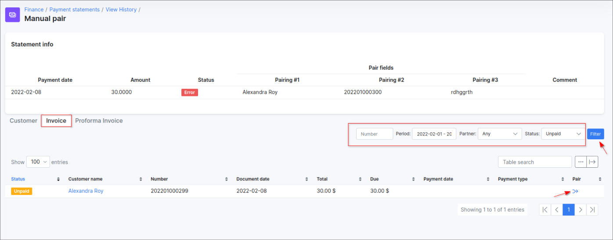

Payment statement processing
==========

The **payment statement processing** feature allows you to reconcile payments receivable with issued invoices by paring them, processing of multiple payments simultaneously is supported.

Payment transactions are automatically processed by Splynx **handlers** – *small modules created for each bank file format*.

---

Payment statement processing starts with **importing statement format file** into Splynx, e.g. **csv** file. For each payments list, a different external handler can be used.

<icon class="image-icon"></icon> Our development team, on a paid basis, can create an external handler to process your bank statements if the *Base* handler doesn't correspond your needs. Please, create a ticket for more details.

---

When the file is loaded, the next step is **to set up matching criteria** for the statement processing fields and click on **Preview**.

For example, we have the file with the next content:

So, we select the necessary fields according to our data:

**NOTE:** The file does not have to contain all of these fields, for example, the file can include only the `Customer full name` and `Amount` fields.

---

After the **Process** button is pressed, a new table with paired data will appear where we can **check all matches** with payments, invoices etc. To finish the processing of multiple payments click on the **Process** button below the table.

---

A notification about successful payment processing will appear:

Then, navigate to `Payment statements → History` to check if the document records were successfully processed and what errors may have occurred:

You can view processed payments from a particular statement more detailed. If you click on the **View** option <icon class="image-icon"></icon> in the **Actions** column or on a title of each file in the **Title** column, a window will appear with a description of every status of processed payment.

Payments with the `Error` or `Ignored` status can be checked and **paired manually** by clicking on the <icon class="image-icon"></icon> (Manual pair) icon in the **Actions** column.

**NOTE:** Payments will be marked with an `Ignored` status when they've already been paid, but you can always double-check the payments and pair them manually.

When you click on the <icon class="image-icon"></icon> (Manual pair) icon, a new window will appear, where you can search for a customer by entering their details, such as portal login, full name, email, phone number etc.

You can also search by entering the Invoice or Proforma Invoice number in the Invoice or Proforma Invoice section of the table or filter all invoices/proforma invoices for a particular period.

When you find the customer whose payment need to be paired, click on the <icon class="image-icon"></icon> (Pair) icon in the **Pair** column of the table. In new window select the [Payment type](configuration/finance/payment_methods/payment_methods.md) and press the **Pair** button to confirm.

Once the manual paring is done, the status of the payment in the Payment statements history view (`Finance → Payment statements → View History`) will be marked as **Manually paired** and payment will be added on customer's account balance.

