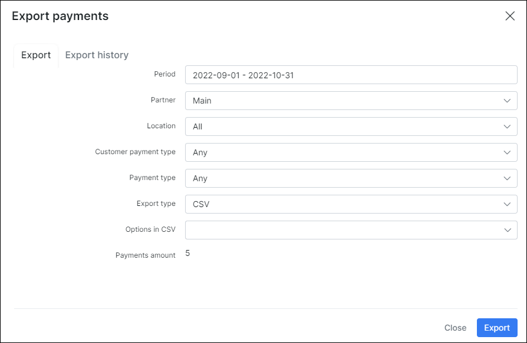

Payments
==========

Splynx processes payments. When customer pays cash at your company office, the cash desk module can be used to enter payments into the system. The cash desk operator’s access is limited: he can only accept, enter payments and view customers’ details. The administrator can add cash payments into the system as well.

ISPs usually have different payment methods; Splynx supports bank transactions or generation of SEPA payment orders and also wide range of payment gateways.

**Payments' table** in Finance module displays all different types of payments for a particular period of time according your choice.
You can also range them by Partner. Under the list of Payments will be a table called *"Totals"*, which will display all types of payments for a particular period of time with number of payments in each type and amount of money in each type.

**To export payments** selected by you into one PDF or CSV file click on tab Export and window with exporting options will pop-up, where you can create an export based on partner, location, customer payment type etc. Here you can also select an export type of the file.

It is possible **to add the payment manually** (without making an invoice).
You will find that option in `Billing →Payments`. Click on `Add Payment` button and window will pop-up, where you can select a Payment type (Cash, Bank transfer, PayPal, Credit card, Braintree etc.), add a Date of payment, Amount, Receipt number, Note for customer and Memo for you etc.

You can also **enable Send receipt option** here, so customer will receive a receipt after payment will be made. After payment will be created  a credit transaction will appear in Transactions table (`Customer's Billing→Transactions`).

It is possible **to operate with every payment** using icons <icon class="image-icon"></icon> the column Operations.
For example, with  option you can edit the payment, with <icon class="image-icon"></icon> icon  you can send payment receipt to the customer, with icon <icon class="image-icon"></icon> you can download payment receipt in PDF format.

