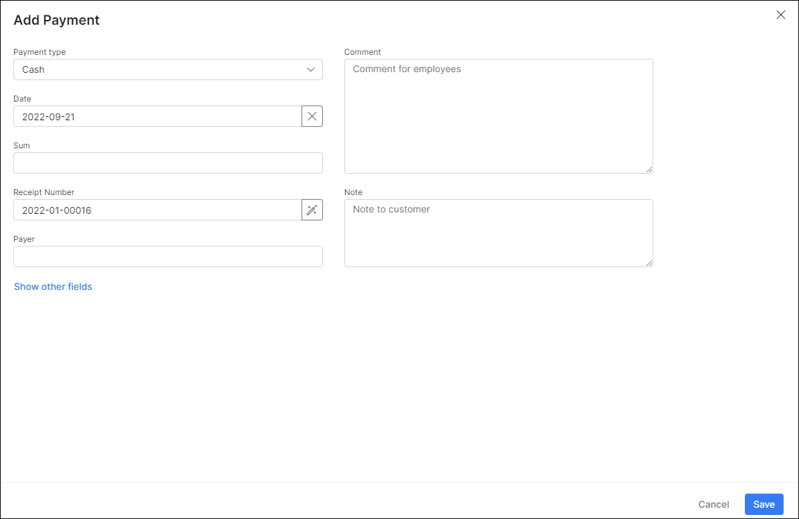

Payments
============

This is the home of all payments in your Splynx system. All payments made by the customer or for the customer by means of all payment methods available are recorded and displayed here.

Splynx is able to process many different methods of payments, to name a few, cash payments, processing and generating of SEPA payment order, bank statement processing and a wide range of payment gateways(Sagepay, etc.)

The Splynx cash desk module can be used to process payments administratively under a restricted and monitored platform.

For more information on the cash desk module please click [ here](addons_modules/cashdesk/cashdesk.md).

The **Payments' table** in the Finance module displays all different types of payments for a particular period of time according to your selection.
You can also range payments by Partner. Under the list of Payments will be a table called *"Totals"*, which will display all types of payments for a particular period of time with a number of payments in each type and amount of money in each type.

Payments selected by you can be **Exported** into one PDF or CSV file, click on the _Export_ button and a window with exporting options will appear, where you can create an export based on the partner, location, or the customer payment type, etc. Here you can also select an export format.

**Manual Payments**

Manual payments can be added in Splynx without the use or need of an invoice. This is done in the customer profile under `Customer view/ Billing / Payments`. Simply click on the _Add Payment_ button and a window will appear, where you can select a Payment type (Cash, Bank transfer, PayPal, Credit card, Braintree, etc.), add a Date of payment, Amount, Receipt number, Note for customer and Memo for you, etc.
You can also choose to send a receipt to the customer by enabling the toggle
thereof. Once a payment is created, a new credit transaction will be visible in the list of transactions.

In the list of payments, you will find a number of icons in the actions column which is used to execute different action to the payment.  <icon class="image-icon"></icon>
For example, with the edit  <icon class="image-icon"></icon> option you can edit the payment, with the send <icon class="image-icon"></icon> icon  you can send the payment receipt to the customer, with the download <icon class="image-icon"></icon> icon you can download payment receipt in PDF format.

