Proforma invoices
==========

**Pro-forma Invoice** is an abridged or estimated invoice sent by a seller to a buyer in advance for the delivery of services/goods. It notes the kind and quantity of services/goods, their value, and other important information. Proforma invoices are commonly used as preliminary invoices with a quotation, or for customs purposes in importation. They differ from a normal invoice in not being a demand or request for payment.

In our billing system, a Proforma Invoice can be used as a request for payment in advance. For example, it can be created 1 month before the occurring payment, so you will see if the customer is able to pay the Proforma Invoice. When a proforma invoice is created, the customer’s balance will not be changed. The main reason for this billing approach is to prevent the payment of VAT tax for non-paying customers. If the customer pays the amount specified in the Proforma Invoice PDF, the company can issue a tax Invoice.

An example of this document is shown in the picture below:
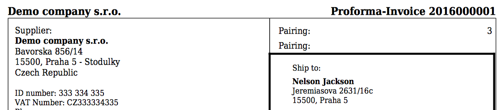

---
All issued Proforma invoices in the system can be found in `Finance → Proforma Invoices`.  It is possible to range them by a particular period of time or partner. You can also access a specific customer's proforma invoices, navigate to `Customers / List / Select customer /  Billing / Proforma Invoices`:

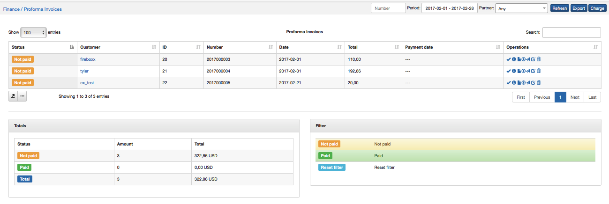

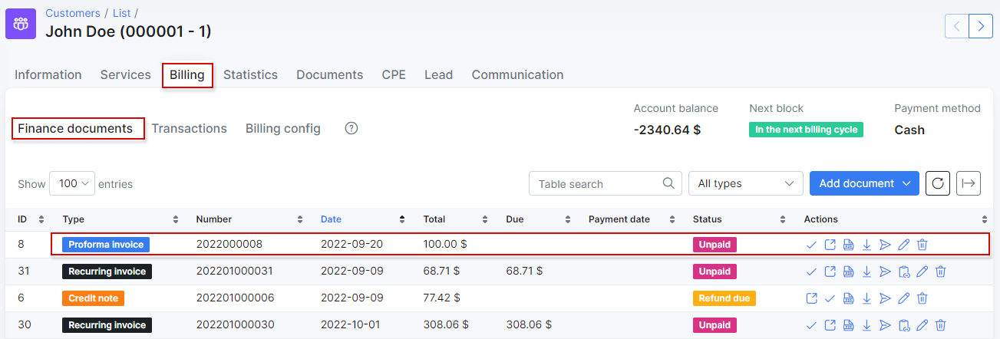

You can also filter proforma invoices in finance to view specific data by period, status or partner.

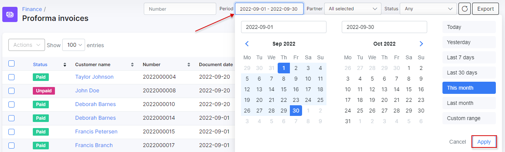

Changes can be made to all proforma invoice with the icons <icon class="image-icon"></icon> in the "*Actions*" column.

* To be able **to view** proforma invoices in PDF format with the view icon <icon class="image-icon"></icon>, it is necessary to configure an invoice template first in `Config → System → Templates` and define the template to use in `Config → System → Company information`.
More information about Invoice template configurations can be found here - [Templates](configuration/system/templates/templates.md), [Invoices](finance/invoices/invoices.md).

* You can also **set up proforma invoice global settings** for all customers in `Config → Finance → Settings`.

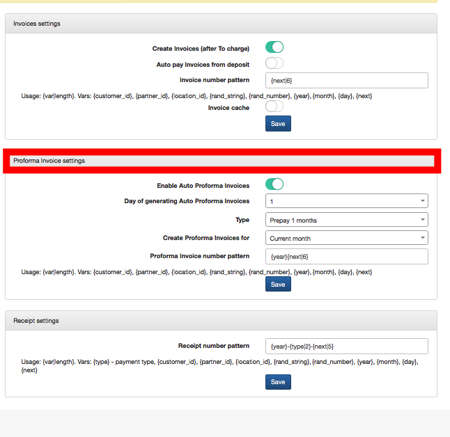

**To edit** the proforma invoice with the edit icon <icon class="image-icon"></icon> , click on the tab `Billing → Proforma Invoices`.

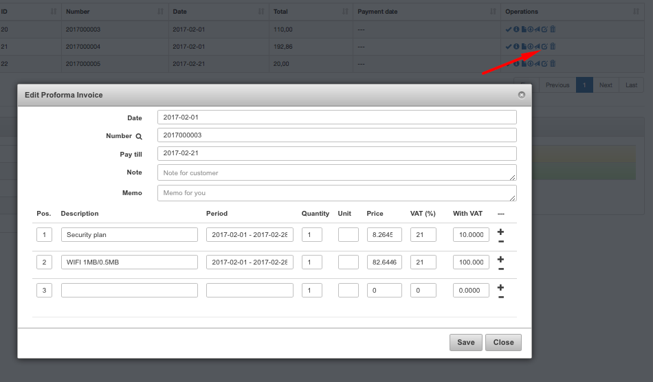

It is possible **to send** the proforma invoice via email with <icon class="image-icon"></icon> (if the email server is [configured](configuration/main_configuration/email_config/email_config.md)).
You can write a message body or choose it from templates and load it.

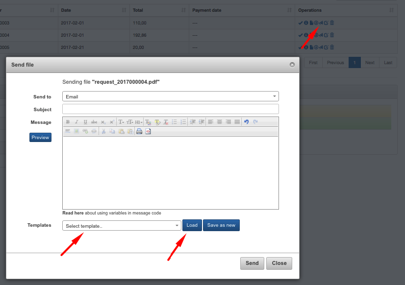

You can also write here a message body and save it as a template.

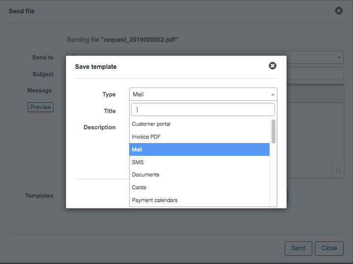

---
**To print or export** the list of proforma invoices for accounting purposes, click on `Finance → Invoices` and click on `Export`. You can select here Period of time, Partner, Location, Customer payment type (cash, bank transfer, PayPal, Credit card, refill card, etc.), Status (paid\ unpaid), Export type (CSV, PDF file inactive, one PDF file, etc.). You can also check an export history here.

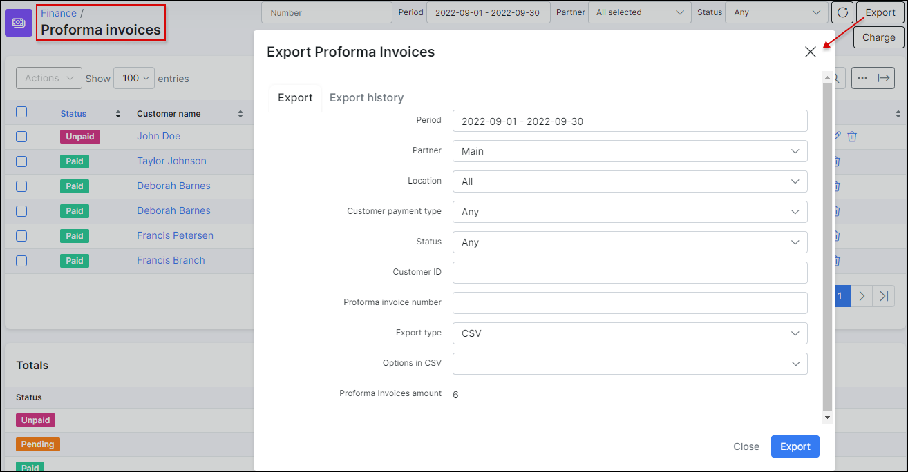

It is possible to **enable auto-creating of proforma invoices** in `Customer's Billing → Billing overview`  choose the particular day, month and type.
Automation for creating proforma invoices is also possible, navigate to `Customer's Billing → Billing overview` and simply enabled the toggle and complete the parameters for generating.

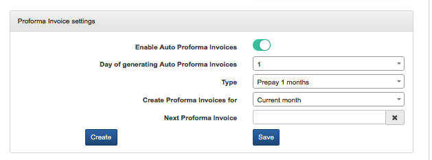

**Parameter descriptions**

* **Day of generating Auto Proforma Invoices**- the day to generate proforma invoices
* **Period** - the period to charge customers for on the invoice
* **Create Proforma Invoice for** - which month to charge the customer for
* **Next Proforma** - when to generate the next proforma invoice

There is also the possibility **to create Proforma Invoices manually** by clicking on *Add Proforma Invoice* in `Customer's Billing → Proforma Invoices`.

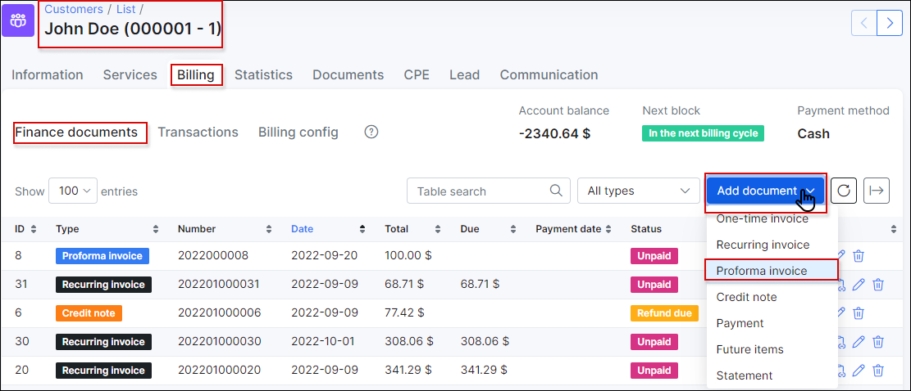
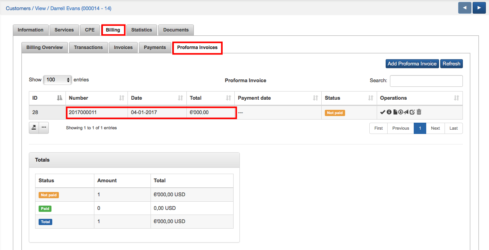
