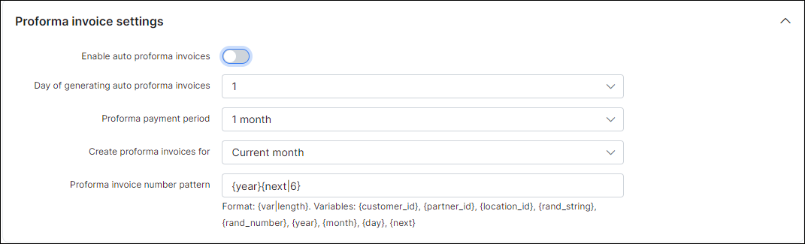

Proforma invoices
==========

**Proforma invoice** is a brief or estimated invoice sent by a seller to a buyer in advance for the delivery of services/goods. It notes the kind and quantity of services/goods, their value, and other important information. Proforma invoices are commonly used as preliminary invoices with a quotation, or for customs purposes in importation. Unlike ordinary invoices, proforma invoices do not request for payment.

In our billing system, **Proforma invoice** can be used as a request for payment in advance. For example, it can be created 1 month before the occurring payment, so you will see if the customer is able to pay the proforma invoice. When a proforma invoice is created, the customer’s balance will not be changed. The main reason for this billing approach is to prevent the payment of VAT tax for non-paying customers. If the customer pays the amount specified in the Proforma invoice PDF, the company can issue a tax invoice.

An example of this document is shown in the picture below:

---
It is possible to **set up proforma invoice global settings** for all customers in `Config → Finance → Settings`.

You can also **enable auto-creating of proforma invoices**, simply enable the toggle and complete the parameters for generating.

**Parameter descriptions**

* **Day of generating Auto Proforma Invoices** - the day to generate proforma invoices
* **Proforma payment period** - the period to charge customers for the invoice
* **Create proforma Invoice for** - which month to charge the customer for
* **Proforma invoice number pattern** - pattern for generating the proforma invoice number

There is also the possibility **to create Proforma Invoices manually** in customer's *Finance documents* section by clicking on `Add document` and selecting *Proforma invoice* in the drop-down menu.

***************************************************************
All issued proforma invoices in the system can be found in `Finance → Proforma Invoices`.  It is possible to range them by a particular period of time or partner. 

You can also access a specific customer's proforma invoices. Navigate to *Customers → List → Select customer → Billing → Finance documents*:

Also, it is possible to filter proforma invoices in finance to view specific data by its **number**, **period**, **status** or **partner**.

*********************************************************************
Let's consider the proforma invoice statuses in details:

| Status  | Description |
| ------------ | ------------ |
| <icon class="image-icon"></icon>  | the invoice has been created, but the customer has not made any payments towards the balance |
| <icon class="image-icon"></icon>   | the proforma invoice has not been paid and is not yet past due but payment is sent for processing. Once the invoice payment is processed successfully, the proforma invoice will be updated to either `Paid` or `Unpaid` status.|
| <icon class="image-icon"></icon>   | a payment has been successfully collected |

Changes can be made to all proforma invoices with the icons <icon class="image-icon"></icon> in the "*Actions*" column.

You can apply all these actions either in *Finance → Proforma invoice* or in *Customers → List → Select customer → Billing → Finance documents*.

**Actions overview:**

<icon class="image-icon"></icon> View proforma invoice

<icon class="image-icon"></icon> Open proforma invoice in PDF format

* To be able **to view** proforma invoices in PDF format, it is necessary to configure an invoice template first in `Config → System → Templates` and define the template to use in `Config → System → Company information`.
More information about Invoice template configurations can be found here: [Templates](configuration/system/templates/templates.md), [Invoices](finance/invoices/invoices.md).

<icon class="image-icon"></icon> Download proforma invoice in PDF format

<icon class="image-icon"></icon> Send proforma invoice via email

* It is possible **to send** the proforma invoice via email if the email server is [configured](configuration/main_configuration/email_config/email_config.md)).

<icon class="image-icon"></icon> Edit proforma invoice information

<icon class="image-icon"></icon> Delete proforma invoice

---
**To print or export** the list of proforma invoices for accounting purposes, go to *Finance → Invoices* and click on `Export`. You can select and enter here Period of time, Partner, Location, Customer payment type (cash, bank transfer, PayPal, Credit card, refill card, etc.), Status (paid\ unpaid), Customer ID, Proforma invoice number, Export type (CSV, PDF file inactive, one PDF file, etc.). Also it is possible to check an export history in the next tab.

