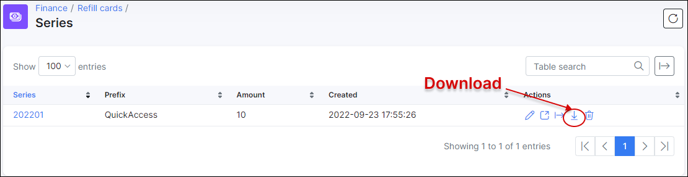

Refill cards
==========

This is a convenient method for your customers to pay for their services and/or make prepaid deposits. Refill cards can be generated in Splynx with options to export them in PDF or CSV formats, to either send to the customer or print a physical copy to hand to the customer. The customer can then redeem the refill cards via the customer portal.

## How to enable refill cards

To enable Refill cards, navigate to *Config → Integrations → Main modules → Finance*, and simply enable the toggle.

## How to generate Refill cards for your customers

* In `Finance → Refill cards → Generate` set up parameters for Refill cards generation: Quantity, Prefix, Price, choose the partner and valid date, and click on `Generate`.

  

**Parameter descriptions**

* **Quantity** - the number of refill cards to generate.
* **Prefix** - the prefixed characters to use for the series of refill cards.
* **Price** - the price of one refill card within the series.
* **Partner** - the partners you wish to make this series of refill cards available to.
* **Valid till** - the expiration date of the refill cards in the series.
******************************************************************************
After generating refill cards, a new window appears displaying a table of all generated refill cards for the new series:

  

  In the Actions column, you can redeem <icon class="image-icon"></icon>, edit <icon class="image-icon"></icon> and delete <icon class="image-icon"></icon> refill cards.

Administrators can redeem a card to top up a customer's balance:

As soon as the card has been redeemed, the status of the card will be changed to *Used*:

After redeeming a refill card for the customer, it will be displayed in the list of the respective customer's transactions table in *Billing → Transactions*:

## Exporting refill cards

By clicking on the export icon, you can export cards in two available formats: CSV or PDF for further printing out and/or sending it as a sale to customers:

Then the download button appears and you will be able to download the series in the desired format:

The list of all series of refill cards can be found in _Finance → Refill Cards → Series_. In the Actions column, there are options to edit view, export or delete the series.

**********************************************************
## How customer can redeem purchased refill card

First, Refill cards should be enabled for the customer's portal. This can be done under *Config → Main → Portal → Per partner settings* in Finance section:

In the Customer's portal, the customer will go to `Finance → Payments → Refill card` and enter the refill card's full code into the Code field.

Customers will be able to check their balances in `Finance → Payments → List`, where the date of the payment, payment type, amount and a possible comment on the payment will be displayed in a table.

