Refill cards
==========

This is a very easy-to-use and convenient method for your customers' to pay for their service and/or make prepaid deposits. Refill cards can be generated in Splynx with options to export them in PDF or CSV formats, to either send to the customer or print a physical copy to hand to the customer. The customer can then redeem the refill cards via the customer portal.

## How to enable refill cards

To enable Refill cards, navigate to `Config → Integrations → Main modules → Finance`, and simply enable the toggle.

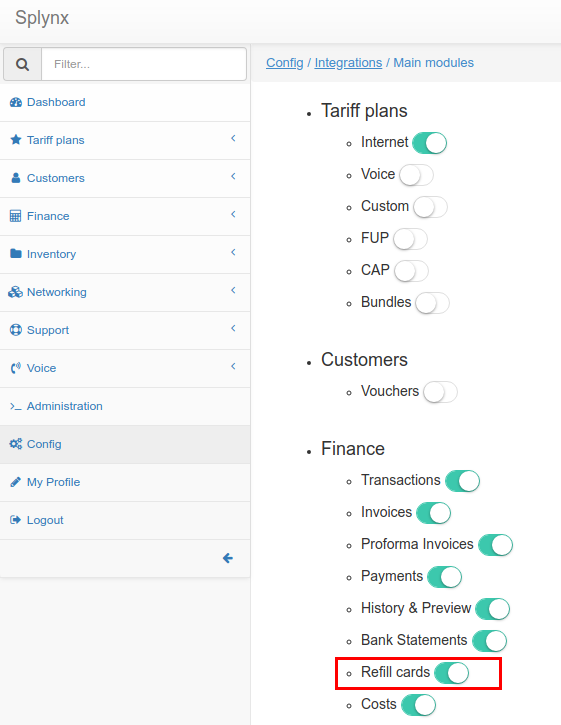

## How to generate Refill cards for your customers

* In `Finance → Refill cards → Generate` set up parameters for Refill cards generation: Quantity, Prefix, Price, choose the partner and valid date, and click on Generate.

To generate new refill cards, navigate to `Finance → Refill cards → Generate`, once here, you can specify the parameters to generate the refill cards with.

  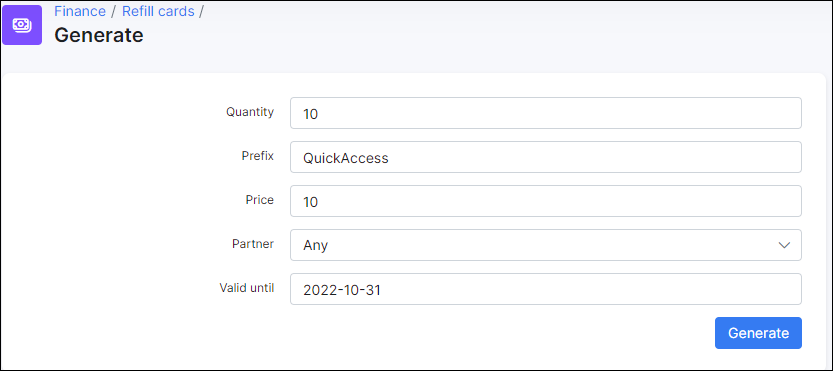

**Parameter descriptions**

* **Quantity** - The number of refill cards to generate.
* **Prefix** - The prefixed characters to use for the series of refill cards.
* **Price** - The price of one refill card within the series.
* **Partner** - The partners you wish to make this series of refill cards available to.
* **Valid till** - The expiration date of the refill cards in the series.

After completing the parameters for the generation of a new series of refill cards, upon generating a new window will appear displaying a table of all the generated refill cards for the new series.

  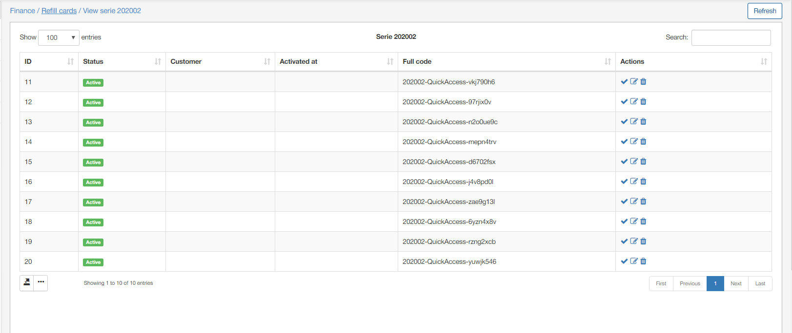

  In the Actions column the follow options (<icon class="image-icon">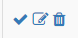</icon>) will be available for redeeming, editing, or deleting the refill card selected.

Administrators can redeem a card to top up a customer's balance by clicking on the redeem icon <icon class="image-icon"></icon>.

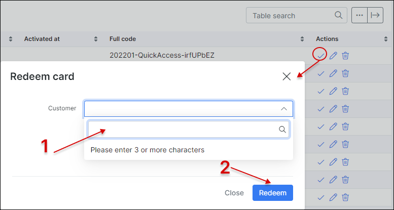

As soon as a card has been redeemed, the status of the card will be changed.

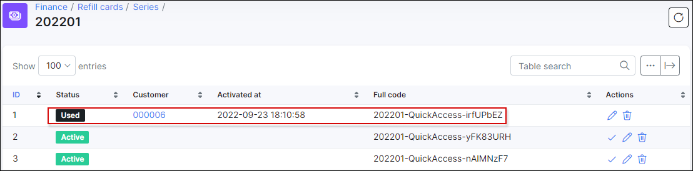

After redeeming a refill card for the customer, it will be displayed in the list of the respective customer's payments table in `Customers → View → Billing → Payments`

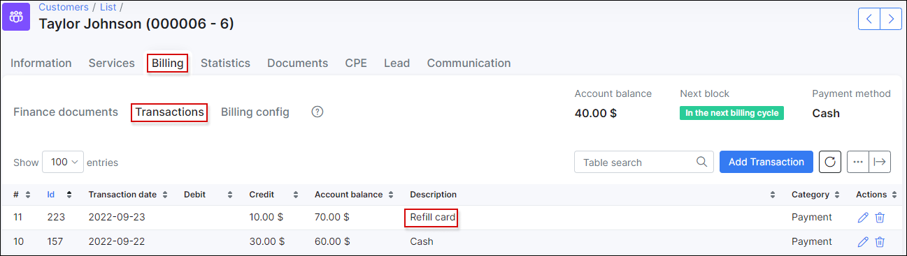

## Exporting refill cards

By clicking on the export icon <icon class="image-icon"></icon>, you can export cards in two available formats: CSV or PDF for further printing out and/or sending it as a sale to customers.

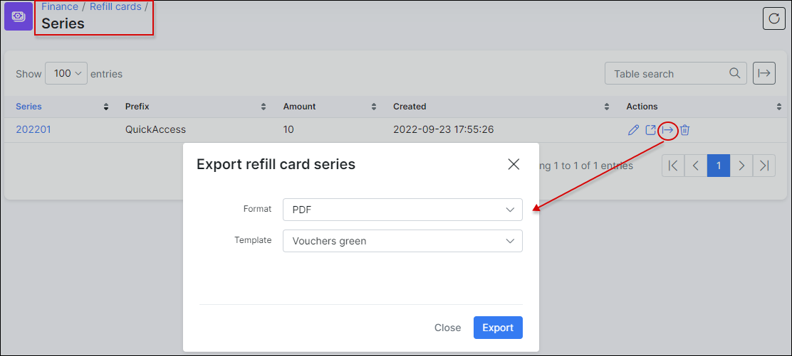

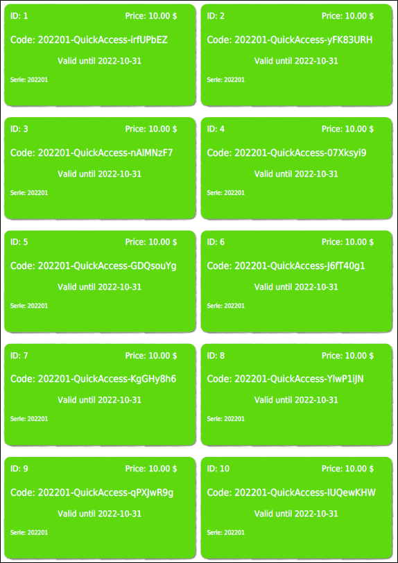

The list of all series of refill cards can be found in `Finance / Refill Cards / Series`

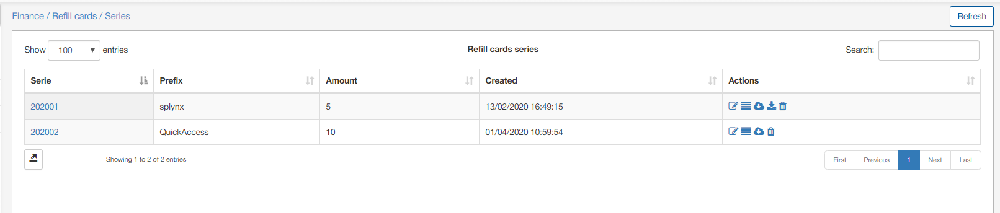

Here there are options available in the Actions column to edit, view refill cards within the series, export refill cards, or delete the series. <icon class="image-icon">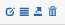</icon>

## How customer can redeem purchased refill card

First, Refill cards should be enabled for the customer's portal. This can be done under `Config → Main → Portal → Finance section `.

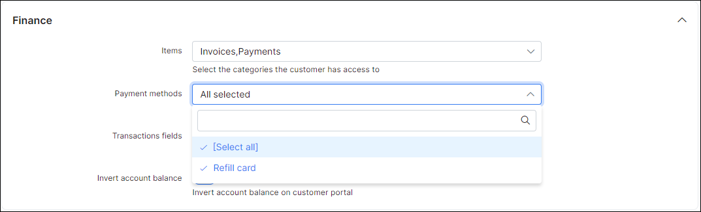

In the Customer's portal, the customer will go to `Finance → Payments → Refill card` and enter the refill card's full code into the Code field.

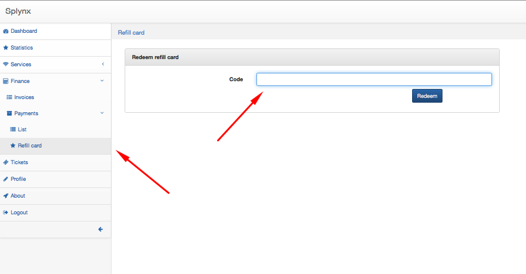

Customers will be able to check their balances in `Finance → Payments → List`, where the date of the payment, payment type, amount and a possible comment on the payment will be displayed in a table.

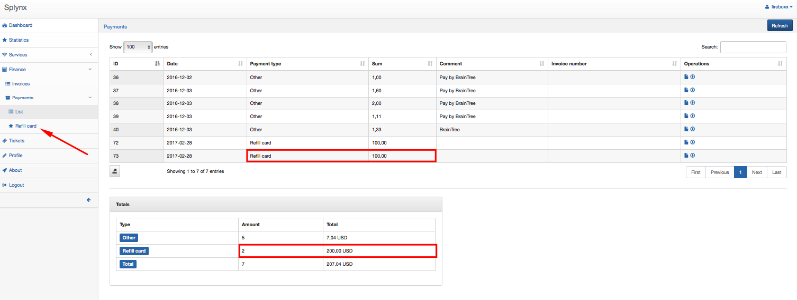
