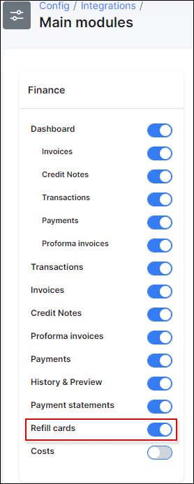

Refill cards
==========

Very easy and convenient way for your customers to pay for their services or make a prepaid deposit is to use refill cards. You can generate Refill cards in Splynx with further exporting them in PDF and CSV format, printing out and delivering them to customers. Your customers, in turn, will be able to redeem refill card via customers' portal.

## How to enable refill cards

Enable Refill cards under `Config → Integrations → Main modules`

## How to generate Refil cards for your customers

* In `Finance → Refill cards → Generate` set up parameters for Refill cards generating: Quantity, Prefix, Price, choose the partner and valid date, and click on Generate.

  

* As soon as cards will be generated a window will pop up with a table of refill cards series.
  

  In Actions column will be options  for editing, viewing the list of Refill cards' series, exporting them and deleting. To edit refill cards serie click on  and window will appear enabling you to make changes.

  

*  By clicking on icon  or on card serie in the Serie Column a table of all cards created under this serie will appear with their full codes.

  

---
Here you can redeem customers' card to top up their balance by clicking on .

As soon as card will be redeemed its status will be changed.

In `Customers → View → Billing → Payments` will be possible to see activated card and amount of deposit made on the customer's account.

---
By clicking on icon  you can export cards in two available formats: CSV and PDF for further printing out and sale to customers.

## How customer can redeem purchased refill card

First, Refill cards should be enabled for the customer's portal. It can be done under `Config → Main → Portal`.

In Customer's portal customer will go to `Finance → Payments → Refill` card and enter the card's code into Code window.

Customers will be able to check their balance in `Finance → Payments → List`, where date of the payment, payment type, amount and possible comment on the payment will be shown.

