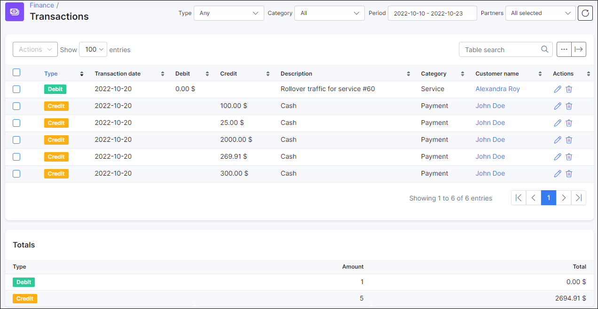
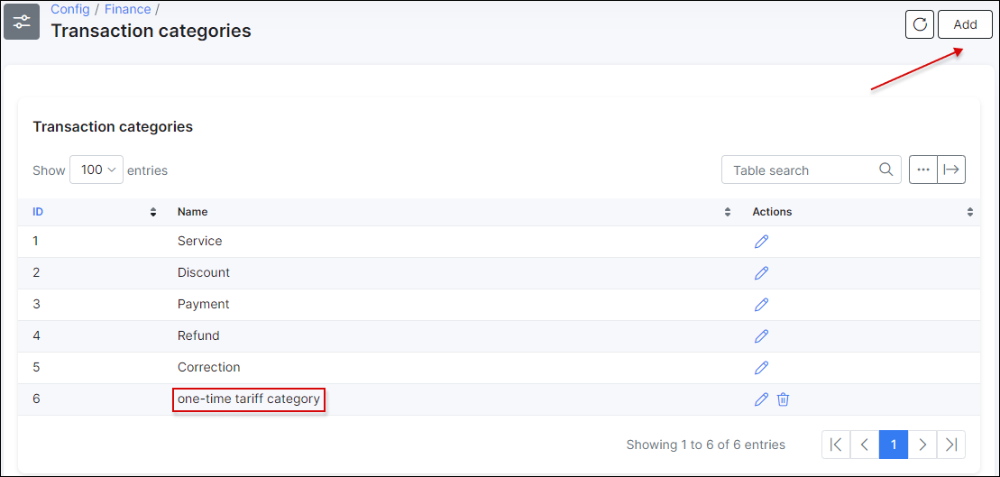

Transactions
============

The entire billing process within Splynx is based on transactions. **Transactions** are the key points in billing and they are always added when there is a change in the customer’s billing flow or balance. The following actions create transactions:

1. **Each invoice period Splynx charges customers automatically**. The administrator can set up the invoice date as the 1st day of the month, and then the customer will be charged for the calendar month.
Splynx has the ability to charge each customer on a different date. For example, one customer is charged on the 15th day of the month and another customer is charged on the 20th. This action creates an `+ Debit` transaction.

2. **The administrator creates the invoice manually**. This action can be performed in `Billing → Finance documents` tab of customer's profile using `Add document → One-time (Recurring) invoice / Future item`  option. This actions create an `+ Debit` transaction.

3. **When a customer pays for service, a transaction is created**. Customers can pay via bank transfer, cash or an online payment gateway. Splynx will always pair the payment with the customer’s account and create one payment transaction. A `- Credit` transaction is created in such case.

4. **When an administrator adds or removes money to/from the customer’s balance**.

5. **When a correction is needed, it can be achieved with a [Credit note](finance/credit_notes/credit_notes.md)**, this in turn makes a transaction creation as well.

Thanks to the transaction system, there is always a clear history as a way to track changes in the customer’s profile (`Customers → List → View (some customer id) → Billing tab → Transactions tab`).

---

The transactions table in `Finance → Transactions` displays all types of transactions related to the customers and contains the *Customer name/ID*, *transaction ID*, *date of transaction*, *type of transaction (debit or credit)*, its *description*, *price*, etc.

A table called **Totals** below the transactions list, displays the **type of transaction** (`Debit / Credit`), **the amount of transactions** and **total amount of money** for each of type.

  

A filter is located above the transactions list, it can be used to sort particular transactions, e.g. by **partner**, by transaction's **category**, by **type** or **period**.

  

Like all tables in Splynx, the icon <icon class="image-icon"></icon> at the top-right corner of the transactions list can be used to export the table by means of printing, copying or saving the table in preferred file. The table can also be customized to view desired/preferred fields/columns with the use of <icon class="image-icon"></icon> icon.

  

  

To add a transaction manually, navigate to `Customers → List → View (some customer id) → Billing tab → Transactions` and click on **Add Transaction** button.

  

When you click on **Add Transaction** button, a window will appear with different fields and options for you to complete and select for the new transaction: **Type** (`Debit/ Credit`), **Comment**, **Category** (*service, discount, payment, refund, correction for customer's balance* etc.), **Transaction date**, **Period**,
**Include transaction in next recurring invoice**, item **Description**, **Quantity**, **Unit**, **Price**, **VAT %**, price **With VAT** and **Total**.

  

**NOTE:**

- If you create a transaction and add an item to it, related to **One-Time** tariff plan, a transaction **Category** will be loaded from the one-time plan settings set up in Splynx.

<b>Example:</b>

1. In `Config → Finance → Transaction categories` was added the additional category item - `one-time tariff category`.

2. Our one-time plan `Router_set-up_one-time` is linked to newly created category:

3. When we add `Router_set-up_one-time` one-time plan to new transaction, transaction category will be loaded automatically according to one-time plan configuration.

If the option `Default for service type` is used in the field **Transaction category** of **One-Time** tariff plan settings, the transaction category will loaded according to the global configuration in `Config → Finance → Transaction categories` (section **Transaction categories configuration**).

More information about **transaction categories** you can find [here](configuration/finance/transaction_categories/transaction_categories.md).

- If the transaction is created with the option `Include transaction in next recurring invoice`, [Future item](customer_management/customer_billing/customer_billing.md) will be created in customer's finance documents.

- A new created **Future item** can be loaded to a new recurring (one-time) invoice during its creation with the help of `Load items from uncharged transactions`.

  

  

When the transaction is created, it is possible to **edit** or **delete** it with the help of related options in **Actions** column <icon class="image-icon"></icon>.

**Important:** If the transaction is created with `Include transaction in next recurring invoice` option and it's loaded into invoice, the transaction by itself will be in **read-only mode** (you cannot edit or delete such transaction), however, the related invoice can be edited accordingly.

For more information about invoices, see [Invoices](finance/invoices/invoices.md) guide.
