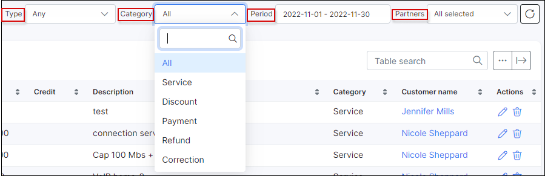
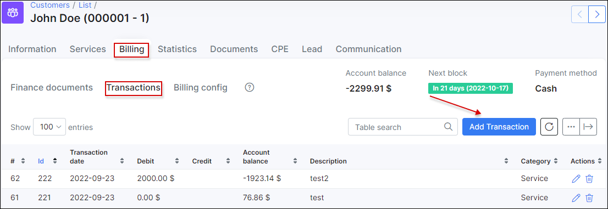
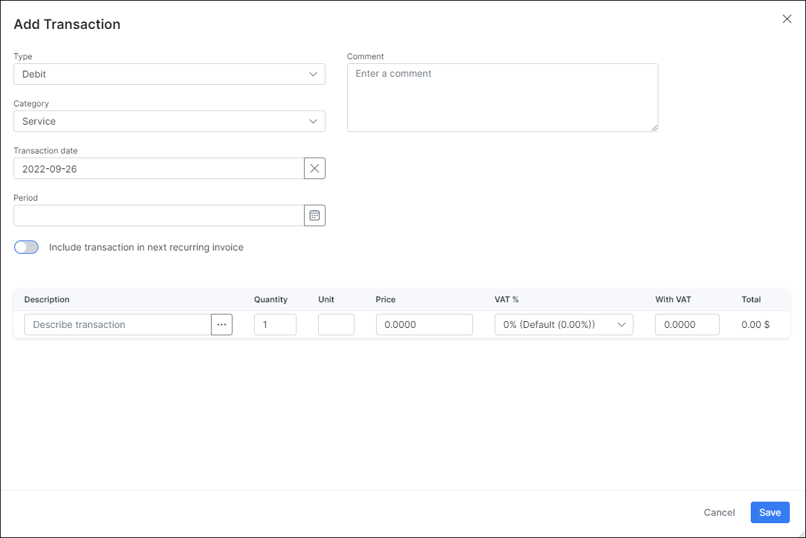

Transactions
============

The entire billing process within Splynx is based on transactions. Transactions are the key points in billing and they are always added when there is a change in the customer’s flow or balance. The following actions create transactions:

a. _Each invoice period Splynx charges customers automatically._ The administrator can set up the invoice date as the 1st day of the month, and then the customer will be charged for the calendar month.
Splynx has the ability to charge each customer on a different date. For example, one customer is charged on the 15th day of the month, and another customer is charged on the 20th. This action creates an “+ Debit” transaction.

b. _When a customer pays for services, a transaction is created._ Customers can pay via bank transfer, cash or an online payment gateway. Splynx will always pair the payment with the customer’s account and create one payment transaction. A “- Credit” transaction is then created.

c. _When an administrator adds or removes money to/from the customer’s balance._

d. _When a correction is needed, it’s also achieved with a transaction._

Thanks to the transaction system, there is always a clear history as a way to track changes in the customer’s profile.

---

The Transactions table in the _Finance Module_ displays all types of transactions related to the customer and contains the Customer name, ID, date of transaction, type of transaction (debit or credit), its description, price, etc.

* There is a table called "_Totals_" below the transactions table, which displays the `type of transaction` (Debit / Credit), `the number of transactions` in total for each type and `total amount of money` respectively.

  

* There is a filter included above the transactions table which can be used to view particular transactions, for example, by partner, by transaction's category, by type or period.

  

Like all tables in Splynx, the buttons below the table can be used to export the table by means of printing, copying or saving the table in either Excel, CSV or PDF formats. The table can also be customized to view desired/preferred fields/columns with the use of the breadcrumbs icon.
  

  

* **Correcting customer account balances** It is sometimes necessary to correct customer account balances due to offerings of free services, credit, etc. We do this by means of creating a new transaction and adding an invoice from the transaction. To perform these actions, navigate to _Customer → View Customer → Billing → Transactions_.

  

  When you click on _Add transaction_, a window will appear with different fields and options for you to complete and select for the new transaction: The `Type (Debit/ Credit)`, `Description`, `Quantity`, `Unit`, `Price`, `VAT`, `Total amount`, `Category` (service, discount, payment, refund, correction for customer's balance, Braintree fee, etc.), `Date`, `Comment` on the transaction and `Period` of the transaction can be specified here.

  

* Once a new transaction is created, it is also possible **to generate an invoice manually** by clicking on _Add Invoice from transaction_ in the Transactions tab. When clicking this button a window will appear where you can fill-in/select the following fields: `Description`, `Price`, `Period`, `Note` for the customer or `Memo` for you (if necessary).

  

* Once the transaction is created, it is possible to edit or delete it with the icons in the Actions column <icon class="image-icon"></icon> . Please note, if you've added an Invoice from a transaction, the option to edit or delete the transaction will no longer be available, however, the invoice can be edited accordingly.  
