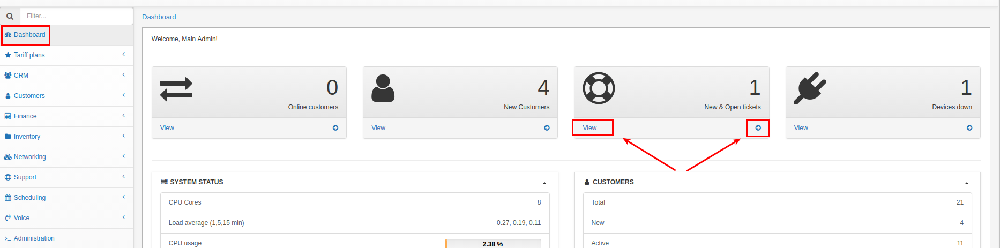
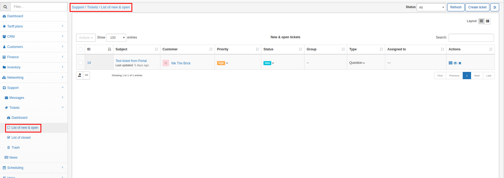
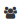
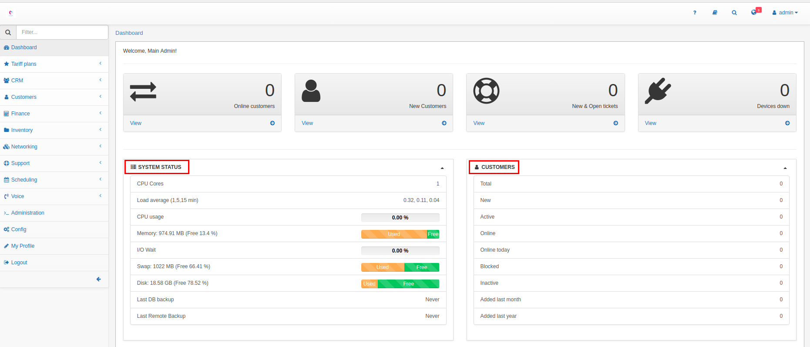
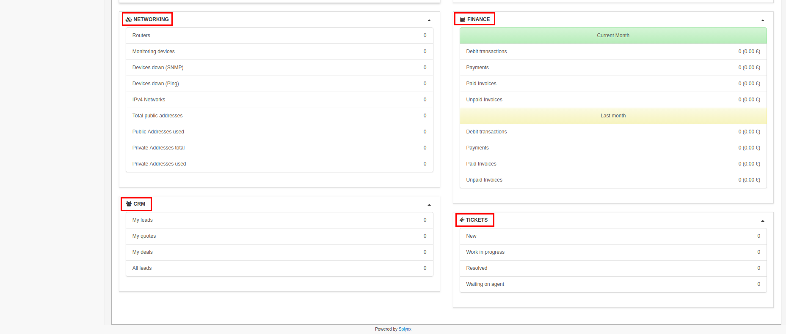

Dashboard
=========

Dashboard is the main control panel in Splynx which will help you to check financial and customer statistics on a daily basis. With dashboard you can also monitor system performance and immediately get information about your network health.

At the top of the live dashboard will be displayed the number of customers online, number of new customers, new and open tickets and number of devices down. It is possible to view them in details in a list.

**Live dashboard** is divided into 6 main parts:

_System status_ <icon class="image-icon"></icon> - with the information free memory, last DB backup, last remote backup, etc.

_Customers_ <icon class="image-icon"></icon> - with the latest statistics about new, active, online, online today, blocked customers, etc.

_Networking_ <icon class="image-icon"></icon> - with the information about number of routers, IPv4 networks, Monitoring, public and private addresses etc.

_Finance_ <icon class="image-icon"></icon> - with the statistics of unpaid/ paid, debit transactions and payments for the current and last months.

_CRM_ <icon class="image-icon"></icon> - with the information about leads, quotes and deals.

_Tickets_ <icon class="image-icon"></icon> - with the statistics of new, work in progress, resolved and waiting on agent tickets.

There is a **Side Menu** at the left side of the page with following modules:

[Tariffs](configuring_tariff_plans/configuring_tariff_plans.md) - It shows the tariffs aspect of the system

CRM - It shows the leads aspect of the system

[Customers](customer_management/customer_management.md) - It shows the customers aspect of the system

[Finance](finance/finance.md) - It shows the financial aspect of the system

[Inventory](inventory/inventory.md) - It shows the inventory aspect of the system

[Networking](networking/networking.md) - It shows the networking aspect of the system

[Support](support_tickets_messages/support_tickets_messages.md) - It shows the support aspect of the system

Scheduling - It shows the scheduling aspect of the system

[Administration](administration/administration.md) - It shows the administration aspect of the system

[Config](configuration/configuration.md) - It shows the configuration aspect of the system

My profile - It shows the current profile on the system

Logout - Logout from the system
