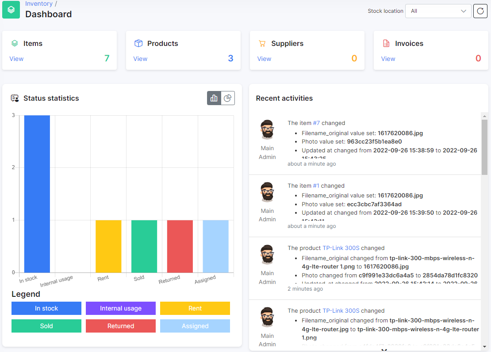

Inventory Dashboard
==========

The Inventory dashboard gives us an overview of all our products. We can see the product's statuses, type of using these products and recent activities.

Here we can see the directory boards - **Items**, **Products**, **Suppliers**, **Invoices** which will direct you to the appropriate sections. The numbers on these blocks show the number of elements in the corresponding sections.

The **Recent Activities** stream shows us live information about changes statuses and change the number of products.

A bar/pie chart - **Status statistics** displays us information about the item's statuses of products.

