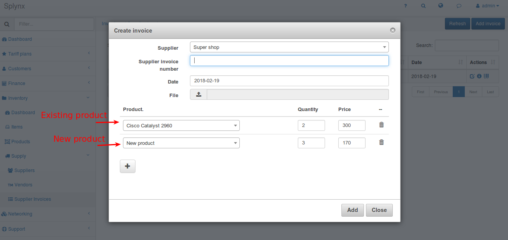
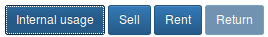
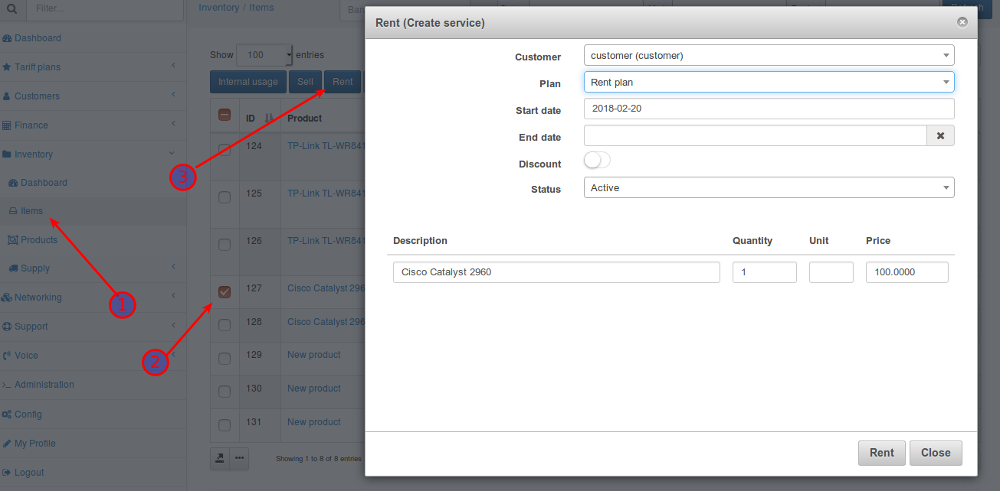

Inventory
==========

Inventory is a built-in feature that allows you to store and account information about equipment and other products. It stores information about you suppliers and product vendors.

Inventory includes:
* **Vendors** - vendors of your products.
For example: «TP-Link».
It is not necessary to specify the vendor for the product.

* **Products** - your products.
For example: «TP-Link TL-WR841N».

* **Items** - items of a specific **product**.
For example: «TP-Link TL-WR841N» with serial number 00-11-22-33. You can manage each item. You can sell or rent items to your customers. Or you can mark them for internal usage.

* **Suppliers** - suppliers of your **products**. For example: «Super shop».

* **Supplier invoices** - they are used to add **items** of **products** to the system.

## Vendors

In menu – `Inventory/Supply/Vendors`

You can create new vendor via button «Add vendor»

Type the name of the vendor and press «Add»

## Products
`Inventory/Products`

You can create new product via button «Add Product»

* **Name** – the product’s name
* **Vendor** – the vendor of the product. (Not necessary)
* **Photo** – the product’s photo. You can choose a photo and it will be added to the product. It will appear in the list of products and in the list of items (near items of this product)
* **Sold price** – the default price for the sale of this product to customers.
* **Rent price** – the default price for the rent of this product to customers.

## Suppliers
`Inventory / Supply / Suppliers`

You can create new supplier via button *«Add supplier»*

Only field **«Name»** is required.
* **Tax included** – include VAT% in supplier’s invoices.

## Supplier invoices

`Inventory/Supply/Supplier Invoices`

If you want to add product items – you have to add it via creating «supplier invoice» here.

Press «Add invoice» and fill invoice fields.

* **Supplier** – choose a supplier. It is necessary.
* **Supplier invoice number** – Invoice number from supplier. (Not necessary)
* **File** – if you have invoice file (image, document) you can specify it here. It’ll be downloaded in the system while invoice is creating. Afterwards you can watch or download it for your needs.
* **Product** – choose existing product. Or you can type new product name and product will be created automatically.
* **Quantity** – items count to add to the system
* **Price** – purchase price of this items.

---
If you press «Add» invoice – the new window will appear. There you can add barcodes of the items. (You can edit barcodes later by pressing <icon class="image-icon"></icon> )

After creating invoice – items of selected products will be added to the system. They will have status **In stock**

---
* **Items** (of products)
`Invertory/Items`

  This is the place where you can see information of the items of your products and manage them

  

  You can edit some information here. Press edit button for this.

  

  If you add some photo it will override a «global» photo of a product (if product has it).

  If you want manage some item (items) – you have check it <icon class="image-icon"></icon> and press one of the buttons: <icon class="image-icon"></icon>

* **Internal usage** – the item is used by your organization

  

* **Sell** – sell the item to the customer

  

  Choose customer and invoice will be generated. Edit what you need and press «Sell»

* **Rent** – rent the item to the customer
Before you can rent some item to the customer – you must create a custom service for this! (`Tariff plans/Custom/Add plan`)

  Then to rent some item – go to the items, check it, press «Rent»

  

  Choose customer, Select rent plan, edit the rest fields for your needs, press «Rent»
  Rent service will be added for selected customer (in Custom services)

* **Return** – return the item to the stock

  You can return the item to the stock only if it has status «in usage» (rent, sold, internal usage)

  Select item(s), press «Return»

  

  You can select status (In stock, Returned ) and mark item (New, Broken)

  All possible statuses of item: `In stock, Internal usage, Sold, Rent, Returned`
  You can see every item’s history. To do this press history button <icon class="image-icon"></icon>.

## Customers

When you rent or sell your products to customers you can see it in customer info

If you rent some item – customer can see it at the portal (in services)

Also you can see the video:
<iframe frameborder=0 height=270 width=350 allowfullscreen src="https://www.youtube.com/embed/KY_Qq-1VxMg?wmode=opaque">Video on youtube</iframe>
