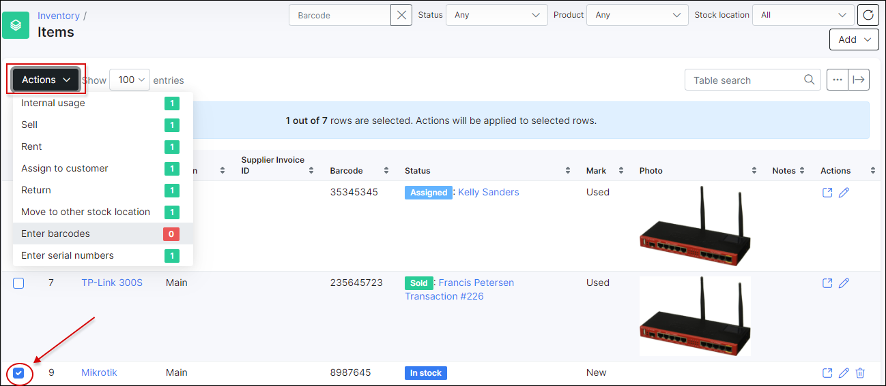

Items (of products)
==========

This is the place where you can see information of the items of your products, manage them and add new ones.

You can edit some additional information or edit existing here. Press edit button for this.

Here you can change Stock location add or edit Barcode.
If you add some photo for the item, it will override a «global» photo of a product (if product has it).
You can to add/edit Notes.

To add a new item just press the button "Add" and select the needed option for one or multiple items.

If you want to manage some item(s) – you have to check it <icon class="image-icon"></icon> and press the **"Actions"** button <icon class="image-icon"></icon> to select one of the desired options.

* **Internal usage** – the item is used by your organization

* **Sell** – sell the item to the customer. If Toggle "Add invoice" is on you will add the transaction and invoice at the same time. If Toggle "Add invoice" is off you will add only the transaction. This transaction will be included in the invoice that is generated once per period with other services.
Choose the customer, edit what you need and press «Sell»

* **Rent** – rent the item to the customer. 
Before you can rent some item to the customer – you must create a custom service for this! (`Tariff plans/Custom/Add plan`)

Then to rent some item – go to the items, check it, press «Rent» in the section "Actions" <icon class="image-icon"></icon>

1. Choose the customer;
2. Select rent plan;
3. Edit the rest fields for your needs, press «Rent»

Rent service will be added for selected customer (in Custom services)

* **Return** – return the item to the stock

You can return the item to the stock if it has status «in usage» (rent, sold, internal usage).
If you need, you can select statuses (New, Broken).
Select item(s) choose status and press «Return».

  

All possible statuses of item: `In stock, Internal usage, Sold, Rent, Assigned to customer`
You can see every item’s history. To do this press history button <icon class="image-icon"></icon>.

## Customers

When you rent or sell your products to customers you can see it in customer info

If you rent some item – customer can see it at the portal (in the section "Services")

Also, you can see the video description of Inventory feature in use:
<iframe frameborder=0 height=270 width=350 allowfullscreen src="https://www.youtube.com/embed/KY_Qq-1VxMg?wmode=opaque">Video on youtube</iframe>
